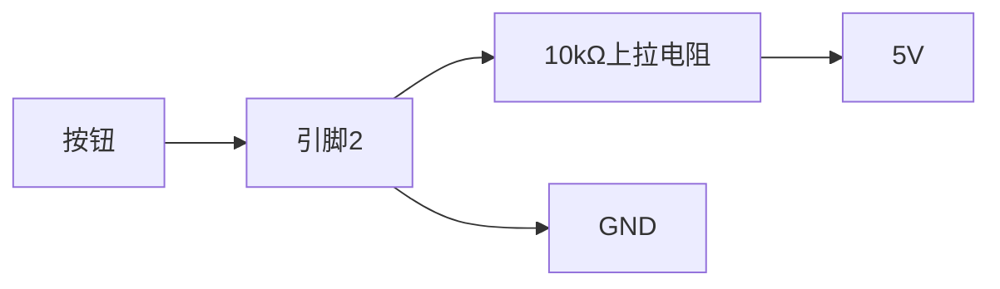

# Arduino 上拉下拉电阻

在Arduino的数字输入输出中，上拉和下拉电阻是非常重要的概念。它们用于确保在没有外部信号输入时，数字引脚能够保持一个稳定的状态（高电平或低电平）。本文将详细介绍上拉和下拉电阻的作用、工作原理以及如何在Arduino中使用它们。

## 什么是上拉和下拉电阻？

上拉电阻和下拉电阻是用于确保数字引脚在未连接外部信号时保持稳定状态的电阻。它们的作用如下：

- **上拉电阻**：将引脚连接到电源（通常是5V或3.3V），以确保引脚在没有外部信号输入时保持高电平。
- **下拉电阻**：将引脚连接到地（GND），以确保引脚在没有外部信号输入时保持低电平。

### 为什么需要上拉和下拉电阻？

在数字电路中，未连接的引脚可能会处于“浮动”状态，这意味着它的电平可能会随机变化，导致不可预测的行为。上拉和下拉电阻可以防止这种情况发生，确保引脚在没有外部信号输入时保持一个确定的状态。

## Arduino 中的上拉电阻

Arduino的微控制器（如ATmega328P）内置了上拉电阻，可以通过软件启用。这使得在使用数字输入引脚时，无需外部上拉电阻即可确保引脚保持高电平。

### 启用内置上拉电阻

在Arduino中，可以通过以下代码启用内置上拉电阻：

```cpp
void setup() {
  pinMode(2, INPUT_PULLUP);  // 将引脚2设置为输入模式，并启用内置上拉电阻
}

void loop() {
  int buttonState = digitalRead(2);  // 读取引脚2的状态
  // 根据按钮状态执行相应操作
}
```

在这个例子中，引脚2被设置为输入模式，并启用了内置上拉电阻。这意味着当没有外部信号输入时，引脚2将保持高电平。

### 外部上拉电阻

如果你需要更高的电阻值或更精确的控制，可以使用外部上拉电阻。通常，上拉电阻的阻值在10kΩ左右。


在这个电路中，5V通过10kΩ电阻连接到引脚2。当没有外部信号输入时，引脚2将保持高电平。

## Arduino 中的下拉电阻

与上拉电阻类似，下拉电阻用于确保引脚在没有外部信号输入时保持低电平。Arduino没有内置的下拉电阻，因此需要使用外部电阻。

### 外部下拉电阻

以下是一个使用外部下拉电阻的示例电路：


在这个电路中，引脚2通过10kΩ电阻连接到GND。当没有外部信号输入时，引脚2将保持低电平。

### 代码示例

以下代码展示了如何使用下拉电阻读取按钮的状态：

```cpp
void setup() {
  pinMode(2, INPUT);  // 将引脚2设置为输入模式
}

void loop() {
  int buttonState = digitalRead(2);  // 读取引脚2的状态
  // 根据按钮状态执行相应操作
}
```

在这个例子中，引脚2被设置为输入模式，并且通过外部下拉电阻连接到GND。当按钮未按下时，引脚2将保持低电平；当按钮按下时，引脚2将连接到5V，变为高电平。

## 实际应用场景

### 按钮输入

上拉和下拉电阻在按钮输入中非常常见。例如，在Arduino项目中，按钮通常用于控制LED的开关。通过使用上拉或下拉电阻，可以确保按钮未按下时引脚保持稳定状态。



在这个电路中，按钮连接到引脚2和GND。当按钮未按下时，引脚2通过上拉电阻保持高电平；当按钮按下时，引脚2连接到GND，变为低电平。

### 传感器输入

某些传感器输出数字信号，可能需要上拉或下拉电阻来确保信号的稳定性。例如，某些红外传感器在检测到物体时输出低电平，未检测到时输出高电平。通过使用上拉电阻，可以确保传感器未检测到物体时引脚保持高电平。

## 总结

上拉和下拉电阻在Arduino的数字输入输出中起着至关重要的作用。它们确保引脚在没有外部信号输入时保持稳定状态，防止引脚处于浮动状态。Arduino内置了上拉电阻，可以通过软件启用，而下拉电阻则需要外部电阻来实现。通过理解和使用上拉和下拉电阻，你可以更可靠地读取数字信号，避免不可预测的行为。

## 附加资源与练习

- **练习1**：尝试在Arduino上使用外部上拉电阻和下拉电阻，分别读取按钮的状态，并观察引脚的电平变化。
- **练习2**：设计一个电路，使用上拉电阻和按钮控制LED的开关，并编写相应的Arduino代码。
- **资源**：Arduino官方文档中关于[数字引脚](https://www.arduino.cc/en/Tutorial/Foundations/DigitalPins)的详细说明。

通过实践和探索，你将更深入地理解上拉和下拉电阻的作用，并能够在实际项目中灵活运用它们。