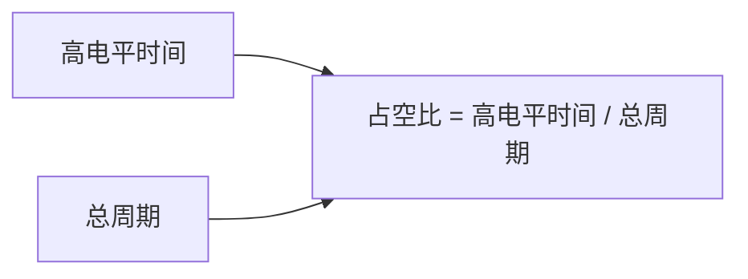

# Arduino 脉冲宽度调制(PWM)

## 介绍

脉冲宽度调制（Pulse Width Modulation，简称PWM）是一种通过快速切换数字信号的高低电平来模拟模拟信号的技术。在Arduino中，PWM常用于控制LED亮度、电机速度、舵机角度等。通过调整信号的占空比（高电平时间与总周期的比例），我们可以控制输出信号的平均电压，从而实现精细的控制。

## PWM的基本原理

PWM信号由两个主要参数定义：
1. **频率（Frequency）**：信号每秒钟重复的次数，单位为赫兹（Hz）。
2. **占空比（Duty Cycle）**：高电平时间与整个周期的比例，通常用百分比表示。

例如，一个50%占空比的PWM信号意味着高电平和低电平的时间相等。



## Arduino 中的PWM

Arduino Uno等开发板上有多个支持PWM输出的引脚，通常标记为`~`符号。这些引脚可以通过`analogWrite()`函数输出PWM信号。`analogWrite()`函数的参数是引脚编号和占空比值（0到255之间）。

### 代码示例：控制LED亮度

以下代码展示了如何使用PWM控制LED的亮度：

```cpp
int ledPin = 9; // 连接到LED的PWM引脚

void setup() {
  pinMode(ledPin, OUTPUT); // 设置引脚为输出模式
}

void loop() {
  // 逐渐增加亮度
  for (int brightness = 0; brightness <= 255; brightness++) {
    analogWrite(ledPin, brightness);
    delay(10); // 等待10毫秒
  }

  // 逐渐减少亮度
  for (int brightness = 255; brightness >= 0; brightness--) {
    analogWrite(ledPin, brightness);
    delay(10); // 等待10毫秒
  }
}
```

:::note
`analogWrite()`函数的占空比值范围为0到255，其中0表示0%占空比（完全关闭），255表示100%占空比（完全打开）。
:::

## PWM的实际应用

### 1. 控制LED亮度
PWM最常见的应用之一是控制LED的亮度。通过调整占空比，我们可以让LED从完全关闭到完全亮起之间平滑过渡。

### 2. 控制电机速度
PWM还可以用于控制直流电机的速度。通过调整占空比，我们可以控制电机的转速，从而实现精确的速度控制。

### 3. 控制舵机角度
舵机通常通过PWM信号控制其角度。不同的占空比对应不同的角度位置，从而实现精确的角度控制。

## 总结

PWM是Arduino中一种强大的技术，能够通过数字信号模拟模拟信号，广泛应用于LED亮度控制、电机速度控制和舵机角度控制等场景。通过`analogWrite()`函数，我们可以轻松地生成PWM信号，并通过调整占空比实现精细的控制。

## 附加资源与练习

1. **练习**：尝试使用PWM控制多个LED，让它们以不同的亮度闪烁。
2. **扩展阅读**：了解Arduino的定时器和PWM频率调整，进一步掌握PWM的高级应用。
3. **项目建议**：设计一个简单的调光台灯，使用电位器调整LED的亮度。

:::tip
如果你对PWM的频率和占空比有更深入的需求，可以尝试使用Arduino的定时器库（如`TimerOne`）来调整PWM频率。
:::