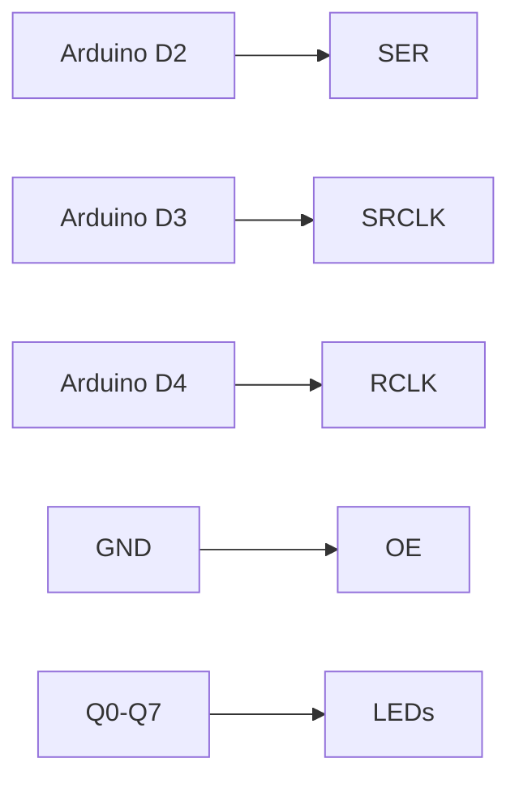

# Arduino 移位寄存器

在Arduino项目中，数字输入输出引脚的数量是有限的。如果你需要控制更多的设备（例如多个LED或按钮），移位寄存器是一个非常有用的工具。它可以帮助你扩展Arduino的引脚数量，同时保持代码的简洁性。

## 什么是移位寄存器？

移位寄存器是一种集成电路芯片，能够将串行数据转换为并行数据，或者将并行数据转换为串行数据。在Arduino中，最常用的移位寄存器是74HC595，它可以将一个串行输入信号转换为8个并行输出信号。

通过使用移位寄存器，你可以用Arduino的3个引脚控制8个甚至更多的输出设备。这对于需要控制大量LED、七段显示器或其他数字设备的项目非常有用。

## 移位寄存器的工作原理

74HC595移位寄存器有以下几个关键引脚：

- **SER（串行数据输入）**：用于接收Arduino发送的串行数据。
- **SRCLK（移位寄存器时钟）**：每次时钟信号从低电平变为高电平时，移位寄存器会将SER引脚上的数据移入内部寄存器。
- **RCLK（存储寄存器时钟）**：当RCLK信号从低电平变为高电平时，移位寄存器中的数据会被复制到输出引脚。
- **OE（输出使能）**：用于启用或禁用输出引脚。通常连接到GND以启用输出。
- **Q0-Q7（并行输出）**：移位寄存器的8个输出引脚。

:::tip
移位寄存器的数据流动可以类比为“流水线”：数据从SER引脚进入，经过8个时钟周期后，8位数据会被存储在寄存器中，最后通过RCLK信号输出到Q0-Q7引脚。
:::

## 连接74HC595到Arduino

以下是一个典型的74HC595与Arduino的连接方式：

- **SER** -> Arduino的D2引脚
- **SRCLK** -> Arduino的D3引脚
- **RCLK** -> Arduino的D4引脚
- **OE** -> GND
- **Q0-Q7** -> 连接到LED或其他设备



## 代码示例

以下是一个简单的Arduino代码示例，用于控制8个LED灯：

```cpp
// 定义引脚
const int dataPin = 2;   // SER
const int clockPin = 3;  // SRCLK
const int latchPin = 4;  // RCLK

void setup() {
  // 设置引脚为输出模式
  pinMode(dataPin, OUTPUT);
  pinMode(clockPin, OUTPUT);
  pinMode(latchPin, OUTPUT);
}

void loop() {
  // 点亮所有LED
  shiftOut(dataPin, clockPin, MSBFIRST, 0b11111111);
  digitalWrite(latchPin, HIGH);
  digitalWrite(latchPin, LOW);
  delay(500);

  // 关闭所有LED
  shiftOut(dataPin, clockPin, MSBFIRST, 0b00000000);
  digitalWrite(latchPin, HIGH);
  digitalWrite(latchPin, LOW);
  delay(500);
}
```

### 代码解释

1. **shiftOut函数**：这是Arduino内置的函数，用于将数据逐位发送到移位寄存器。`MSBFIRST`表示数据从最高位开始发送。
2. **digitalWrite(latchPin, HIGH)**：将RCLK引脚置高，将数据从移位寄存器复制到输出引脚。
3. **digitalWrite(latchPin, LOW)**：将RCLK引脚置低，准备接收下一组数据。

## 实际应用场景

移位寄存器在以下场景中非常有用：

1. **LED矩阵控制**：通过级联多个74HC595，你可以控制大量的LED灯，创建复杂的图案或动画。
2. **七段显示器**：移位寄存器可以用于驱动多个七段显示器，显示数字或字符。
3. **扩展输入引脚**：虽然74HC595主要用于输出，但类似的芯片（如74HC165）可以用于扩展输入引脚。

:::caution
在使用移位寄存器时，确保电源电压和电流在芯片的额定范围内，避免损坏芯片。
:::

## 总结

移位寄存器是Arduino项目中扩展数字输出引脚的有效工具。通过使用74HC595，你可以用少量的Arduino引脚控制多个设备。本文介绍了移位寄存器的基本原理、连接方式以及一个简单的LED控制示例。

## 附加资源与练习

1. **练习**：尝试修改代码，使LED灯依次点亮，形成“跑马灯”效果。
2. **扩展阅读**：了解如何级联多个74HC595芯片，以控制更多的输出设备。
3. **项目建议**：使用移位寄存器制作一个8x8 LED矩阵，并显示自定义图案。

通过掌握移位寄存器的使用，你将能够实现更复杂的Arduino项目，同时节省宝贵的引脚资源。