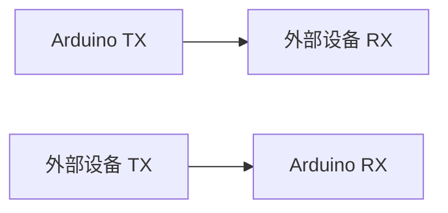

## 介绍

串行通信（UART，Universal Asynchronous Receiver/Transmitter）是Arduino与外部设备通信的一种常见方式。它通过两根线（TX和RX）实现数据的发送和接收，是一种简单且广泛使用的通信协议。UART通信是异步的，意味着发送方和接收方不需要共享时钟信号，而是通过预定义的波特率（Baud Rate）来同步数据传输。

在本教程中，我们将深入探讨Arduino的串行通信，包括其工作原理、代码实现以及实际应用场景。

## 串行通信的工作原理

UART通信使用两根线：
- **TX（Transmit）**：用于发送数据。
- **RX（Receive）**：用于接收数据。

数据以字节为单位传输，每个字节由起始位、数据位、可选的奇偶校验位和停止位组成。通信双方需要预先约定波特率，以确保数据传输的同步。



:::note
**波特率**：波特率是指每秒传输的符号数。常见的波特率有9600、19200、38400、57600和115200等。通信双方必须使用相同的波特率。
:::

## Arduino 串行通信的基本设置

在Arduino中，串行通信通过 `Serial` 库来实现。以下是一个简单的示例，展示如何初始化串行通信并发送数据。

```cpp
void setup() {
  // 初始化串行通信，设置波特率为9600
  Serial.begin(9600);
}

void loop() {
  // 每隔1秒发送一次数据
  Serial.println("Hello, World!");
  delay(1000);
}
```

### 代码解释
- `Serial.begin(9600);`：初始化串行通信，波特率设置为9600。
- `Serial.println("Hello, World!");`：通过串口发送字符串 "Hello, World!"。
- `delay(1000);`：延迟1秒，以便每隔1秒发送一次数据。

### 输出
在Arduino IDE的串口监视器中，您将看到每隔1秒输出一次 "Hello, World!"。

## 接收数据

除了发送数据，Arduino还可以通过串行通信接收数据。以下示例展示了如何接收来自串口的数据并回显。

```cpp
void setup() {
  Serial.begin(9600);
}

void loop() {
  // 检查是否有数据可读
  if (Serial.available() > 0) {
    // 读取一个字节的数据
    char incomingByte = Serial.read();
    // 回显接收到的数据
    Serial.print("Received: ");
    Serial.println(incomingByte);
  }
}
```

### 代码解释
- `Serial.available()`：检查是否有数据可读。
- `Serial.read()`：读取一个字节的数据。
- `Serial.print()` 和 `Serial.println()`：将接收到的数据回显到串口监视器。

### 输入和输出
- **输入**：在串口监视器中输入字符，例如 "A"。
- **输出**：Arduino将回显 "Received: A"。

## 实际应用案例

### 案例1：Arduino与PC通信

Arduino可以通过串行通信与PC进行数据交换。例如，Arduino可以读取传感器数据并将其发送到PC，PC上的程序可以处理这些数据并显示结果。

```cpp
void setup() {
  Serial.begin(9600);
}

void loop() {
  // 模拟读取传感器数据
  int sensorValue = analogRead(A0);
  // 将传感器数据发送到PC
  Serial.println(sensorValue);
  delay(1000);
}
```

### 案例2：Arduino与Arduino通信

两个Arduino可以通过串行通信进行数据交换。一个Arduino作为发送方，另一个作为接收方。

**发送方代码：**
```cpp
void setup() {
  Serial.begin(9600);
}

void loop() {
  Serial.println("Data from Arduino 1");
  delay(1000);
}
```

**接收方代码：**
```cpp
void setup() {
  Serial.begin(9600);
}

void loop() {
  if (Serial.available() > 0) {
    String incomingData = Serial.readString();
    Serial.print("Received: ");
    Serial.println(incomingData);
  }
}
```

## 总结

串行通信（UART）是Arduino与外部设备通信的一种简单而有效的方式。通过 `Serial` 库，Arduino可以轻松实现数据的发送和接收。本文介绍了串行通信的基本概念、代码实现以及实际应用场景，希望能帮助初学者更好地理解和应用这一技术。

## 附加资源与练习

- **练习1**：修改接收数据的代码，使其能够接收并处理多个字节的数据。
- **练习2**：尝试使用不同的波特率进行通信，观察通信的稳定性。
- **资源**：Arduino官方文档中的[Serial库参考](https://www.arduino.cc/reference/en/language/functions/communication/serial/)。

:::tip
**提示**：在实际项目中，确保通信双方的波特率一致，以避免数据传输错误。
:::