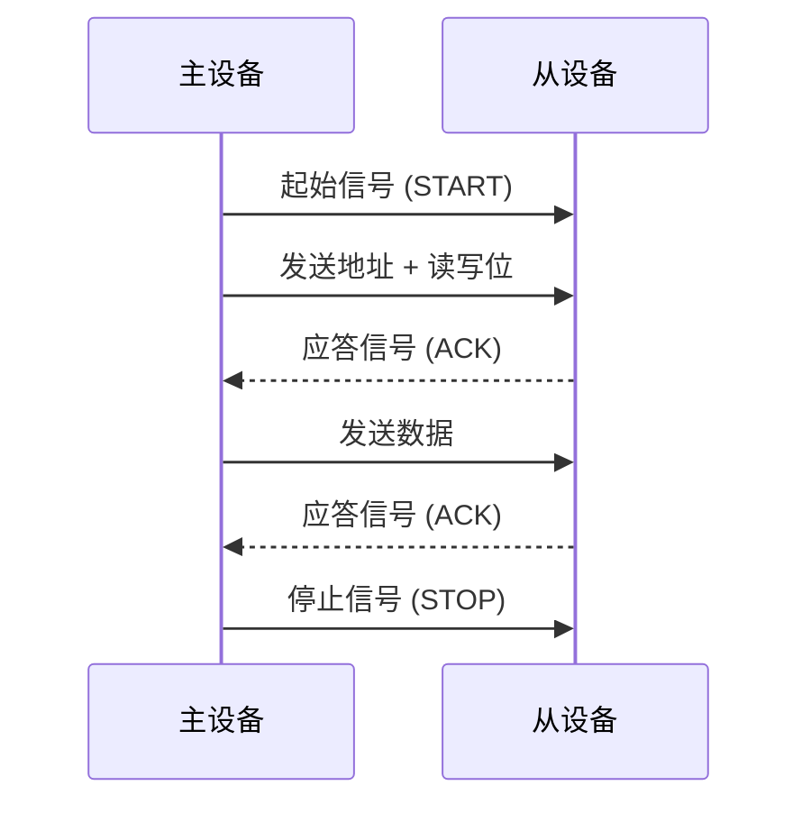

# Arduino I2C协议

I2C（Inter-Integrated Circuit）是一种常用的串行通信协议，广泛应用于微控制器与外围设备之间的通信。它使用两根线（SDA 和 SCL）进行数据传输，支持多主设备和多从设备的连接。本文将详细介绍I2C协议的工作原理、Arduino中的实现方法以及实际应用案例。

## I2C协议简介

I2C协议由Philips公司开发，主要用于短距离通信。它使用两根线：
- **SDA（Serial Data Line）**：用于数据传输。
- **SCL（Serial Clock Line）**：用于同步时钟信号。

I2C支持多主设备和多从设备，每个设备都有一个唯一的地址。主设备通过发送地址来选择从设备，然后进行数据交换。

:::note
I2C协议的优点包括：
- 只需要两根线即可实现通信。
- 支持多主设备和多从设备。
- 数据传输速率较高（标准模式为100kbps，快速模式为400kbps）。
:::

## I2C工作原理

I2C通信的基本流程如下：
1. **起始信号**：主设备发送起始信号（START），表示通信开始。
2. **地址传输**：主设备发送从设备的地址和读写位。
3. **应答信号**：从设备发送应答信号（ACK）表示已接收到地址。
4. **数据传输**：主设备和从设备之间进行数据交换。
5. **停止信号**：主设备发送停止信号（STOP），表示通信结束。



## Arduino 中的I2C实现

Arduino提供了`Wire`库来简化I2C通信的实现。以下是一个简单的示例，展示如何在Arduino中使用I2C与从设备通信。

### 示例代码：主设备发送数据

```cpp
#include <Wire.h>

void setup() {
  Wire.begin(); // 初始化I2C通信
}

void loop() {
  Wire.beginTransmission(8); // 向地址为8的从设备发送数据
  Wire.write("Hello");       // 发送数据
  Wire.endTransmission();    // 结束传输
  delay(1000);
}
```

### 示例代码：从设备接收数据

```cpp
#include <Wire.h>

void setup() {
  Wire.begin(8);              // 加入I2C总线，地址为8
  Wire.onReceive(receiveEvent); // 注册接收事件
  Serial.begin(9600);
}

void loop() {
  // 主循环为空，事件驱动
}

void receiveEvent(int bytes) {
  while (Wire.available()) {
    char c = Wire.read(); // 读取接收到的数据
    Serial.print(c);      // 打印到串口监视器
  }
}
```

:::tip
在Arduino Uno中，I2C的SDA和SCL引脚分别是A4和A5。在其他型号的Arduino板上，请参考相关文档确认引脚。
:::

## 实际应用案例

### 案例1：温度传感器读取

I2C常用于连接温度传感器，如LM75或BMP280。以下是一个使用BMP280读取温度数据的示例：

```cpp
#include <Wire.h>
#include <Adafruit_BMP280.h>

Adafruit_BMP280 bmp; // 创建BMP280对象

void setup() {
  Serial.begin(9600);
  if (!bmp.begin(0x76)) { // 初始化BMP280，地址为0x76
    Serial.println("Could not find a valid BMP280 sensor, check wiring!");
    while (1);
  }
}

void loop() {
  Serial.print("Temperature = ");
  Serial.print(bmp.readTemperature()); // 读取温度
  Serial.println(" *C");
  delay(1000);
}
```

### 案例2：OLED显示屏控制

I2C也常用于控制OLED显示屏。以下是一个使用SSD1306 OLED显示屏的示例：

```cpp
#include <Wire.h>
#include <Adafruit_GFX.h>
#include <Adafruit_SSD1306.h>

#define SCREEN_WIDTH 128
#define SCREEN_HEIGHT 64

Adafruit_SSD1306 display(SCREEN_WIDTH, SCREEN_HEIGHT, &Wire, -1);

void setup() {
  if(!display.begin(SSD1306_I2C_ADDRESS, 0x3C)) { // 初始化OLED，地址为0x3C
    Serial.println(F("SSD1306 allocation failed"));
    for(;;);
  }
  display.display();
  delay(2000);
  display.clearDisplay();
  display.setTextSize(1);
  display.setTextColor(SSD1306_WHITE);
  display.setCursor(0,0);
  display.println("Hello, World!");
  display.display();
}

void loop() {
  // 主循环为空，显示静态内容
}
```

## 总结

I2C是一种高效、灵活的通信协议，适用于Arduino与多种外围设备的连接。通过`Wire`库，Arduino可以轻松实现I2C通信。本文介绍了I2C的基本原理、Arduino中的实现方法以及实际应用案例，希望能帮助你更好地理解和应用I2C协议。

## 附加资源与练习

- **练习1**：尝试使用I2C连接多个从设备，并实现主设备与多个从设备之间的通信。
- **练习2**：使用I2C协议连接一个加速度传感器（如MPU6050），并读取其数据。
- **资源**：
  - [Arduino Wire库文档](https://www.arduino.cc/en/Reference/Wire)
  - [I2C协议详解](https://www.i2c-bus.org/)

:::caution
在实际应用中，确保I2C总线的上拉电阻正确连接，以避免通信失败。
:::