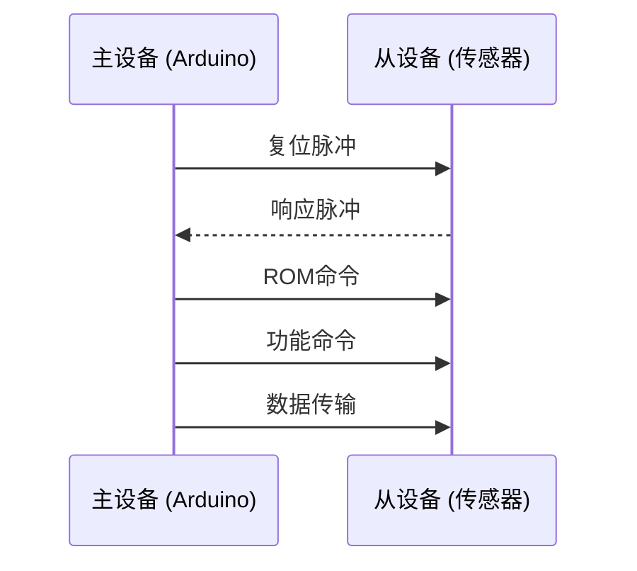

# Arduino OneWire协议

## 介绍

OneWire协议是一种由Dallas Semiconductor（现为Maxim Integrated）开发的单线通信协议。它允许通过单根数据线进行双向通信，同时还可以为连接的设备提供电源。这种协议非常适合用于连接多个设备，例如温度传感器、EEPROM存储器等。

OneWire协议的主要优点是简化了硬件连接，减少了引脚的使用，特别适合在资源有限的微控制器（如Arduino）上使用。

## OneWire协议的工作原理

OneWire协议使用单根数据线进行通信，同时还可以通过这根线为设备供电。通信过程中，主设备（通常是Arduino）通过发送特定的命令来控制从设备（如温度传感器）。每个从设备都有一个唯一的64位地址，主设备可以通过这个地址与特定的从设备通信。

### 通信流程

1. **初始化**：主设备发送一个复位脉冲，所有从设备响应这个脉冲。
2. **ROM命令**：主设备发送一个ROM命令，用于选择特定的从设备。
3. **功能命令**：主设备发送功能命令，指示从设备执行特定的操作（如读取温度）。
4. **数据传输**：主设备和从设备之间进行数据交换。



## 代码示例

以下是一个使用OneWire协议读取DS18B20温度传感器的示例代码：

```cpp
#include <OneWire.h>
#include <DallasTemperature.h>

// 数据线连接到Arduino的2号引脚
#define ONE_WIRE_BUS 2

// 设置OneWire实例
OneWire oneWire(ONE_WIRE_BUS);

// 将OneWire实例传递给Dallas Temperature库
DallasTemperature sensors(&oneWire);

void setup() {
  // 启动串口通信
  Serial.begin(9600);
  // 启动传感器
  sensors.begin();
}

void loop() {
  // 请求温度读数
  sensors.requestTemperatures();
  // 读取并打印温度
  float temperature = sensors.getTempCByIndex(0);
  Serial.print("Temperature: ");
  Serial.print(temperature);
  Serial.println(" °C");
  // 延迟1秒
  delay(1000);
}
```

### 代码解释

1. **OneWire库**：用于处理OneWire协议的底层通信。
2. **DallasTemperature库**：简化了与DS18B20温度传感器的交互。
3. **setup()函数**：初始化串口通信和传感器。
4. **loop()函数**：每隔1秒读取并打印温度数据。

:::tip
确保将DS18B20的数据引脚连接到Arduino的2号引脚，并且使用一个4.7kΩ的上拉电阻。
:::

## 实际应用场景

OneWire协议广泛应用于各种传感器和存储器设备中。以下是一些常见的应用场景：

1. **温度监测**：使用DS18B20温度传感器监测环境温度。
2. **数据存储**：使用EEPROM存储器存储数据。
3. **设备识别**：通过唯一的64位地址识别多个设备。

### 案例：多传感器温度监测系统

假设你需要监测多个房间的温度，可以使用多个DS18B20传感器连接到同一根数据线上。每个传感器都有一个唯一的地址，Arduino可以通过这些地址分别读取每个传感器的温度数据。

```cpp
#include <OneWire.h>
#include <DallasTemperature.h>

#define ONE_WIRE_BUS 2

OneWire oneWire(ONE_WIRE_BUS);
DallasTemperature sensors(&oneWire);

void setup() {
  Serial.begin(9600);
  sensors.begin();
}

void loop() {
  sensors.requestTemperatures();
  for (int i = 0; i < sensors.getDeviceCount(); i++) {
    float temperature = sensors.getTempCByIndex(i);
    Serial.print("Sensor ");
    Serial.print(i);
    Serial.print(": ");
    Serial.print(temperature);
    Serial.println(" °C");
  }
  delay(1000);
}
```

:::note
在这个案例中，`sensors.getDeviceCount()` 返回连接到总线的传感器数量，`sensors.getTempCByIndex(i)` 返回第i个传感器的温度。
:::

## 总结

OneWire协议是一种简单而强大的通信协议，特别适合在资源有限的微控制器上使用。通过单根数据线，你可以连接多个设备并进行双向通信。本文介绍了OneWire协议的基本原理、代码示例以及实际应用场景，希望能帮助你更好地理解和应用这一协议。

## 附加资源与练习

- **练习1**：尝试将多个DS18B20传感器连接到Arduino，并分别读取它们的温度数据。
- **练习2**：研究如何使用OneWire协议与其他类型的设备（如EEPROM存储器）进行通信。
- **资源**：访问[Arduino官方文档](https://www.arduino.cc/)和[OneWire库文档](https://www.pjrc.com/teensy/td_libs_OneWire.html)以获取更多信息。

:::caution
在使用OneWire协议时，确保正确连接上拉电阻，否则可能导致通信失败。
:::