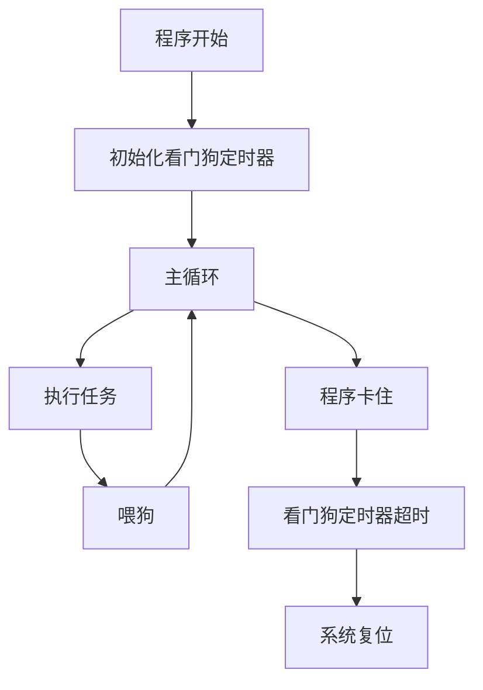

# Arduino 看门狗定时器

## 介绍

在嵌入式系统中，看门狗定时器（Watchdog Timer，简称WDT）是一种重要的硬件功能，用于检测和恢复系统故障。当程序运行异常或进入死循环时，看门狗定时器可以自动重启系统，确保设备能够恢复正常工作。Arduino微控制器也内置了看门狗定时器，本文将详细介绍其工作原理和使用方法。

## 看门狗定时器的工作原理

看门狗定时器本质上是一个计数器，它会不断递减。如果计数器减到零，系统会认为程序运行异常，并触发复位操作。为了防止复位，程序需要定期“喂狗”（即重置计数器）。如果程序正常运行，计数器会被定期重置；如果程序卡住或进入死循环，计数器会减到零，触发复位。



## 在Arduino中使用看门狗定时器

Arduino的看门狗定时器可以通过`<avr/wdt.h>`库进行配置。以下是一个简单的示例，展示如何使用看门狗定时器。

```cpp
#include <avr/wdt.h>

void setup() {
  Serial.begin(9600);
  Serial.println("Initializing...");

  // 启用看门狗定时器，设置超时时间为2秒
  wdt_enable(WDTO_2S);
}

void loop() {
  Serial.println("Running...");

  // 模拟任务执行
  delay(1000);

  // 喂狗
  wdt_reset();
}
```

### 代码解释

1. **`wdt_enable(WDTO_2S)`**: 启用看门狗定时器，并设置超时时间为2秒。
2. **`wdt_reset()`**: 重置看门狗定时器，防止系统复位。

### 输入与输出

- **输入**: 无
- **输出**: 串口监视器会不断打印"Running..."，如果程序卡住超过2秒，系统会自动复位。

## 实际应用场景

### 1. 防止程序卡死

在复杂的程序中，可能会因为某些原因导致程序卡死。使用看门狗定时器可以确保系统在卡死时自动重启，避免设备长时间无响应。

### 2. 远程设备监控

在远程设备中，如果设备因为网络问题或其他原因无法响应，看门狗定时器可以自动重启设备，恢复通信。

## 总结

看门狗定时器是Arduino中一个非常有用的功能，能够有效提高系统的稳定性和可靠性。通过定期“喂狗”，可以防止系统因程序异常而卡死。在实际应用中，看门狗定时器常用于防止程序卡死和远程设备监控等场景。

## 附加资源与练习

- **练习**: 修改上述代码，将看门狗定时器的超时时间设置为4秒，并观察系统行为。
- **资源**: 阅读Arduino官方文档，了解更多关于看门狗定时器的配置选项和使用技巧。

:::tip
在使用看门狗定时器时，务必确保“喂狗”操作不会过于频繁或过于稀疏，以免影响系统正常运行。
:::