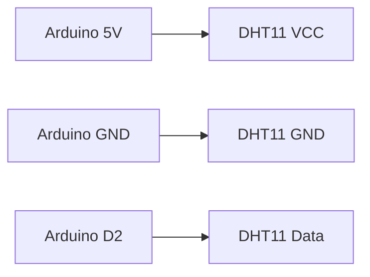

# Arduino 湿度传感器

湿度传感器是一种用于测量环境湿度的电子设备。它可以帮助我们监测空气中的水分含量，广泛应用于气象站、温室、家居自动化等领域。本文将介绍如何使用Arduino与湿度传感器结合，测量并显示环境湿度。

## 什么是湿度传感器？

湿度传感器是一种能够检测空气中水蒸气含量的设备。常见的湿度传感器类型包括电容式、电阻式和热导式传感器。其中，电容式湿度传感器因其高精度和稳定性而被广泛使用。

## 如何连接Arduino与湿度传感器？

以常见的DHT11湿度传感器为例，以下是连接Arduino的步骤：

1. **VCC引脚**：连接到Arduino的5V引脚。
2. **GND引脚**：连接到Arduino的GND引脚。
3. **数据引脚**：连接到Arduino的数字引脚（例如D2）。



## 编写Arduino代码

以下是一个简单的Arduino代码示例，用于读取DHT11传感器的湿度数据并显示在串口监视器中：

```cpp
#include <DHT.h>

#define DHTPIN 2     // 数据引脚连接到D2
#define DHTTYPE DHT11 // 使用DHT11传感器

DHT dht(DHTPIN, DHTTYPE);

void setup() {
  Serial.begin(9600);
  dht.begin();
}

void loop() {
  float humidity = dht.readHumidity(); // 读取湿度值
  Serial.print("Humidity: ");
  Serial.print(humidity);
  Serial.println(" %");
  delay(2000); // 每2秒读取一次
}
```

### 代码解释

1. **`#include <DHT.h>`**：引入DHT库，用于与DHT11传感器通信。
2. **`dht.begin()`**：初始化传感器。
3. **`dht.readHumidity()`**：读取当前湿度值。
4. **`Serial.print()`**：将湿度值输出到串口监视器。

:::tip
确保已安装DHT库。如果没有安装，可以通过Arduino IDE的库管理器搜索并安装“DHT sensor library”。
:::

## 实际应用场景

### 1. 温室湿度监测

在温室中，湿度传感器可以实时监测空气湿度，帮助农民调整灌溉系统，确保植物生长在最佳环境中。

### 2. 家居自动化

在家居自动化系统中，湿度传感器可以与加湿器或除湿器联动，自动调节室内湿度，提升居住舒适度。

### 3. 气象站

气象站使用湿度传感器来收集环境数据，用于天气预报和气候研究。

## 总结

通过本文，您已经学会了如何使用Arduino与湿度传感器结合，测量环境湿度。湿度传感器在多个领域都有广泛应用，掌握其使用方法将为您的项目增添更多可能性。

## 附加资源与练习

1. **练习**：尝试将湿度传感器与LCD显示屏结合，实时显示湿度值。
2. **扩展阅读**：了解更多关于DHT22传感器的知识，它与DHT11类似，但精度更高。
3. **项目建议**：设计一个智能家居系统，使用湿度传感器自动控制加湿器。

希望本文对您的学习有所帮助！继续探索Arduino的世界，您会发现更多有趣的应用！