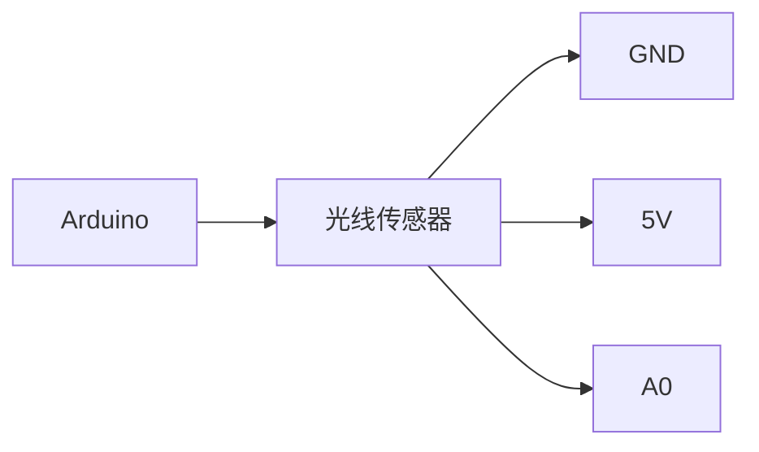

## 介绍

Arduino光线传感器是一种用于检测环境光强度的电子元件。它通常基于光敏电阻（LDR，Light Dependent Resistor）或光电二极管等光敏元件，能够将光信号转换为电信号。通过读取这些电信号，Arduino可以感知周围环境的光照强度，并根据这些数据做出相应的反应。

光线传感器在许多实际应用中非常有用，例如自动调节屏幕亮度、智能照明系统、植物生长监测等。本文将详细介绍如何使用Arduino光线传感器，并通过代码示例和实际案例帮助你理解其工作原理。

## 光线传感器的工作原理

光线传感器的核心是光敏元件，最常见的是光敏电阻（LDR）。光敏电阻的电阻值会随着光照强度的变化而变化：光照越强，电阻值越低；光照越弱，电阻值越高。通过测量电阻值的变化，Arduino可以间接检测到环境光强度的变化。

### 电路连接

光线传感器通常需要与Arduino的模拟输入引脚连接。以下是一个简单的电路连接示意图：



在这个电路中，光线传感器的输出引脚连接到Arduino的模拟输入引脚（例如A0），电源引脚连接到5V，接地引脚连接到GND。

## 代码示例

以下是一个简单的Arduino代码示例，用于读取光线传感器的值并将其打印到串口监视器：

```cpp
int lightSensorPin = A0; // 光线传感器连接到A0引脚

void setup() {
  Serial.begin(9600); // 初始化串口通信
}

void loop() {
  int lightValue = analogRead(lightSensorPin); // 读取光线传感器的值
  Serial.println(lightValue); // 打印光线传感器的值到串口监视器
  delay(1000); // 延迟1秒
}
```

### 代码解释

1. **`int lightSensorPin = A0;`**：定义光线传感器连接的模拟输入引脚为A0。
2. **`Serial.begin(9600);`**：初始化串口通信，波特率设置为9600。
3. **`int lightValue = analogRead(lightSensorPin);`**：使用`analogRead()`函数读取光线传感器的值，并将其存储在变量`lightValue`中。
4. **`Serial.println(lightValue);`**：将读取到的光线传感器值打印到串口监视器。
5. **`delay(1000);`**：延迟1秒，以便每隔1秒读取一次光线传感器的值。

### 输入与输出

- **输入**：光线传感器检测到的环境光强度。
- **输出**：Arduino通过串口监视器输出的光线传感器值（0-1023之间的整数）。

:::note
**注意**：`analogRead()`函数返回的值范围是0到1023，其中0表示完全黑暗，1023表示最大光照强度。
:::

## 实际应用案例

### 案例1：自动调节屏幕亮度

在智能手机或笔记本电脑中，光线传感器常用于自动调节屏幕亮度。当环境光较强时，屏幕亮度会自动增加以提高可视性；当环境光较弱时，屏幕亮度会自动降低以节省电量。

### 案例2：智能照明系统

在智能家居系统中，光线传感器可以用于控制室内灯光的开关和亮度。例如，当检测到室内光线不足时，系统可以自动打开灯光并调节亮度；当检测到光线充足时，系统可以自动关闭灯光以节省能源。

### 案例3：植物生长监测

在农业或园艺中，光线传感器可以用于监测植物的光照条件。通过实时监测光照强度，农民或园艺爱好者可以调整植物的位置或光照时间，以确保植物获得最佳的生长条件。

## 总结

Arduino光线传感器是一种简单但功能强大的工具，能够帮助我们检测环境光强度并将其应用于各种实际项目中。通过本文的介绍，你应该已经了解了光线传感器的工作原理、如何连接电路、如何编写代码读取传感器值，以及一些实际应用案例。

## 附加资源与练习

- **练习1**：尝试修改代码，使Arduino在光线强度低于某个阈值时点亮LED灯。
- **练习2**：将光线传感器与LCD显示屏结合，实时显示当前的光照强度。
- **附加资源**：查阅Arduino官方文档，了解更多关于模拟输入和传感器的使用方法。

希望本文能帮助你更好地理解和使用Arduino光线传感器。如果你有任何问题或需要进一步的帮助，请随时访问我们的社区论坛或联系我们的支持团队。