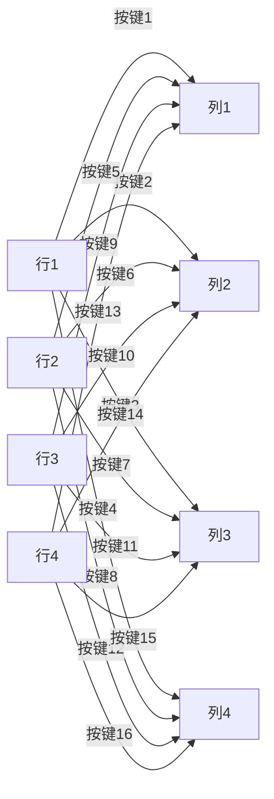

# Arduino 矩阵键盘

矩阵键盘是一种常见的输入设备，广泛应用于需要多个按键的场景，如密码输入、菜单选择等。与独立按键相比，矩阵键盘通过行列交叉的方式减少了引脚的使用数量，从而节省了Arduino的资源。本文将详细介绍矩阵键盘的工作原理、连接方法以及如何通过Arduino读取按键输入。

## 矩阵键盘的工作原理

矩阵键盘由多行和多列的按键组成。每个按键位于行和列的交叉点上。当按下某个按键时，对应的行和列会被连接在一起。通过扫描行和列的状态，Arduino可以确定哪个按键被按下。

例如，一个4x4的矩阵键盘有4行和4列，共16个按键。如果使用独立按键，需要16个引脚，而使用矩阵键盘只需要8个引脚（4行 + 4列）。



## 连接矩阵键盘到Arduino

要将矩阵键盘连接到Arduino，需要将键盘的行和列分别连接到Arduino的数字引脚。以下是一个4x4矩阵键盘的连接示例：

- 行1 -> Arduino引脚2
- 行2 -> Arduino引脚3
- 行3 -> Arduino引脚4
- 行4 -> Arduino引脚5
- 列1 -> Arduino引脚6
- 列2 -> Arduino引脚7
- 列3 -> Arduino引脚8
- 列4 -> Arduino引脚9

:::note
确保在连接时使用适当的电阻（如10kΩ上拉电阻）以防止引脚悬空。
:::

## 读取矩阵键盘的按键输入

以下是一个简单的Arduino代码示例，用于读取4x4矩阵键盘的按键输入并打印到串口监视器：

```cpp
#include <Keypad.h>

const byte ROWS = 4; // 行数
const byte COLS = 4; // 列数

// 定义按键映射
char keys[ROWS][COLS] = {
  {'1','2','3','A'},
  {'4','5','6','B'},
  {'7','8','9','C'},
  {'*','0','#','D'}
};

// 定义行和列的引脚
byte rowPins[ROWS] = {2, 3, 4, 5}; // 连接到行
byte colPins[COLS] = {6, 7, 8, 9}; // 连接到列

// 初始化Keypad对象
Keypad keypad = Keypad(makeKeymap(keys), rowPins, colPins, ROWS, COLS);

void setup() {
  Serial.begin(9600);
}

void loop() {
  char key = keypad.getKey(); // 读取按键
  if (key) {
    Serial.println(key); // 打印按键值
  }
}
```

:::tip
`Keypad`库简化了矩阵键盘的读取过程。你可以通过Arduino IDE的库管理器安装该库。
:::

## 实际应用场景

矩阵键盘在许多实际应用中非常有用，例如：

1. **密码输入**：用于安全系统或门禁控制，用户可以通过矩阵键盘输入密码。
2. **菜单选择**：在嵌入式系统中，矩阵键盘可以用于选择菜单选项或调整设置。
3. **数据输入**：在需要输入数字或字符的设备中，矩阵键盘提供了一种便捷的输入方式。

## 总结

矩阵键盘是一种高效且节省资源的输入设备，特别适用于需要多个按键的场景。通过本文，你学会了如何将矩阵键盘连接到Arduino，并使用`Keypad`库读取按键输入。希望你能将这些知识应用到自己的项目中！

## 附加资源与练习

- **练习1**：尝试修改代码，使得按下某个特定按键时，Arduino板上的LED灯亮起。
- **练习2**：扩展代码，使其能够处理长按按键的情况。
- **资源**：访问[Arduino官方文档](https://www.arduino.cc/)了解更多关于矩阵键盘和其他输入设备的信息。

:::caution
在实际项目中，确保按键的防抖处理，以避免误触发。
:::