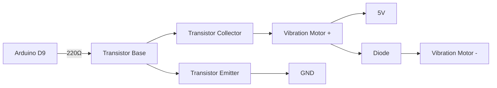

# Arduino 振动电机

振动电机是一种常见的执行器，广泛应用于手机、游戏手柄、智能设备等场景中，用于提供触觉反馈。通过Arduino，我们可以轻松控制振动电机，实现各种有趣的功能。本文将详细介绍如何使用Arduino控制振动电机，并提供代码示例和实际应用案例。

## 什么是振动电机？

振动电机是一种小型电机，内部包含一个偏心轮。当电机旋转时，偏心轮会产生振动。这种振动可以通过设备外壳传递到用户手中，从而提供触觉反馈。振动电机通常分为两种类型：**有刷电机**和**无刷电机**。在Arduino项目中，我们通常使用有刷振动电机，因为它更易于控制。

## 振动电机的工作原理

振动电机的核心是一个带有偏心轮的直流电机。当电机通电时，偏心轮开始旋转，产生离心力，从而导致电机振动。振动的强度和频率取决于电机的转速和偏心轮的质量。

:::note
振动电机的振动效果可以通过改变电机的电压或PWM信号来调节。
:::

## 连接振动电机到Arduino

振动电机的连接非常简单。由于振动电机通常需要较高的电流，Arduino的数字引脚无法直接驱动它。因此，我们需要使用一个晶体管（如NPN型晶体管或MOSFET）来放大电流。

### 所需材料
- Arduino开发板（如Arduino Uno）
- 振动电机
- NPN晶体管（如2N2222）
- 二极管（如1N4007）
- 电阻（220Ω）
- 连接线
- 面包板

### 电路连接
1. 将振动电机的正极连接到电源正极（如5V）。
2. 将振动电机的负极连接到晶体管的集电极（C）。
3. 将晶体管的发射极（E）连接到电源负极（GND）。
4. 将晶体管的基极（B）通过220Ω电阻连接到Arduino的数字引脚（如D9）。
5. 在振动电机的正负极之间并联一个二极管，用于保护电路。



## 控制振动电机的代码示例

以下是一个简单的Arduino代码示例，用于控制振动电机的开关和振动强度。

```cpp
const int motorPin = 9; // 振动电机连接的引脚

void setup() {
  pinMode(motorPin, OUTPUT); // 设置引脚为输出模式
}

void loop() {
  // 打开振动电机
  digitalWrite(motorPin, HIGH);
  delay(1000); // 振动1秒

  // 关闭振动电机
  digitalWrite(motorPin, LOW);
  delay(1000); // 停止1秒

  // 使用PWM控制振动强度
  analogWrite(motorPin, 128); // 50%的振动强度
  delay(1000); // 振动1秒

  analogWrite(motorPin, 255); // 100%的振动强度
  delay(1000); // 振动1秒
}
```

:::tip
通过调整 `analogWrite` 的值（0-255），可以控制振动电机的振动强度。值越大，振动越强。
:::

## 实际应用案例

### 1. 触觉反馈设备
振动电机可以用于制作触觉反馈设备，例如：
- **智能手环**：当收到通知时，手环会振动提醒用户。
- **游戏手柄**：在游戏中，手柄会根据游戏事件（如碰撞或爆炸）产生振动反馈。

### 2. 报警系统
振动电机可以用于制作无声报警系统。例如：
- **智能门锁**：当门锁被非法打开时，设备会通过振动提醒用户。
- **安全设备**：在危险环境中，设备可以通过振动提醒用户注意安全。

### 3. 互动艺术装置
振动电机可以用于制作互动艺术装置。例如：
- **振动画布**：当用户触摸画布时，画布会振动，产生独特的触觉体验。
- **音乐装置**：根据音乐的节奏，振动电机会产生相应的振动效果。

## 总结

通过本文，我们学习了如何使用Arduino控制振动电机，包括其工作原理、电路连接和代码实现。振动电机是一种简单但功能强大的执行器，可以用于多种实际应用场景，如触觉反馈、报警系统和互动艺术装置。

:::caution
在使用振动电机时，请注意其电流需求，避免直接连接到Arduino的数字引脚，以免损坏开发板。
:::

## 附加资源与练习

### 练习
1. 尝试修改代码，使振动电机根据环境光强度（使用光敏电阻）调整振动强度。
2. 设计一个振动提醒系统，当温度超过一定阈值时，振动电机开始工作。

### 资源
- [Arduino官方文档](https://www.arduino.cc/)
- [振动电机的工作原理](https://en.wikipedia.org/wiki/Vibration_motor)
- [晶体管的使用指南](https://learn.sparkfun.com/tutorials/transistors)

希望本文能帮助你更好地理解和使用Arduino振动电机！如果你有任何问题，欢迎在评论区留言。