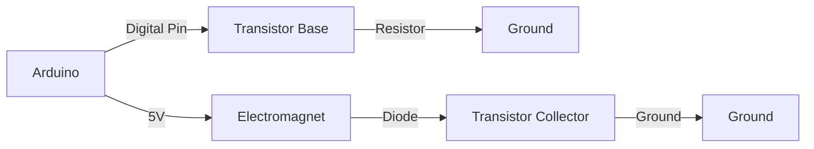

# Arduino 电磁铁控制

电磁铁是一种通过电流产生磁场的装置，广泛应用于各种电子设备中。通过Arduino控制电磁铁，可以实现自动化操作，例如开关门、抓取物体等。本文将详细介绍如何使用Arduino控制电磁铁，并提供代码示例和实际应用案例。

## 电磁铁的基本原理

电磁铁由线圈和铁芯组成。当电流通过线圈时，会产生磁场，铁芯被磁化，从而产生磁力。电流越大，磁场越强，磁力也越大。通过控制电流的通断，可以实现电磁铁的开关。

## 所需材料

- Arduino开发板（如Arduino Uno）
- 电磁铁
- 晶体管（如NPN型晶体管2N2222）
- 二极管（如1N4007）
- 电阻（如220Ω）
- 连接线
- 电源（如9V电池）

## 电路连接

电磁铁需要较大的电流，而Arduino的数字引脚只能提供有限的电流（约40mA）。因此，我们需要使用晶体管来放大电流，以驱动电磁铁。

### 电路图



### 连接步骤

1. 将Arduino的数字引脚（如D2）连接到晶体管的基极（Base），中间串联一个220Ω的电阻。
2. 将晶体管的发射极（Emitter）连接到Arduino的GND。
3. 将电磁铁的一端连接到电源正极（如9V电池的正极），另一端连接到晶体管的集电极（Collector）。
4. 在电磁铁两端并联一个二极管（1N4007），用于保护电路，防止电磁铁断电时产生的反向电压损坏晶体管。

## 代码示例

以下是一个简单的Arduino代码示例，用于控制电磁铁的开关。

```cpp
const int electromagnetPin = 2;  // 电磁铁连接的引脚

void setup() {
  pinMode(electromagnetPin, OUTPUT);  // 设置引脚为输出模式
}

void loop() {
  digitalWrite(electromagnetPin, HIGH);  // 打开电磁铁
  delay(1000);  // 保持1秒
  digitalWrite(electromagnetPin, LOW);   // 关闭电磁铁
  delay(1000);  // 保持1秒
}
```

### 代码解释

- `electromagnetPin`：定义电磁铁连接的引脚为D2。
- `setup()`：在`setup()`函数中，将`electromagnetPin`设置为输出模式。
- `loop()`：在`loop()`函数中，通过`digitalWrite()`函数控制电磁铁的开关。`HIGH`表示打开电磁铁，`LOW`表示关闭电磁铁。`delay(1000)`用于控制电磁铁的开关时间。

## 实际应用案例

### 案例1：自动门锁

电磁铁可以用于自动门锁系统。当Arduino接收到开门信号时，控制电磁铁通电，门锁打开；当接收到关门信号时，电磁铁断电，门锁关闭。

### 案例2：抓取机器人

在抓取机器人中，电磁铁可以用于抓取金属物体。通过控制电磁铁的通断，机器人可以抓取或释放物体。

## 总结

通过本文，我们学习了如何使用Arduino控制电磁铁。我们了解了电磁铁的基本原理、电路连接方法以及代码实现。此外，我们还探讨了电磁铁在实际应用中的一些案例。

## 附加资源与练习

- **练习1**：尝试修改代码，使电磁铁每隔5秒开关一次。
- **练习2**：设计一个电路，使用两个电磁铁实现双向控制。
- **资源**：阅读Arduino官方文档，了解更多关于数字引脚和晶体管的使用方法。

希望本文能帮助你掌握Arduino电磁铁控制的基本知识，并激发你在实际项目中的应用灵感！