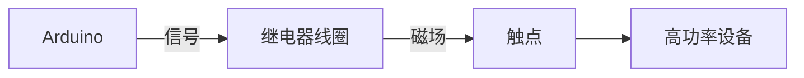

# Arduino 继电器控制

继电器是一种电子开关，它允许低功率信号控制高功率设备。在Arduino项目中，继电器常用于控制家用电器、电机或其他高功率设备。本文将详细介绍如何使用Arduino控制继电器，并通过实际案例展示其应用。

## 继电器的工作原理

继电器主要由线圈和触点组成。当线圈通电时，产生的磁场会吸引触点，使其闭合或断开，从而控制电路的通断。继电器通常有常开（NO）和常闭（NC）两种状态。



## 所需材料

- Arduino开发板
- 继电器模块
- 高功率设备（如灯泡、电机等）
- 连接线
- 电源（根据高功率设备需求）

## 连接电路

1. 将继电器的VCC引脚连接到Arduino的5V引脚。
2. 将继电器的GND引脚连接到Arduino的GND引脚。
3. 将继电器的IN引脚连接到Arduino的数字引脚（例如D2）。
4. 将高功率设备的一端连接到继电器的常开（NO）引脚，另一端连接到电源。
5. 将电源的另一端连接到继电器的公共（COM）引脚。

:::caution
确保电源电压与高功率设备的额定电压匹配，避免损坏设备。
:::

## 编写代码

以下是一个简单的Arduino代码示例，用于控制继电器的开关状态。

```cpp
const int relayPin = 2;  // 继电器连接到D2引脚

void setup() {
  pinMode(relayPin, OUTPUT);  // 设置D2引脚为输出模式
}

void loop() {
  digitalWrite(relayPin, HIGH);  // 打开继电器
  delay(1000);                   // 等待1秒
  digitalWrite(relayPin, LOW);   // 关闭继电器
  delay(1000);                   // 等待1秒
}
```

### 代码解释

- `pinMode(relayPin, OUTPUT);`：将D2引脚设置为输出模式，用于控制继电器。
- `digitalWrite(relayPin, HIGH);`：向继电器发送高电平信号，使其闭合，从而接通高功率设备。
- `digitalWrite(relayPin, LOW);`：向继电器发送低电平信号，使其断开，从而关闭高功率设备。

## 实际应用案例

### 案例1：控制家用灯泡

假设你希望通过Arduino控制家中的灯泡。你可以将灯泡连接到继电器的常开引脚，并通过Arduino程序控制灯泡的开关。

```cpp
const int relayPin = 2;

void setup() {
  pinMode(relayPin, OUTPUT);
}

void loop() {
  digitalWrite(relayPin, HIGH);  // 打开灯泡
  delay(5000);                   // 灯泡亮5秒
  digitalWrite(relayPin, LOW);   // 关闭灯泡
  delay(5000);                   // 灯泡灭5秒
}
```

### 案例2：自动浇水系统

在自动浇水系统中，继电器可以控制水泵的开关。通过土壤湿度传感器检测土壤湿度，当湿度低于设定值时，Arduino控制继电器打开水泵进行浇水。

```cpp
const int relayPin = 2;
const int sensorPin = A0;
int sensorValue = 0;

void setup() {
  pinMode(relayPin, OUTPUT);
  pinMode(sensorPin, INPUT);
}

void loop() {
  sensorValue = analogRead(sensorPin);  // 读取土壤湿度传感器值
  if (sensorValue < 500) {             // 如果土壤干燥
    digitalWrite(relayPin, HIGH);      // 打开水泵
  } else {
    digitalWrite(relayPin, LOW);       // 关闭水泵
  }
  delay(1000);                         // 每隔1秒检测一次
}
```

## 总结

通过本文，你学习了如何使用Arduino控制继电器，并了解了继电器的工作原理及其在实际项目中的应用。继电器是连接低功率控制电路和高功率设备的桥梁，广泛应用于自动化控制、家用电器控制等领域。

## 附加资源与练习

- **练习1**：尝试使用多个继电器控制多个设备，例如同时控制灯泡和风扇。
- **练习2**：结合传感器（如温度传感器）和继电器，创建一个温度控制系统，当温度超过设定值时自动打开风扇。
- **资源**：查阅Arduino官方文档和继电器模块的数据手册，深入了解其工作原理和更多应用场景。

:::tip
在实际项目中，务必注意安全，特别是在处理高电压设备时。确保所有连接正确无误，避免短路或触电风险。
:::