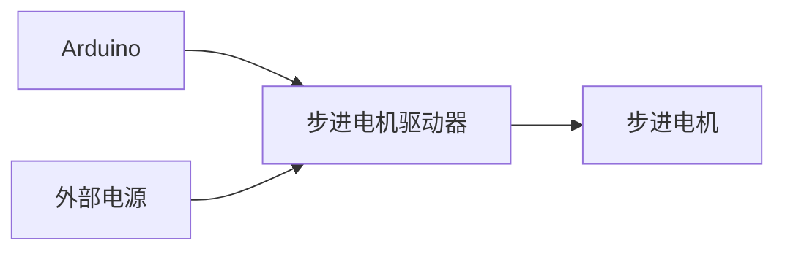

# Arduino 步进电机

步进电机是一种将电脉冲信号转换为角位移或线位移的电机。与普通直流电机不同，步进电机可以精确控制旋转角度和速度，因此在许多需要精确控制的场景中得到了广泛应用，例如3D打印机、CNC机床和机器人等。

## 步进电机的工作原理

步进电机通过接收电脉冲信号来逐步旋转。每个脉冲信号会使电机旋转一个固定的角度，称为“步距角”。步进电机的旋转方向、速度和位置可以通过控制脉冲信号的频率和顺序来实现。

步进电机通常分为两种类型：
1. **单极步进电机**：具有一个中心抽头的线圈，电流只能单向流动。
2. **双极步进电机**：具有两个独立的线圈，电流可以双向流动。

## 连接步进电机到Arduino

要控制步进电机，通常需要使用一个步进电机驱动器（如L298N或A4988）。驱动器的作用是将Arduino输出的低电流信号转换为步进电机所需的高电流信号。

### 连接示例
以下是一个典型的连接方式：
- 步进电机的线圈连接到驱动器的输出端。
- 驱动器的输入端连接到Arduino的数字引脚。
- 驱动器的电源端连接到外部电源（注意电压和电流要与步进电机匹配）。



## 控制步进电机的代码示例

以下是一个使用Arduino控制步进电机的简单示例。我们将使用`Stepper`库来控制步进电机。

```cpp
#include <Stepper.h>

// 定义步进电机的步数和引脚
const int stepsPerRevolution = 200;  // 步进电机每转的步数
Stepper myStepper(stepsPerRevolution, 8, 9, 10, 11);  // 连接到引脚8,9,10,11

void setup() {
  // 设置步进电机的速度（单位：RPM）
  myStepper.setSpeed(60);
}

void loop() {
  // 顺时针旋转一圈
  myStepper.step(stepsPerRevolution);
  delay(500);

  // 逆时针旋转一圈
  myStepper.step(-stepsPerRevolution);
  delay(500);
}
```

### 代码解释
1. **`Stepper`库**：Arduino的`Stepper`库简化了步进电机的控制。我们只需要指定步进电机的步数和连接的引脚即可。
2. **`setSpeed()`**：设置步进电机的旋转速度，单位为每分钟转数（RPM）。
3. **`step()`**：控制步进电机旋转指定的步数。正数表示顺时针旋转，负数表示逆时针旋转。

## 实际应用场景

步进电机在许多领域都有广泛应用，以下是一些常见的应用场景：

1. **3D打印机**：步进电机用于精确控制打印头的移动，确保打印精度。
2. **CNC机床**：步进电机用于控制刀具的移动，实现高精度的加工。
3. **机器人**：步进电机用于控制机器人的关节，实现精确的运动控制。

## 总结

步进电机是一种非常实用的执行器，特别适合需要精确控制的应用场景。通过Arduino和步进电机驱动器，我们可以轻松控制步进电机的旋转方向、速度和位置。希望本文能帮助你理解步进电机的基本原理，并激发你在项目中使用步进电机的兴趣。

## 附加资源与练习

- **练习**：尝试修改代码，使步进电机以不同的速度旋转，并观察电机的行为。
- **资源**：
  - [Arduino官方文档](https://www.arduino.cc/)
  - [步进电机驱动器的数据手册](https://example.com)

:::tip
如果你在项目中遇到问题，可以参考Arduino社区论坛或相关教程，获取更多帮助。
:::