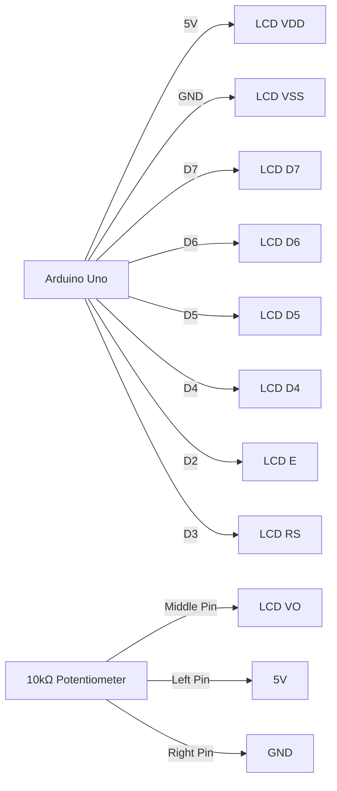

# Arduino LCD显示屏

LCD（液晶显示器）是Arduino项目中常用的输出设备，用于显示文本或简单的图形。它可以帮助你实时查看传感器数据、调试信息或其他重要内容。本文将带你从零开始学习如何使用Arduino控制LCD显示屏。

## 什么是LCD显示屏？

LCD显示屏是一种常见的电子显示设备，能够显示文本、数字或简单的图形。Arduino常用的LCD显示屏通常是16x2或20x4的字符型LCD，分别表示每行16个字符、共2行，或每行20个字符、共4行。

LCD显示屏通常通过并行接口或I2C接口与Arduino连接。本文将重点介绍并行接口的LCD显示屏。

## 所需材料

- Arduino开发板（如Arduino Uno）
- 16x2字符型LCD显示屏
- 10kΩ电位器（用于调节对比度）
- 连接线
- 面包板

## 连接LCD显示屏

LCD显示屏通常有16个引脚，但常用的只有以下引脚：

- VSS：接地（GND）
- VDD：接电源（5V）
- VO：对比度调节（接电位器中间引脚）
- RS：寄存器选择
- RW：读写控制（通常接地）
- E：使能引脚
- D4-D7：数据引脚
- A：背光正极（接5V）
- K：背光负极（接地）

以下是一个典型的连接示意图：



## 安装LiquidCrystal库

Arduino IDE自带了一个名为`LiquidCrystal`的库，用于控制LCD显示屏。你无需额外安装，只需在代码中引入即可。

```cpp
#include <LiquidCrystal.h>
```

## 初始化LCD显示屏

在代码中，首先需要初始化LCD显示屏。以下是一个简单的示例：

```cpp
#include <LiquidCrystal.h>

// 初始化LCD对象，指定引脚连接
LiquidCrystal lcd(3, 2, 7, 6, 5, 4);

void setup() {
  // 设置LCD的列数和行数（16列，2行）
  lcd.begin(16, 2);
  // 在LCD上显示一条消息
  lcd.print("Hello, World!");
}

void loop() {
  // 这里可以添加其他代码
}
```

### 代码解释

- `LiquidCrystal lcd(3, 2, 7, 6, 5, 4);`：初始化LCD对象，参数依次为RS、E、D4、D5、D6、D7引脚。
- `lcd.begin(16, 2);`：设置LCD的列数和行数。
- `lcd.print("Hello, World!");`：在LCD上显示文本。

## 显示动态内容

除了静态文本，你还可以显示动态内容，例如传感器数据。以下示例展示了如何显示一个不断增加的计数器：

```cpp
#include <LiquidCrystal.h>

LiquidCrystal lcd(3, 2, 7, 6, 5, 4);
int counter = 0;

void setup() {
  lcd.begin(16, 2);
  lcd.print("Counter:");
}

void loop() {
  // 将光标移动到第二行
  lcd.setCursor(0, 1);
  // 显示计数器的值
  lcd.print(counter);
  // 计数器加1
  counter++;
  // 延迟1秒
  delay(1000);
}
```

### 代码解释

- `lcd.setCursor(0, 1);`：将光标移动到第二行第一列。
- `lcd.print(counter);`：显示计数器的值。
- `delay(1000);`：延迟1秒，以便观察计数器的变化。

## 实际应用案例

### 温度监控系统

假设你有一个温度传感器连接到Arduino，你可以使用LCD显示屏实时显示温度数据。以下是一个简单的示例：

```cpp
#include <LiquidCrystal.h>

LiquidCrystal lcd(3, 2, 7, 6, 5, 4);

void setup() {
  lcd.begin(16, 2);
  lcd.print("Temperature:");
}

void loop() {
  // 读取模拟温度传感器数据（假设连接到A0）
  int sensorValue = analogRead(A0);
  // 将模拟值转换为温度（假设为简单的线性转换）
  float temperature = sensorValue * 0.48875;
  
  // 将光标移动到第二行
  lcd.setCursor(0, 1);
  // 显示温度值
  lcd.print(temperature);
  lcd.print(" C");
  
  // 延迟1秒
  delay(1000);
}
```

:::tip
在实际项目中，温度传感器的数据可能需要更复杂的校准和转换。这里仅展示了一个简单的示例。
:::

## 总结

通过本文，你学会了如何连接和控制Arduino LCD显示屏，并掌握了显示静态和动态内容的基本方法。LCD显示屏是Arduino项目中非常有用的工具，能够帮助你实时监控数据或显示调试信息。

## 附加资源与练习

1. **练习1**：尝试修改代码，使LCD显示屏显示两行不同的文本。
2. **练习2**：结合其他传感器（如湿度传感器），在LCD上显示更多环境数据。
3. **资源**：查阅Arduino官方文档，了解更多关于`LiquidCrystal`库的高级功能。

希望你能通过本文掌握LCD显示屏的使用，并在未来的项目中灵活应用！