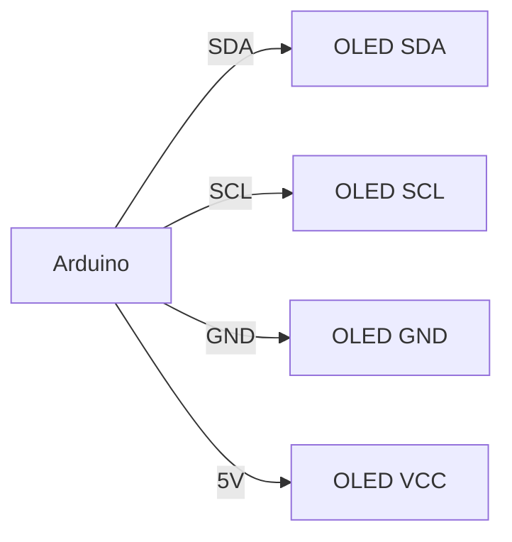

# Arduino OLED显示屏

OLED（Organic Light-Emitting Diode）显示屏是一种基于有机材料的发光二极管技术，具有高对比度、低功耗和快速响应的特点。在Arduino项目中，OLED显示屏常用于显示文本、图形或传感器数据。本文将带你从基础开始，逐步学习如何使用Arduino控制OLED显示屏。

## 什么是OLED显示屏？

OLED显示屏是一种自发光显示技术，每个像素点都可以独立发光，因此不需要背光。这使得OLED显示屏在显示黑色时能够完全关闭像素，从而实现极高的对比度。常见的OLED显示屏尺寸为0.96英寸，分辨率为128x64像素。

## 所需材料

- Arduino开发板（如Arduino Uno）
- 0.96英寸OLED显示屏（通常使用SSD1306驱动芯片）
- 杜邦线若干

## 连接OLED显示屏

OLED显示屏通常通过I2C或SPI接口与Arduino通信。本文以I2C接口为例。

### 接线图



### 连接步骤

1. 将OLED的SDA引脚连接到Arduino的A4引脚（或SDA引脚）。
2. 将OLED的SCL引脚连接到Arduino的A5引脚（或SCL引脚）。
3. 将OLED的GND引脚连接到Arduino的GND引脚。
4. 将OLED的VCC引脚连接到Arduino的5V引脚。

## 安装库

为了简化OLED显示屏的控制，我们可以使用`Adafruit SSD1306`和`Adafruit GFX`库。通过Arduino IDE的库管理器安装这两个库。

1. 打开Arduino IDE。
2. 点击`工具` -> `管理库`。
3. 搜索`Adafruit SSD1306`并安装。
4. 搜索`Adafruit GFX`并安装。

## 编写代码

以下是一个简单的示例代码，用于在OLED显示屏上显示“Hello, World!”。

```cpp
#include <Wire.h>
#include <Adafruit_GFX.h>
#include <Adafruit_SSD1306.h>

#define SCREEN_WIDTH 128
#define SCREEN_HEIGHT 64

Adafruit_SSD1306 display(SCREEN_WIDTH, SCREEN_HEIGHT, &Wire, -1);

void setup() {
  // 初始化OLED显示屏
  if(!display.begin(SSD1306_I2C_ADDRESS, 0x3C)) {
    Serial.println(F("SSD1306 allocation failed"));
    for(;;);
  }

  // 清屏
  display.clearDisplay();

  // 设置文本大小和颜色
  display.setTextSize(1);
  display.setTextColor(SSD1306_WHITE);

  // 设置光标位置
  display.setCursor(0, 0);

  // 显示文本
  display.println("Hello, World!");
  display.display();
}

void loop() {
  // 主循环中不需要执行任何操作
}
```

### 代码解释

1. **库引入**：我们引入了`Wire`、`Adafruit_GFX`和`Adafruit_SSD1306`库。
2. **显示屏初始化**：在`setup()`函数中，我们初始化了OLED显示屏，并检查是否成功连接。
3. **清屏**：使用`display.clearDisplay()`清空屏幕。
4. **设置文本**：我们设置了文本大小和颜色，并将光标定位到屏幕的左上角。
5. **显示文本**：使用`display.println()`显示“Hello, World!”，并通过`display.display()`将内容刷新到屏幕上。

## 实际应用案例

### 案例1：显示传感器数据

假设你有一个温度传感器连接到Arduino，你可以将读取的温度值显示在OLED屏幕上。

```cpp
#include <Wire.h>
#include <Adafruit_GFX.h>
#include <Adafruit_SSD1306.h>

#define SCREEN_WIDTH 128
#define SCREEN_HEIGHT 64

Adafruit_SSD1306 display(SCREEN_WIDTH, SCREEN_HEIGHT, &Wire, -1);

void setup() {
  // 初始化OLED显示屏
  if(!display.begin(SSD1306_I2C_ADDRESS, 0x3C)) {
    Serial.println(F("SSD1306 allocation failed"));
    for(;;);
  }

  // 清屏
  display.clearDisplay();

  // 设置文本大小和颜色
  display.setTextSize(1);
  display.setTextColor(SSD1306_WHITE);
}

void loop() {
  // 模拟读取温度传感器数据
  float temperature = readTemperature();

  // 清屏
  display.clearDisplay();

  // 设置光标位置
  display.setCursor(0, 0);

  // 显示温度数据
  display.print("Temperature: ");
  display.print(temperature);
  display.print(" C");
  display.display();

  delay(1000); // 每秒更新一次
}

float readTemperature() {
  // 模拟读取温度传感器数据
  return 25.0 + (random(100) / 100.0); // 返回一个随机温度值
}
```

### 案例2：显示图形

你还可以在OLED屏幕上绘制简单的图形，如线条、矩形或圆形。

```cpp
#include <Wire.h>
#include <Adafruit_GFX.h>
#include <Adafruit_SSD1306.h>

#define SCREEN_WIDTH 128
#define SCREEN_HEIGHT 64

Adafruit_SSD1306 display(SCREEN_WIDTH, SCREEN_HEIGHT, &Wire, -1);

void setup() {
  // 初始化OLED显示屏
  if(!display.begin(SSD1306_I2C_ADDRESS, 0x3C)) {
    Serial.println(F("SSD1306 allocation failed"));
    for(;;);
  }

  // 清屏
  display.clearDisplay();

  // 绘制矩形
  display.drawRect(10, 10, 50, 30, SSD1306_WHITE);

  // 绘制圆形
  display.drawCircle(64, 32, 15, SSD1306_WHITE);

  // 显示图形
  display.display();
}

void loop() {
  // 主循环中不需要执行任何操作
}
```

## 总结

通过本文，你已经学会了如何使用Arduino控制OLED显示屏。我们从基础概念开始，逐步讲解了如何连接硬件、安装库、编写代码以及实际应用案例。OLED显示屏在Arduino项目中非常实用，可以用于显示传感器数据、图形或简单的用户界面。

## 附加资源与练习

- **练习1**：尝试修改代码，使OLED显示屏显示当前时间（可以使用RTC模块）。
- **练习2**：结合多个传感器，设计一个多数据显示界面。
- **资源**：参考[Adafruit SSD1306库文档](https://learn.adafruit.com/monochrome-oled-breakouts)了解更多高级功能。

:::tip
如果你在项目中遇到问题，可以访问Arduino官方论坛或Adafruit社区寻求帮助。
:::