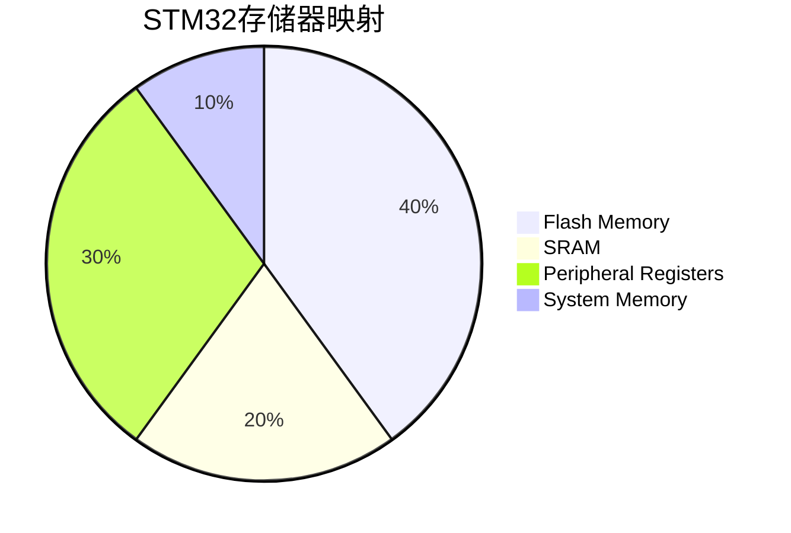

## 介绍

STM32微控制器是基于ARM Cortex-M内核的嵌入式系统，其存储器映射是理解和使用STM32的关键概念之一。存储器映射定义了微控制器中各种存储器区域（如Flash、SRAM、外设寄存器等）在地址空间中的分布。通过了解存储器映射，开发者可以有效地访问和管理这些资源。

## 存储器映射概述

STM32的存储器映射将整个地址空间划分为多个区域，每个区域对应不同的功能模块。以下是一个典型的STM32存储器映射结构：



### 主要存储器区域

1. **Flash Memory**：用于存储程序代码和常量数据。STM32的Flash存储器通常位于地址空间的起始位置。
2. **SRAM**：用于存储运行时数据，如变量和堆栈。SRAM通常位于Flash存储器之后。
3. **Peripheral Registers**：用于控制和配置外设的寄存器。这些寄存器通常位于地址空间的高位。
4. **System Memory**：包含系统启动代码和其他系统级功能。

## 访问存储器

在STM32中，存储器访问是通过地址进行的。开发者可以通过指针直接访问存储器地址。以下是一个简单的代码示例，展示如何访问SRAM中的变量：

```c
#include <stdint.h>

#define SRAM_START 0x20000000

int main(void) {
    uint32_t *sram_ptr = (uint32_t *)SRAM_START;
    *sram_ptr = 0xDEADBEEF;  // 将0xDEADBEEF写入SRAM的起始地址
    return 0;
}
```

:::note
在STM32中，直接操作存储器地址需要谨慎，确保访问的地址是有效的，并且不会覆盖重要的数据。
:::

## 实际案例

假设我们需要配置STM32的GPIO端口，可以通过访问外设寄存器来实现。以下是一个配置GPIOA端口为输出模式的示例：

```c
#include <stdint.h>

#define GPIOA_BASE 0x40020000
#define GPIOA_MODER (*(volatile uint32_t *)(GPIOA_BASE + 0x00))

int main(void) {
    // 配置GPIOA的第5引脚为输出模式
    GPIOA_MODER &= ~(0x3 << (5 * 2));  // 清除模式位
    GPIOA_MODER |= (0x1 << (5 * 2));    // 设置为输出模式
    return 0;
}
```

:::tip
在实际开发中，建议使用STM32提供的标准外设库（如HAL库）来简化外设配置，避免直接操作寄存器。
:::

## 总结

STM32的存储器映射是理解和使用STM32微控制器的基础。通过掌握存储器映射，开发者可以有效地访问和管理Flash、SRAM和外设寄存器等资源。在实际开发中，合理使用存储器映射和外设寄存器可以显著提高代码的效率和可靠性。

## 附加资源

- [STM32参考手册](https://www.st.com/resource/en/reference_manual/dm00031020-stm32f405-415-stm32f407-417-stm32f427-437-and-stm32f429-439-advanced-arm-based-32-bit-mcus-stmicroelectronics.pdf)
- [ARM Cortex-M编程指南](https://developer.arm.com/documentation/den0013/d)

## 练习

1. 编写一个程序，将SRAM中的某个地址的值读取并打印出来。
2. 使用外设寄存器配置GPIOB的第10引脚为输入模式，并读取其状态。
