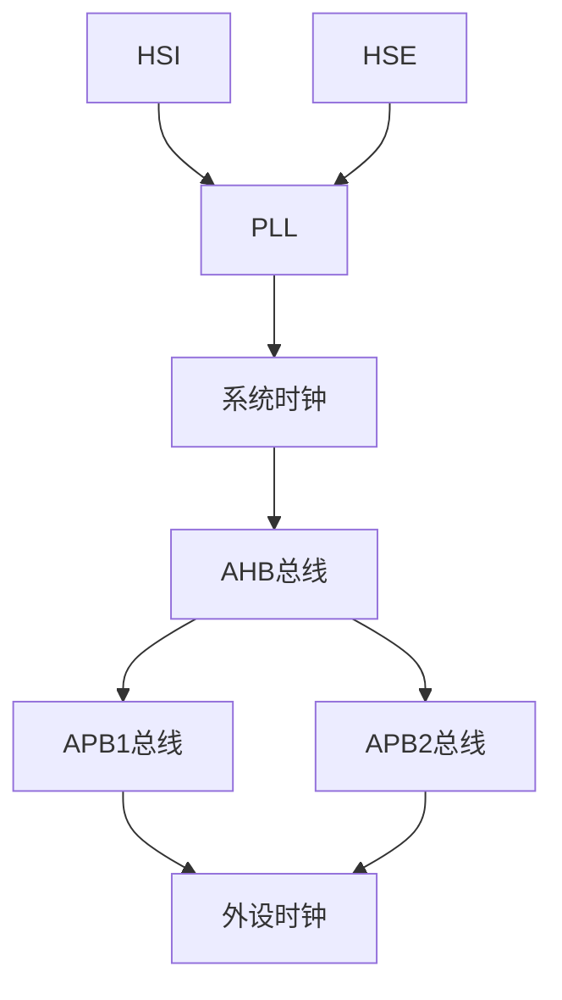

# STM32 时钟系统

STM32微控制器的时钟系统是其核心功能之一，它为CPU、外设和存储器提供精确的时钟信号。理解时钟系统的工作原理对于优化性能和功耗至关重要。本文将逐步讲解STM32的时钟系统，并通过代码示例和实际案例帮助你掌握这一概念。

## 1. 时钟系统简介

STM32的时钟系统由多个时钟源和分频器组成，用于生成不同频率的时钟信号。这些信号驱动CPU、外设和存储器，确保它们能够正常工作。STM32的时钟系统具有高度的灵活性，允许开发者根据需求配置不同的时钟源和频率。

### 主要时钟源
- **HSI（高速内部时钟）**：内部RC振荡器，频率通常为8MHz。
- **HSE（高速外部时钟）**：外部晶体振荡器或时钟信号，频率通常为4-25MHz。
- **LSI（低速内部时钟）**：内部RC振荡器，频率通常为32kHz，用于低功耗模式。
- **LSE（低速外部时钟）**：外部晶体振荡器，频率通常为32.768kHz，用于实时时钟（RTC）。

## 2. 时钟树结构

STM32的时钟系统可以看作一棵“时钟树”，从时钟源开始，经过分频器和倍频器，最终生成各种时钟信号。以下是一个简化的时钟树结构：



### 关键组件
- **PLL（锁相环）**：用于倍频时钟信号，生成更高的频率。
- **AHB总线**：高速总线，连接CPU和存储器。
- **APB总线**：低速总线，连接外设。

## 3. 配置时钟系统

STM32的时钟系统可以通过寄存器或HAL库进行配置。以下是一个使用HAL库配置系统时钟的示例：

```c
#include "stm32f4xx_hal.h"

void SystemClock_Config(void) {
    RCC_OscInitTypeDef RCC_OscInitStruct = {0};
    RCC_ClkInitTypeDef RCC_ClkInitStruct = {0};

    // 配置HSE和PLL
    RCC_OscInitStruct.OscillatorType = RCC_OSCILLATORTYPE_HSE;
    RCC_OscInitStruct.HSEState = RCC_HSE_ON;
    RCC_OscInitStruct.PLL.PLLState = RCC_PLL_ON;
    RCC_OscInitStruct.PLL.PLLSource = RCC_PLLSOURCE_HSE;
    RCC_OscInitStruct.PLL.PLLM = 8;
    RCC_OscInitStruct.PLL.PLLN = 336;
    RCC_OscInitStruct.PLL.PLLP = RCC_PLLP_DIV2;
    RCC_OscInitStruct.PLL.PLLQ = 7;
    HAL_RCC_OscConfig(&RCC_OscInitStruct);

    // 配置系统时钟
    RCC_ClkInitStruct.ClockType = RCC_CLOCKTYPE_HCLK | RCC_CLOCKTYPE_SYSCLK
                                  | RCC_CLOCKTYPE_PCLK1 | RCC_CLOCKTYPE_PCLK2;
    RCC_ClkInitStruct.SYSCLKSource = RCC_SYSCLKSOURCE_PLLCLK;
    RCC_ClkInitStruct.AHBCLKDivider = RCC_SYSCLK_DIV1;
    RCC_ClkInitStruct.APB1CLKDivider = RCC_HCLK_DIV4;
    RCC_ClkInitStruct.APB2CLKDivider = RCC_HCLK_DIV2;
    HAL_RCC_ClockConfig(&RCC_ClkInitStruct, FLASH_LATENCY_5);
}
```

:::tip
在实际项目中，建议使用STM32CubeMX工具生成时钟配置代码，以减少手动配置的错误。
:::

## 4. 实际应用案例

### 案例：配置STM32F4的时钟系统以驱动LED闪烁

假设我们需要配置STM32F4的时钟系统，使其以84MHz的频率运行，并驱动一个LED以1Hz的频率闪烁。以下是实现步骤：

1. **配置时钟系统**：使用HSE和PLL生成84MHz的系统时钟。
2. **配置GPIO**：将LED连接的GPIO引脚配置为输出模式。
3. **编写主程序**：在主循环中控制LED的闪烁。

```c
#include "stm32f4xx_hal.h"

void SystemClock_Config(void);
void GPIO_Init(void);

int main(void) {
    HAL_Init();
    SystemClock_Config();
    GPIO_Init();

    while (1) {
        HAL_GPIO_TogglePin(GPIOA, GPIO_PIN_5);
        HAL_Delay(500); // 500ms延迟
    }
}

void GPIO_Init(void) {
    __HAL_RCC_GPIOA_CLK_ENABLE();
    GPIO_InitTypeDef GPIO_InitStruct = {0};
    GPIO_InitStruct.Pin = GPIO_PIN_5;
    GPIO_InitStruct.Mode = GPIO_MODE_OUTPUT_PP;
    GPIO_InitStruct.Pull = GPIO_NOPULL;
    GPIO_InitStruct.Speed = GPIO_SPEED_FREQ_LOW;
    HAL_GPIO_Init(GPIOA, &GPIO_InitStruct);
}
```

:::note
在实际应用中，确保时钟配置正确，否则可能导致系统无法正常工作。
:::

## 5. 总结

STM32的时钟系统是其核心功能之一，理解其工作原理对于优化性能和功耗至关重要。本文介绍了STM32的时钟源、时钟树结构、配置方法以及实际应用案例。通过本文的学习，你应该能够配置STM32的时钟系统，并应用于实际项目中。

## 6. 附加资源与练习

- **练习**：尝试使用不同的时钟源（如HSI和LSI）配置STM32的时钟系统，并观察系统行为的变化。
- **资源**：参考STM32官方文档和HAL库手册，深入了解时钟系统的更多细节。

:::caution
在配置时钟系统时，务必注意时钟频率的限制，避免超出芯片的额定工作频率。
:::