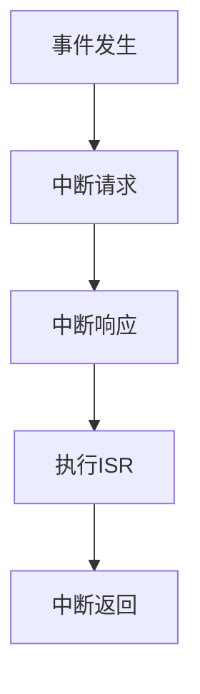

# STM32 中断概念

## 介绍

在嵌入式系统中，中断是一种非常重要的机制，它允许微控制器在执行主程序的同时，能够及时响应外部或内部事件。STM32微控制器中的中断机制使得系统能够高效地处理实时任务，例如按键输入、定时器溢出、通信数据接收等。

中断的核心思想是：当某个特定事件发生时，微控制器会暂停当前正在执行的程序，转而去执行与该事件相关的中断服务程序（ISR），执行完毕后再返回到原来的程序继续执行。

## 中断的工作原理

### 中断的基本流程

1. **事件发生**：某个外部或内部事件触发中断请求（例如按键按下、定时器溢出等）。
2. **中断请求**：中断请求被发送到中断控制器（NVIC，Nested Vectored Interrupt Controller）。
3. **中断响应**：如果中断被使能且优先级允许，微控制器会暂停当前任务，保存当前上下文（如程序计数器、寄存器等）。
4. **执行中断服务程序（ISR）**：微控制器跳转到预先定义的中断服务程序并执行。
5. **中断返回**：中断服务程序执行完毕后，恢复之前保存的上下文，继续执行主程序。



### 中断优先级

STM32的中断控制器（NVIC）支持多级优先级。每个中断源都可以配置一个优先级，优先级高的中断可以打断优先级低的中断。优先级分为抢占优先级和子优先级，抢占优先级高的中断可以打断正在执行的低优先级中断。

## 配置STM32中断

### 1. 使能中断源

首先，需要使能具体的外设中断。例如，如果要使用外部中断（EXTI），需要配置GPIO引脚并启用EXTI中断。

```c
// 使能GPIO时钟
RCC_APB2PeriphClockCmd(RCC_APB2Periph_GPIOA, ENABLE);

// 配置GPIO引脚为输入模式
GPIO_InitTypeDef GPIO_InitStruct;
GPIO_InitStruct.GPIO_Pin = GPIO_Pin_0;
GPIO_InitStruct.GPIO_Mode = GPIO_Mode_IPU; // 上拉输入
GPIO_InitStruct.GPIO_Speed = GPIO_Speed_50MHz;
GPIO_Init(GPIOA, &GPIO_InitStruct);

// 配置EXTI中断
EXTI_InitTypeDef EXTI_InitStruct;
EXTI_InitStruct.EXTI_Line = EXTI_Line0;
EXTI_InitStruct.EXTI_Mode = EXTI_Mode_Interrupt;
EXTI_InitStruct.EXTI_Trigger = EXTI_Trigger_Falling; // 下降沿触发
EXTI_InitStruct.EXTI_LineCmd = ENABLE;
EXTI_Init(&EXTI_InitStruct);
```

### 2. 配置NVIC

接下来，需要配置NVIC以启用中断并设置优先级。

```c
// 配置NVIC
NVIC_InitTypeDef NVIC_InitStruct;
NVIC_InitStruct.NVIC_IRQChannel = EXTI0_IRQn; // 外部中断0
NVIC_InitStruct.NVIC_IRQChannelPreemptionPriority = 0; // 抢占优先级
NVIC_InitStruct.NVIC_IRQChannelSubPriority = 0; // 子优先级
NVIC_InitStruct.NVIC_IRQChannelCmd = ENABLE;
NVIC_Init(&NVIC_InitStruct);
```

### 3. 编写中断服务程序（ISR）

最后，编写中断服务程序来处理中断事件。

```c
void EXTI0_IRQHandler(void) {
    if (EXTI_GetITStatus(EXTI_Line0) != RESET) {
        // 处理中断事件
        // 例如，点亮LED
        GPIO_SetBits(GPIOC, GPIO_Pin_13);

        // 清除中断标志
        EXTI_ClearITPendingBit(EXTI_Line0);
    }
}
```

## 实际应用案例

### 按键中断控制LED

假设我们有一个按键连接到GPIOA的引脚0，并且我们希望当按键按下时，点亮连接到GPIOC引脚13的LED。

1. **配置GPIO和EXTI**：如上文所示，配置GPIOA的引脚0为输入模式，并启用EXTI中断。
2. **配置NVIC**：启用EXTI0中断并设置优先级。
3. **编写ISR**：在中断服务程序中，点亮LED并清除中断标志。

```c
void EXTI0_IRQHandler(void) {
    if (EXTI_GetITStatus(EXTI_Line0) != RESET) {
        // 点亮LED
        GPIO_SetBits(GPIOC, GPIO_Pin_13);

        // 清除中断标志
        EXTI_ClearITPendingBit(EXTI_Line0);
    }
}
```

:::tip
在实际应用中，为了避免按键抖动，可以在ISR中加入延时或使用硬件去抖动电路。
:::

## 总结

中断是STM32微控制器中非常重要的机制，它使得系统能够高效地响应外部或内部事件。通过合理配置中断优先级和编写中断服务程序，可以实现复杂的实时任务处理。

### 附加资源

- [STM32官方参考手册](https://www.st.com/resource/en/reference_manual/dm00031020-stm32f405-415-stm32f407-417-stm32f427-437-and-stm32f429-439-advanced-arm-based-32-bit-mcus-stmicroelectronics.pdf)
- [STM32 NVIC配置指南](https://www.st.com/content/st_com/en/support/learning/stm32-education/stm32-nvic.html)

### 练习

1. 尝试配置一个定时器中断，每隔1秒钟点亮一次LED。
2. 修改按键中断程序，使得每次按键按下时，LED的状态切换（点亮或熄灭）。

:::caution
在编写中断服务程序时，尽量避免长时间的操作，以免影响系统的实时性。
:::