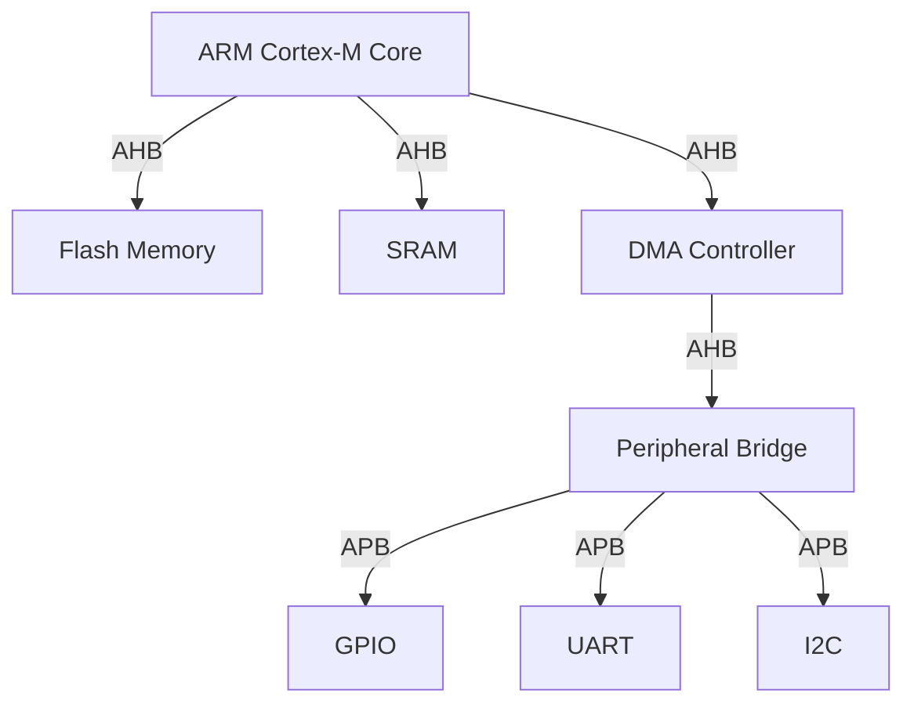

## 介绍

STM32微控制器是基于ARM Cortex-M内核的高性能嵌入式处理器，广泛应用于工业控制、消费电子、物联网等领域。STM32的总线系统是其硬件架构的核心部分，负责连接处理器内核、存储器、外设等模块，确保数据的高效传输。理解STM32的总线系统对于优化程序性能和硬件设计至关重要。

本文将详细介绍STM32的总线系统，包括AHB（高级高性能总线）、APB（高级外设总线）等，并通过实际案例展示其应用。

---

## STM32 总线系统概述

STM32的总线系统采用分层架构，主要包括以下几种总线：

1. **AHB（Advanced High-performance Bus）**：用于连接高性能模块，如处理器内核、DMA控制器、Flash存储器等。
2. **APB（Advanced Peripheral Bus）**：用于连接低速外设，如GPIO、UART、I2C等。
3. **AXI（Advanced eXtensible Interface）**：在某些高端STM32型号中使用，提供更高的带宽和灵活性。

以下是一个简化的STM32总线系统架构图：



---

## AHB总线

AHB总线是STM32中最高性能的总线，主要用于连接处理器内核和高带宽外设。它的特点包括：

- **高带宽**：支持多主设备并行访问。
- **低延迟**：通过流水线技术提高数据传输效率。
- **多主设备支持**：允许多个主设备（如DMA控制器和处理器内核）同时访问总线。

### 示例：AHB总线上的数据传输

以下是一个简单的代码示例，展示如何通过AHB总线访问Flash存储器：

```c
#include "stm32f4xx.h"

int main(void) {
    uint32_t *flash_address = (uint32_t *)0x08000000; // Flash起始地址
    uint32_t data = *flash_address; // 通过AHB总线读取数据
    return 0;
}
```

:::note
在实际开发中，直接操作硬件地址需要谨慎，建议使用STM32 HAL库或LL库提供的API。
:::

---

## APB总线

APB总线用于连接低速外设，如GPIO、UART、I2C等。它的特点包括：

- **低功耗**：适合连接低速外设。
- **简单协议**：易于实现和调试。
- **分频支持**：可以通过配置时钟分频器降低总线频率。

### 示例：APB总线上的GPIO配置

以下是一个通过APB总线配置GPIO的代码示例：

```c
#include "stm32f4xx.h"

int main(void) {
    RCC->AHB1ENR |= RCC_AHB1ENR_GPIOAEN; // 使能GPIOA时钟
    GPIOA->MODER &= ~(3 << (2 * 5));     // 配置PA5为输出模式
    GPIOA->MODER |= (1 << (2 * 5));
    GPIOA->ODR |= (1 << 5);              // 设置PA5为高电平
    return 0;
}
```

:::tip
使用STM32 HAL库可以简化外设配置，例如 `HAL_GPIO_WritePin(GPIOA, GPIO_PIN_5, GPIO_PIN_SET)`。
:::

---

## 实际案例：UART通信

以下是一个通过APB总线实现UART通信的案例：

```c
#include "stm32f4xx.h"

void UART_Init(void) {
    RCC->APB2ENR |= RCC_APB2ENR_USART1EN; // 使能USART1时钟
    USART1->BRR = 0x0683;                 // 配置波特率为9600
    USART1->CR1 |= USART_CR1_TE | USART_CR1_UE; // 使能发送和UART
}

void UART_SendChar(char ch) {
    while (!(USART1->SR & USART_SR_TXE)); // 等待发送缓冲区为空
    USART1->DR = ch;                      // 发送字符
}

int main(void) {
    UART_Init();
    UART_SendChar('H');
    UART_SendChar('i');
    return 0;
}
```

:::caution
在实际项目中，建议使用中断或DMA实现UART通信，以提高效率。
:::

---

## 总结

STM32的总线系统是其硬件架构的核心，理解AHB和APB总线的作用对于优化程序性能和硬件设计至关重要。通过本文的学习，你应该能够：

1. 区分AHB和APB总线的特点。
2. 掌握如何通过总线访问存储器和外设。
3. 在实际项目中应用总线系统。

---

## 附加资源

- [STM32参考手册](https://www.st.com/resource/en/reference_manual/dm00031020-stm32f405-415-stm32f407-417-stm32f427-437-and-stm32f429-439-advanced-arm-based-32-bit-mcus-stmicroelectronics.pdf)
- [STM32 HAL库文档](https://www.st.com/en/embedded-software/stm32cube-mcu-mpu-packages.html)

---

## 练习

1. 修改UART通信示例，使其能够接收数据并回显。
2. 尝试通过AHB总线访问SRAM，并验证数据的正确性。
3. 研究STM32的DMA控制器，并编写一个通过DMA传输数据的程序。