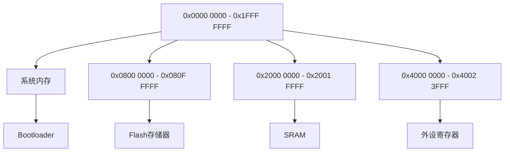

## 介绍

STM32微控制器是嵌入式系统中广泛使用的芯片系列之一。了解其内存组织是开发高效嵌入式应用程序的关键。STM32的内存组织主要包括Flash存储器、SRAM和寄存器。本文将逐步讲解这些部分的功能和布局，并通过实际案例帮助你理解其应用场景。

## STM32 内存布局

STM32的内存布局可以分为以下几个主要部分：

1. **Flash存储器**：用于存储程序代码和常量数据。
2. **SRAM**：用于存储运行时数据和堆栈。
3. **寄存器**：用于配置和控制外设。

### Flash存储器

Flash存储器是STM32中用于存储程序代码和常量数据的主要部分。它通常位于内存映射的起始位置（0x0800 0000）。Flash存储器的容量因芯片型号而异，从几十KB到几MB不等。

:::note
Flash存储器的访问速度较慢，因此通常用于存储不需要频繁修改的数据。
:::

### SRAM

SRAM（静态随机存取存储器）是STM32中用于存储运行时数据和堆栈的部分。它通常位于内存映射的中间位置（0x2000 0000）。SRAM的容量也因芯片型号而异，从几KB到几百KB不等。

:::tip
SRAM的访问速度较快，适合存储需要频繁修改的数据。
:::

### 寄存器

寄存器是STM32中用于配置和控制外设的特殊内存区域。它们通常位于内存映射的高地址区域（0x4000 0000）。每个外设都有一组专用的寄存器，用于配置其工作模式和状态。

:::caution
直接操作寄存器需要谨慎，错误的配置可能导致系统不稳定或外设无法正常工作。
:::

## 内存映射示例

以下是一个典型的STM32内存映射示例：



## 实际案例

假设我们需要在STM32中配置一个GPIO引脚为输出模式，并将其设置为高电平。以下是一个简单的代码示例：

```c
#include "stm32f4xx.h"

int main(void) {
    // 启用GPIOA外设时钟
    RCC->AHB1ENR |= RCC_AHB1ENR_GPIOAEN;

    // 配置PA5引脚为输出模式
    GPIOA->MODER &= ~(3 << (5 * 2)); // 清除模式位
    GPIOA->MODER |= (1 << (5 * 2));  // 设置为输出模式

    // 设置PA5引脚为高电平
    GPIOA->BSRR = (1 << 5);

    while (1) {
        // 主循环
    }
}
```

### 代码解释

1. **启用GPIOA外设时钟**：通过设置`RCC->AHB1ENR`寄存器的`GPIOAEN`位，启用GPIOA外设的时钟。
2. **配置PA5引脚为输出模式**：通过设置`GPIOA->MODER`寄存器的相应位，将PA5引脚配置为输出模式。
3. **设置PA5引脚为高电平**：通过设置`GPIOA->BSRR`寄存器的相应位，将PA5引脚设置为高电平。

## 总结

STM32的内存组织是嵌入式开发中的基础概念。通过了解Flash存储器、SRAM和寄存器的布局与功能，你可以更好地理解和控制STM32微控制器。本文通过清晰的解释和实际案例，帮助你掌握了STM32的内存架构。

## 附加资源

- [STM32参考手册](https://www.st.com/content/st_com/en/products/microcontrollers-microprocessors/stm32-32-bit-arm-cortex-mcus.html)
- [STM32CubeMX](https://www.st.com/en/development-tools/stm32cubemx.html)
- [ARM Cortex-M系列编程指南](https://developer.arm.com/documentation/den0013/d)

## 练习

1. 修改上述代码，将PA5引脚配置为输入模式，并读取其状态。
2. 尝试使用不同的GPIO引脚，配置为不同的模式（输入、输出、复用功能等）。
3. 研究STM32的内存映射图，找出其他外设的寄存器地址，并尝试配置它们。

通过完成这些练习，你将更深入地理解STM32的内存组织和外设配置。