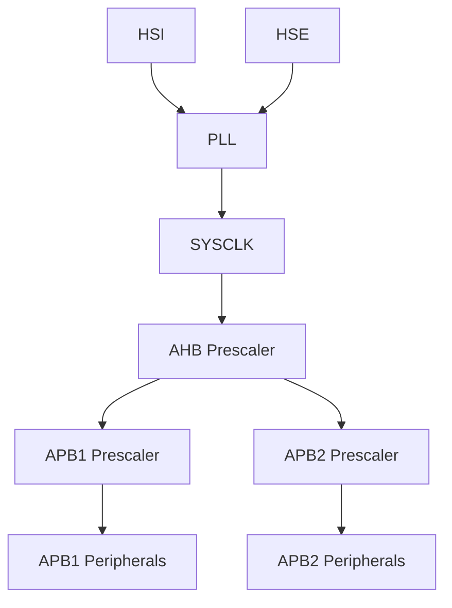

# STM32 时钟树

## 介绍

在STM32微控制器中，时钟树（Clock Tree）是一个非常重要的概念。它决定了系统中各个模块的时钟来源和频率分配。理解时钟树的结构和配置方法，对于优化系统性能和降低功耗至关重要。

## 时钟树的基本结构

STM32的时钟树由多个时钟源、分频器、倍频器和多路选择器组成。以下是时钟树的主要组成部分：

1. **时钟源**：包括内部高速时钟（HSI）、外部高速时钟（HSE）、内部低速时钟（LSI）和外部低速时钟（LSE）。
2. **分频器和倍频器**：用于调整时钟频率。
3. **多路选择器**：用于选择不同的时钟源。



## 时钟配置示例

以下是一个简单的时钟配置示例，展示了如何将HSE作为系统时钟源，并通过PLL倍频到72MHz。

```c
#include "stm32f10x.h"

void SystemClock_Config(void) {
    // 使能HSE
    RCC->CR |= RCC_CR_HSEON;
    while (!(RCC->CR & RCC_CR_HSERDY));

    // 配置PLL
    RCC->CFGR |= RCC_CFGR_PLLSRC_HSE | RCC_CFGR_PLLMULL9;
    RCC->CR |= RCC_CR_PLLON;
    while (!(RCC->CR & RCC_CR_PLLRDY));

    // 选择PLL作为系统时钟源
    RCC->CFGR |= RCC_CFGR_SW_PLL;
    while ((RCC->CFGR & RCC_CFGR_SWS) != RCC_CFGR_SWS_PLL);

    // 配置AHB、APB1和APB2分频器
    RCC->CFGR |= RCC_CFGR_HPRE_DIV1 | RCC_CFGR_PPRE1_DIV2 | RCC_CFGR_PPRE2_DIV1;
}

int main(void) {
    SystemClock_Config();
    while (1) {
        // 主循环
    }
}
```

## 实际应用场景

在实际应用中，时钟配置通常用于以下场景：

1. **高性能需求**：通过PLL倍频提高系统时钟频率，以满足高性能计算需求。
2. **低功耗模式**：通过降低时钟频率或切换到低速时钟源，以降低功耗。
3. **外设时钟管理**：为不同的外设配置不同的时钟频率，以优化系统性能。

:::tip
在配置时钟时，务必参考STM32的参考手册，确保时钟频率不超过芯片的最大工作频率。
:::

## 总结

STM32的时钟树是一个复杂但非常重要的系统。通过合理配置时钟树，可以显著提高系统性能和降低功耗。希望本文能帮助你理解STM32时钟树的基本结构和配置方法。

## 附加资源

- [STM32参考手册](https://www.st.com/resource/en/reference_manual/dm00031020-stm32f405-415-stm32f407-417-stm32f427-437-and-stm32f429-439-advanced-arm-based-32-bit-mcus-stmicroelectronics.pdf)
- [STM32CubeMX](https://www.st.com/en/development-tools/stm32cubemx.html)：一个图形化工具，可以帮助你快速配置STM32的时钟树。

## 练习

1. 尝试修改上述代码，将系统时钟配置为48MHz。
2. 使用STM32CubeMX工具生成一个时钟配置代码，并分析其生成的代码结构。
