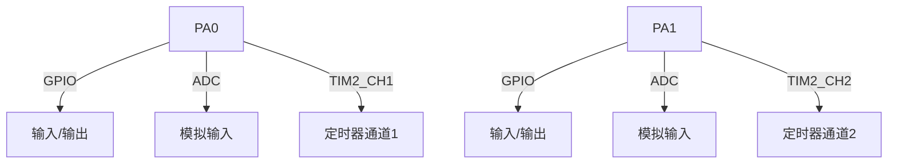

## 介绍

STM32微控制器是嵌入式系统中广泛使用的芯片之一，其引脚定义是硬件开发的基础。每个引脚都有特定的功能，例如通用输入输出（GPIO）、串行通信接口（UART）、模拟输入（ADC）等。理解引脚定义对于正确配置和使用STM32至关重要。

## STM32 引脚的基本概念

STM32的引脚通常分为以下几类：

1. **电源引脚**：用于供电和接地。
2. **GPIO引脚**：通用输入输出引脚，可以配置为输入或输出。
3. **外设引脚**：用于连接特定的外设，如UART、SPI、I2C等。
4. **调试引脚**：用于调试和编程，如SWD、JTAG。

## 引脚功能复用

STM32的引脚通常具有多种功能，这称为引脚复用。通过配置寄存器，可以将引脚设置为不同的功能。例如，一个引脚可以配置为GPIO、UART TX或SPI MOSI。

```c
// 示例：配置PA2引脚为UART2 TX
RCC->APB1ENR |= RCC_APB1ENR_USART2EN; // 使能USART2时钟
GPIOA->MODER &= ~(3 << (2 * 2));     // 清除PA2的模式
GPIOA->MODER |= (2 << (2 * 2));      // 设置PA2为复用模式
GPIOA->AFR[0] |= (7 << (2 * 4));     // 设置PA2的复用功能为USART2 TX
```

## 实际案例：配置LED闪烁

假设我们有一个连接到PA5引脚的LED，我们可以通过配置该引脚为GPIO输出模式来控制LED的闪烁。

```c
// 示例：配置PA5引脚为GPIO输出模式
RCC->AHB1ENR |= RCC_AHB1ENR_GPIOAEN; // 使能GPIOA时钟
GPIOA->MODER &= ~(3 << (5 * 2));     // 清除PA5的模式
GPIOA->MODER |= (1 << (5 * 2));      // 设置PA5为输出模式

// 控制LED闪烁
while (1) {
    GPIOA->ODR ^= (1 << 5);          // 切换PA5的状态
    for (int i = 0; i < 1000000; i++); // 简单延时
}
```

## 引脚定义表

以下是一个简单的STM32引脚定义表示例：



## 总结

STM32的引脚定义是硬件开发的基础，理解每个引脚的功能及其复用方式对于正确配置和使用STM32至关重要。通过实际案例和代码示例，我们可以更好地掌握引脚配置的方法。

## 附加资源

- [STM32参考手册](https://www.st.com/resource/en/reference_manual/dm00031020-stm32f405-415-stm32f407-417-stm32f427-437-and-stm32f429-439-advanced-arm-based-32-bit-mcus-stmicroelectronics.pdf)
- [STM32CubeMX](https://www.st.com/en/development-tools/stm32cubemx.html) - 用于配置STM32引脚和生成初始化代码的工具。

## 练习

1. 尝试将PA6引脚配置为PWM输出，并控制LED的亮度。
2. 使用STM32CubeMX工具生成一个简单的GPIO配置代码，并在开发板上验证其功能。
