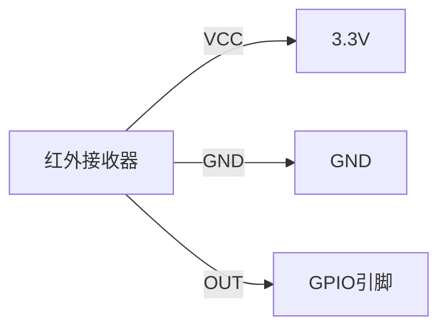

# STM32 红外接收器

## 介绍

红外接收器是一种常见的外设，用于接收来自红外遥控器的信号。STM32微控制器可以通过其GPIO引脚和定时器外设来解码这些信号，从而实现遥控功能。本文将详细介绍如何在STM32上使用红外接收器，包括硬件连接、代码实现和实际应用场景。

## 硬件连接

红外接收器通常有三个引脚：VCC、GND和OUT。VCC连接到STM32的3.3V电源，GND连接到地，OUT连接到STM32的一个GPIO引脚。为了减少噪声干扰，建议在VCC和GND之间添加一个0.1µF的电容。



## 代码实现

### 初始化GPIO

首先，我们需要初始化用于接收红外信号的GPIO引脚。以下是一个简单的初始化代码示例：

```c
#include "stm32f4xx.h"

void IR_Receiver_Init(void) {
    // 使能GPIO时钟
    RCC_AHB1PeriphClockCmd(RCC_AHB1Periph_GPIOA, ENABLE);

    // 配置GPIO引脚为输入模式
    GPIO_InitTypeDef GPIO_InitStruct;
    GPIO_InitStruct.GPIO_Pin = GPIO_Pin_0;
    GPIO_InitStruct.GPIO_Mode = GPIO_Mode_IN;
    GPIO_InitStruct.GPIO_PuPd = GPIO_PuPd_NOPULL;
    GPIO_Init(GPIOA, &GPIO_InitStruct);
}
```

### 解码红外信号

红外信号通常使用脉冲宽度调制（PWM）编码。我们可以使用STM32的定时器来测量脉冲宽度，从而解码信号。以下是一个简单的解码代码示例：

```c
#include "stm32f4xx.h"
#include "stm32f4xx_tim.h"

void TIM2_IRQHandler(void) {
    if (TIM_GetITStatus(TIM2, TIM_IT_Update) != RESET) {
        // 处理红外信号
        TIM_ClearITPendingBit(TIM2, TIM_IT_Update);
    }
}

void IR_Receiver_Decode(void) {
    // 使能TIM2时钟
    RCC_APB1PeriphClockCmd(RCC_APB1Periph_TIM2, ENABLE);

    // 配置TIM2
    TIM_TimeBaseInitTypeDef TIM_TimeBaseStruct;
    TIM_TimeBaseStruct.TIM_Period = 0xFFFF;
    TIM_TimeBaseStruct.TIM_Prescaler = 84 - 1; // 1MHz时钟
    TIM_TimeBaseStruct.TIM_ClockDivision = 0;
    TIM_TimeBaseStruct.TIM_CounterMode = TIM_CounterMode_Up;
    TIM_TimeBaseInit(TIM2, &TIM_TimeBaseStruct);

    // 使能TIM2中断
    TIM_ITConfig(TIM2, TIM_IT_Update, ENABLE);
    NVIC_EnableIRQ(TIM2_IRQn);

    // 启动TIM2
    TIM_Cmd(TIM2, ENABLE);
}
```

### 实际应用场景

红外接收器广泛应用于家电遥控、智能家居控制等领域。例如，你可以使用STM32和红外接收器来解码电视遥控器的信号，从而控制电视的开关、音量调节等功能。

## 总结

通过本文，你应该已经了解了如何在STM32上使用红外接收器。我们从硬件连接开始，逐步讲解了GPIO初始化和红外信号解码的代码实现，并探讨了实际应用场景。希望这些内容能帮助你在项目中成功实现红外接收功能。

## 附加资源

- [STM32官方文档](https://www.st.com/en/microcontrollers-microprocessors/stm32-32-bit-arm-cortex-mcus.html)
- [红外遥控协议详解](https://www.sbprojects.net/knowledge/ir/)

## 练习

1. 尝试修改代码，使其能够解码不同品牌的红外遥控器信号。
2. 设计一个简单的红外遥控系统，使用STM32控制LED灯的开关和亮度。
