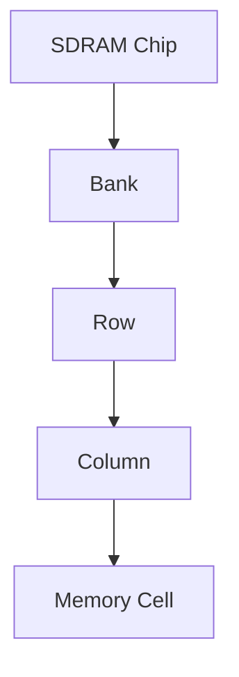

## 介绍

SDRAM（同步动态随机存取存储器）是一种高速、高容量的存储器，常用于需要大量数据存储的应用场景。STM32 微控制器集成了 SDRAM 控制器，允许开发者通过简单的配置将外部 SDRAM 芯片连接到 STM32，从而扩展系统的内存容量。

在本教程中，我们将逐步讲解 STM32 SDRAM 控制器的工作原理、配置方法以及实际应用案例。通过本教程，您将能够理解如何在 STM32 项目中使用 SDRAM 控制器，并掌握相关的编程技巧。

## SDRAM 控制器的工作原理

SDRAM 控制器是 STM32 微控制器中的一个硬件模块，负责管理与外部 SDRAM 芯片的通信。它通过特定的时序和协议与 SDRAM 芯片进行数据交换，确保数据的正确读写。

### SDRAM 的基本结构

SDRAM 通常由多个存储单元组成，每个存储单元可以存储一个比特的数据。SDRAM 的存储单元被组织成行和列，通过行地址和列地址来访问特定的存储单元。



### SDRAM 控制器的主要功能

1. **初始化**：在系统启动时，SDRAM 控制器需要对 SDRAM 芯片进行初始化，配置其工作模式。
2. **地址映射**：SDRAM 控制器将外部 SDRAM 的地址映射到 STM32 的内存地址空间，使得 CPU 可以直接访问 SDRAM。
3. **时序控制**：SDRAM 控制器负责生成正确的时序信号，确保数据的正确读写。
4. **刷新管理**：SDRAM 需要定期刷新以保持数据，SDRAM 控制器负责管理刷新操作。

## 配置 STM32 SDRAM 控制器

在 STM32 中配置 SDRAM 控制器通常涉及以下几个步骤：

1. **硬件连接**：将 SDRAM 芯片正确连接到 STM32 的 FMC（Flexible Memory Controller）接口。
2. **初始化代码**：编写初始化代码，配置 SDRAM 控制器的工作模式、时序参数等。
3. **测试代码**：编写测试代码，验证 SDRAM 的正确性和性能。

### 硬件连接

假设我们使用一个 16 位宽度的 SDRAM 芯片，连接到 STM32 的 FMC 接口。以下是典型的连接方式：

- **地址线**：连接 SDRAM 的地址线到 STM32 的 FMC 地址引脚。
- **数据线**：连接 SDRAM 的数据线到 STM32 的 FMC 数据引脚。
- **控制信号**：连接 SDRAM 的控制信号（如 RAS、CAS、WE 等）到 STM32 的 FMC 控制引脚。

### 初始化代码

以下是一个简单的 SDRAM 初始化代码示例：

```c
#include "stm32f4xx_hal.h"

FMC_SDRAM_CommandTypeDef command;

void SDRAM_Init(void) {
    // 配置 FMC SDRAM 控制器的时序参数
    FMC_SDRAM_TimingTypeDef timing;
    timing.LoadToActiveDelay = 2;
    timing.ExitSelfRefreshDelay = 7;
    timing.SelfRefreshTime = 4;
    timing.RowCycleDelay = 7;
    timing.WriteRecoveryTime = 2;
    timing.RPDelay = 2;
    timing.RCDDelay = 2;

    // 配置 SDRAM 控制器的模式
    HAL_SDRAM_Init(&hsdram1, &timing);

    // 发送预充电命令
    command.CommandMode = FMC_SDRAM_CMD_PRECHARGE;
    command.CommandTarget = FMC_SDRAM_CMD_TARGET_BANK1;
    command.AutoRefreshNumber = 1;
    command.ModeRegisterDefinition = 0;
    HAL_SDRAM_SendCommand(&hsdram1, &command, 0xFFFF);

    // 发送自动刷新命令
    command.CommandMode = FMC_SDRAM_CMD_AUTOREFRESH_MODE;
    HAL_SDRAM_SendCommand(&hsdram1, &command, 0xFFFF);

    // 配置 SDRAM 的模式寄存器
    command.CommandMode = FMC_SDRAM_CMD_LOAD_MODE;
    command.ModeRegisterDefinition = 0x230;
    HAL_SDRAM_SendCommand(&hsdram1, &command, 0xFFFF);
}
```

### 测试代码

以下是一个简单的测试代码，用于验证 SDRAM 的正确性：

```c
uint32_t *sdram_address = (uint32_t *)0xC0000000; // SDRAM 的起始地址

void SDRAM_Test(void) {
    // 写入数据
    *sdram_address = 0x12345678;

    // 读取数据
    uint32_t data = *sdram_address;

    // 验证数据
    if (data == 0x12345678) {
        printf("SDRAM test passed!\n");
    } else {
        printf("SDRAM test failed!\n");
    }
}
```

## 实际应用案例

### 案例 1：图形显示

在图形显示应用中，SDRAM 通常用于存储帧缓冲区。STM32 的 SDRAM 控制器可以高效地管理帧缓冲区的读写操作，确保图形显示的流畅性。

### 案例 2：音频处理

在音频处理应用中，SDRAM 可以用于存储音频数据。通过 STM32 的 SDRAM 控制器，可以实现高效的音频数据存取，满足实时音频处理的需求。

## 总结

通过本教程，您已经了解了 STM32 SDRAM 控制器的工作原理、配置方法以及实际应用场景。SDRAM 控制器是 STM32 微控制器中一个强大的功能模块，能够显著扩展系统的内存容量，适用于需要大量数据存储的应用场景。

## 附加资源与练习

- **练习 1**：尝试在您的 STM32 开发板上连接一个 SDRAM 芯片，并编写代码进行初始化与测试。
- **练习 2**：在图形显示应用中，使用 SDRAM 存储帧缓冲区，并实现一个简单的图形显示功能。

:::tip
如果您在配置 SDRAM 控制器时遇到问题，可以参考 STM32 的官方文档或社区论坛，获取更多帮助。
:::