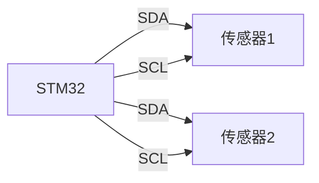
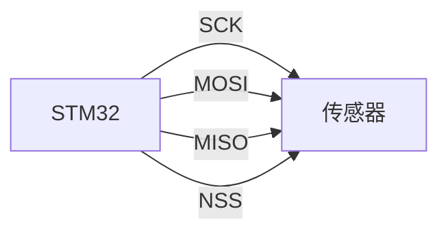
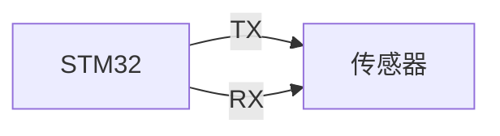

# STM32 传感器接口

## 介绍

传感器是嵌入式系统中不可或缺的组件，用于感知环境中的物理量（如温度、湿度、光照等），并将其转换为电信号。STM32微控制器提供了多种外设接口，可以轻松地与各种传感器进行通信。本教程将介绍如何在STM32上连接和使用传感器，涵盖常见的通信协议（如I2C、SPI、UART）以及如何编写代码来读取传感器数据。

## 传感器接口概述

STM32微控制器支持多种通信协议，用于与传感器进行数据交换。以下是常见的传感器接口：

1. **I2C（Inter-Integrated Circuit）**：一种两线制的串行通信协议，适合短距离通信。
2. **SPI（Serial Peripheral Interface）**：一种高速的全双工通信协议，适合高速数据传输。
3. **UART（Universal Asynchronous Receiver/Transmitter）**：一种异步串行通信协议，适合长距离通信。

每种接口都有其优缺点，选择合适的接口取决于传感器的类型和应用场景。

## I2C接口

### 硬件连接

I2C接口使用两根线进行通信：**SDA（数据线）**和**SCL（时钟线）**。STM32的I2C外设支持多主从模式，可以连接多个传感器。



### 代码示例

以下是一个使用STM32 HAL库读取I2C传感器的示例代码：

```c
#include "stm32f4xx_hal.h"

I2C_HandleTypeDef hi2c1;

void I2C_Init(void) {
    hi2c1.Instance = I2C1;
    hi2c1.Init.ClockSpeed = 100000;
    hi2c1.Init.DutyCycle = I2C_DUTYCYCLE_2;
    hi2c1.Init.OwnAddress1 = 0;
    hi2c1.Init.AddressingMode = I2C_ADDRESSINGMODE_7BIT;
    hi2c1.Init.DualAddressMode = I2C_DUALADDRESS_DISABLE;
    hi2c1.Init.OwnAddress2 = 0;
    hi2c1.Init.GeneralCallMode = I2C_GENERALCALL_DISABLE;
    hi2c1.Init.NoStretchMode = I2C_NOSTRETCH_DISABLE;
    HAL_I2C_Init(&hi2c1);
}

uint8_t Read_Sensor_Data(uint8_t sensor_address, uint8_t reg_address) {
    uint8_t data;
    HAL_I2C_Mem_Read(&hi2c1, sensor_address, reg_address, 1, &data, 1, 100);
    return data;
}
```

:::tip
在实际应用中，确保I2C总线上每个设备的地址是唯一的，以避免地址冲突。
:::

## SPI接口

### 硬件连接

SPI接口使用四根线进行通信：**SCK（时钟线）**、**MOSI（主出从入）**、**MISO（主入从出）**和**NSS（片选信号）**。SPI支持全双工通信，适合高速数据传输。



### 代码示例

以下是一个使用STM32 HAL库读取SPI传感器的示例代码：

```c
#include "stm32f4xx_hal.h"

SPI_HandleTypeDef hspi1;

void SPI_Init(void) {
    hspi1.Instance = SPI1;
    hspi1.Init.Mode = SPI_MODE_MASTER;
    hspi1.Init.Direction = SPI_DIRECTION_2LINES;
    hspi1.Init.DataSize = SPI_DATASIZE_8BIT;
    hspi1.Init.CLKPolarity = SPI_POLARITY_LOW;
    hspi1.Init.CLKPhase = SPI_PHASE_1EDGE;
    hspi1.Init.NSS = SPI_NSS_SOFT;
    hspi1.Init.BaudRatePrescaler = SPI_BAUDRATEPRESCALER_256;
    hspi1.Init.FirstBit = SPI_FIRSTBIT_MSB;
    hspi1.Init.TIMode = SPI_TIMODE_DISABLE;
    hspi1.Init.CRCCalculation = SPI_CRCCALCULATION_DISABLE;
    hspi1.Init.CRCPolynomial = 10;
    HAL_SPI_Init(&hspi1);
}

uint8_t Read_Sensor_Data(uint8_t reg_address) {
    uint8_t data;
    HAL_SPI_Transmit(&hspi1, &reg_address, 1, 100);
    HAL_SPI_Receive(&hspi1, &data, 1, 100);
    return data;
}
```

:::caution
在使用SPI时，确保片选信号（NSS）正确配置，以避免多个设备同时响应。
:::

## UART接口

### 硬件连接

UART接口使用两根线进行通信：**TX（发送线）**和**RX（接收线）**。UART适合长距离通信，但速度较慢。



### 代码示例

以下是一个使用STM32 HAL库读取UART传感器的示例代码：

```c
#include "stm32f4xx_hal.h"

UART_HandleTypeDef huart2;

void UART_Init(void) {
    huart2.Instance = USART2;
    huart2.Init.BaudRate = 9600;
    huart2.Init.WordLength = UART_WORDLENGTH_8B;
    huart2.Init.StopBits = UART_STOPBITS_1;
    huart2.Init.Parity = UART_PARITY_NONE;
    huart2.Init.Mode = UART_MODE_TX_RX;
    huart2.Init.HwFlowCtl = UART_HWCONTROL_NONE;
    huart2.Init.OverSampling = UART_OVERSAMPLING_16;
    HAL_UART_Init(&huart2);
}

void Read_Sensor_Data(uint8_t *data, uint16_t size) {
    HAL_UART_Receive(&huart2, data, size, 100);
}
```

:::note
UART通信需要双方设备配置相同的波特率、数据位、停止位和校验位。
:::

## 实际应用案例

### 温度传感器

假设我们有一个I2C温度传感器（如LM75），我们可以使用以下代码读取温度数据：

```c
float Read_Temperature(void) {
    uint8_t temp_data[2];
    HAL_I2C_Mem_Read(&hi2c1, 0x48, 0x00, 1, temp_data, 2, 100);
    int16_t temp = (temp_data[0] << 8) | temp_data[1];
    return temp / 256.0;
}
```

### 光照传感器

假设我们有一个SPI光照传感器（如BH1750），我们可以使用以下代码读取光照强度：

```c
uint16_t Read_Light_Intensity(void) {
    uint8_t light_data[2];
    HAL_SPI_Transmit(&hspi1, 0x10, 1, 100);
    HAL_SPI_Receive(&hspi1, light_data, 2, 100);
    return (light_data[0] << 8) | light_data[1];
}
```

## 总结

通过本教程，您已经了解了如何在STM32微控制器上连接和使用传感器。我们介绍了I2C、SPI和UART接口的硬件连接和代码实现，并通过实际案例展示了如何读取传感器数据。希望这些内容能帮助您在嵌入式项目中更好地使用传感器。

## 附加资源

- [STM32 HAL库文档](https://www.st.com/en/embedded-software/stm32cube-mcu-mpu-packages.html)
- [I2C协议详解](https://www.i2c-bus.org/)
- [SPI协议详解](https://www.analog.com/en/analog-dialogue/articles/introduction-to-spi-interface.html)
- [UART协议详解](https://www.circuitbasics.com/basics-uart-communication/)

## 练习

1. 尝试使用I2C接口连接一个加速度传感器（如MPU6050），并读取加速度数据。
2. 使用SPI接口连接一个气压传感器（如BMP280），并读取气压数据。
3. 使用UART接口连接一个GPS模块，并解析GPS数据。

祝您学习愉快！