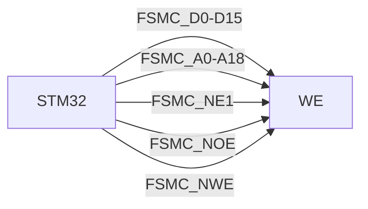

## 介绍

STM32微控制器系列提供了灵活的外部存储器接口（FSMC/FMC），用于连接和管理外部存储器设备，如SRAM、NOR闪存和NAND闪存。这些接口允许STM32与外部存储器设备进行高速数据交换，扩展了微控制器的存储能力，适用于需要大量数据存储或高速数据处理的应用程序。

在本教程中，我们将逐步介绍STM32的外部存储器接口，包括其工作原理、配置方法以及实际应用案例。

## STM32 外部存储器接口概述

STM32的外部存储器接口（FSMC/FMC）是一种灵活的接口，支持多种类型的存储器设备。它通过一组专用的引脚和寄存器，实现了与外部存储器设备的高速通信。

### 支持的存储器类型

- **SRAM**：静态随机存取存储器，用于高速数据存储。
- **NOR闪存**：用于存储程序代码和数据，支持随机访问。
- **NAND闪存**：用于大容量数据存储，支持块访问。

### 主要特性

- **多存储区支持**：FSMC/FMC支持多个存储区，每个存储区可以配置为不同的存储器类型。
- **灵活的时序配置**：可以根据外部存储器的时序要求，灵活配置读写时序。
- **数据宽度支持**：支持8位、16位和32位数据宽度。

## 配置STM32外部存储器接口

### 1. 硬件连接

首先，确保STM32与外部存储器设备的硬件连接正确。以下是一个典型的SRAM连接示例：



### 2. 配置FSMC/FMC寄存器

在STM32中，FSMC/FMC的配置通过一组寄存器完成。以下是一个配置SRAM的示例代码：

```c
#include "stm32f4xx.h"

void FSMC_SRAM_Init(void) {
    // 使能FSMC时钟
    RCC_AHB3PeriphClockCmd(RCC_AHB3Periph_FSMC, ENABLE);

    // 配置FSMC控制寄存器
    FSMC_NORSRAMInitTypeDef FSMC_NORSRAMInitStructure;
    FSMC_NORSRAMTimingInitTypeDef FSMC_NORSRAMTimingInitStructure;

    FSMC_NORSRAMTimingInitStructure.FSMC_AddressSetupTime = 1;
    FSMC_NORSRAMTimingInitStructure.FSMC_AddressHoldTime = 0;
    FSMC_NORSRAMTimingInitStructure.FSMC_DataSetupTime = 2;
    FSMC_NORSRAMTimingInitStructure.FSMC_BusTurnAroundDuration = 0;
    FSMC_NORSRAMTimingInitStructure.FSMC_CLKDivision = 0;
    FSMC_NORSRAMTimingInitStructure.FSMC_DataLatency = 0;
    FSMC_NORSRAMTimingInitStructure.FSMC_AccessMode = FSMC_AccessMode_A;

    FSMC_NORSRAMInitStructure.FSMC_Bank = FSMC_Bank1_NORSRAM1;
    FSMC_NORSRAMInitStructure.FSMC_DataAddressMux = FSMC_DataAddressMux_Disable;
    FSMC_NORSRAMInitStructure.FSMC_MemoryType = FSMC_MemoryType_SRAM;
    FSMC_NORSRAMInitStructure.FSMC_MemoryDataWidth = FSMC_MemoryDataWidth_16b;
    FSMC_NORSRAMInitStructure.FSMC_BurstAccessMode = FSMC_BurstAccessMode_Disable;
    FSMC_NORSRAMInitStructure.FSMC_WaitSignalPolarity = FSMC_WaitSignalPolarity_Low;
    FSMC_NORSRAMInitStructure.FSMC_WrapMode = FSMC_WrapMode_Disable;
    FSMC_NORSRAMInitStructure.FSMC_WaitSignalActive = FSMC_WaitSignalActive_BeforeWaitState;
    FSMC_NORSRAMInitStructure.FSMC_WriteOperation = FSMC_WriteOperation_Enable;
    FSMC_NORSRAMInitStructure.FSMC_WaitSignal = FSMC_WaitSignal_Disable;
    FSMC_NORSRAMInitStructure.FSMC_ExtendedMode = FSMC_ExtendedMode_Disable;
    FSMC_NORSRAMInitStructure.FSMC_WriteBurst = FSMC_WriteBurst_Disable;
    FSMC_NORSRAMInitStructure.FSMC_ReadWriteTimingStruct = &FSMC_NORSRAMTimingInitStructure;
    FSMC_NORSRAMInitStructure.FSMC_WriteTimingStruct = &FSMC_NORSRAMTimingInitStructure;

    FSMC_NORSRAMInit(&FSMC_NORSRAMInitStructure);
    FSMC_NORSRAMCmd(FSMC_Bank1_NORSRAM1, ENABLE);
}
```

### 3. 读写数据

配置完成后，可以通过FSMC/FMC接口读写外部存储器中的数据。以下是一个简单的读写示例：

```c
uint16_t read_data = 0;
uint16_t write_data = 0x1234;

// 写入数据
*(__IO uint16_t*)(0x60000000) = write_data;

// 读取数据
read_data = *(__IO uint16_t*)(0x60000000);
```

## 实际应用案例

### 案例：使用外部SRAM扩展STM32的内存

在某些应用中，STM32的内部RAM可能不足以满足需求。通过连接外部SRAM，可以扩展STM32的内存容量，用于存储大量数据或运行复杂的算法。

例如，在图像处理应用中，可以将图像数据存储在外部SRAM中，以便快速访问和处理。

## 总结

STM32的外部存储器接口（FSMC/FMC）为连接和管理外部存储器设备提供了强大的支持。通过灵活的配置和高速的数据交换能力，STM32可以轻松扩展其存储能力，满足各种应用需求。

## 附加资源与练习

- **资源**：
  - [STM32参考手册](https://www.st.com/resource/en/reference_manual/dm00031020-stm32f405-415-stm32f407-417-stm32f427-437-and-stm32f429-439-advanced-arm-based-32-bit-mcus-stmicroelectronics.pdf)
  - [STM32CubeMX配置工具](https://www.st.com/en/development-tools/stm32cubemx.html)

- **练习**：
  - 尝试连接一个NOR闪存设备，并编写代码读取其ID。
  - 使用外部SRAM存储一个数组，并对其进行排序操作。

通过本教程，您应该已经掌握了STM32外部存储器接口的基本概念和配置方法。继续探索和实践，您将能够更深入地理解和应用这一强大的功能。