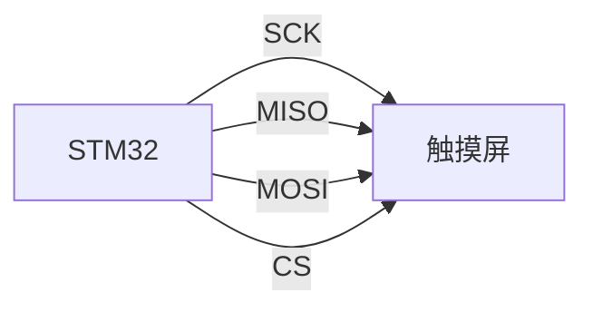
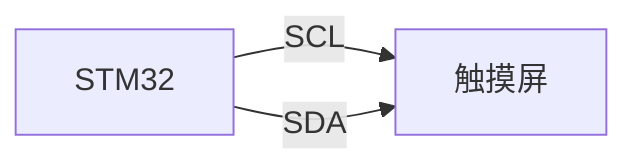

# STM32 触摸屏控制

触摸屏是现代嵌入式系统中常见的输入设备，广泛应用于智能手机、工业控制面板和医疗设备等领域。STM32微控制器因其强大的性能和丰富的外设接口，成为实现触摸屏控制的理想选择。本文将逐步讲解如何在STM32上实现触摸屏控制，并提供代码示例和实际应用案例。

## 1. 触摸屏的基本原理

触摸屏通常由两层导电层组成，一层是X轴，另一层是Y轴。当用户触摸屏幕时，两层导电层会在触摸点接触，形成一个电压分压器。通过测量X轴和Y轴的电压，可以确定触摸点的位置。

### 1.1 电阻式触摸屏

电阻式触摸屏是最常见的触摸屏类型之一。它由两层导电层组成，中间由微小的隔离点隔开。当用户触摸屏幕时，两层导电层接触，形成一个电压分压器。通过测量X轴和Y轴的电压，可以确定触摸点的位置。

### 1.2 电容式触摸屏

电容式触摸屏利用人体电容的变化来检测触摸位置。当用户触摸屏幕时，触摸点的电容会发生变化，通过测量电容的变化可以确定触摸点的位置。

## 2. STM32触摸屏控制硬件连接

在STM32上实现触摸屏控制，首先需要将触摸屏与STM32微控制器连接。常见的触摸屏接口包括SPI、I2C和GPIO。

### 2.1 SPI接口连接

SPI接口是触摸屏与STM32之间常用的通信接口。以下是SPI接口的连接示意图：



### 2.2 I2C接口连接

I2C接口是另一种常见的触摸屏通信接口。以下是I2C接口的连接示意图：



## 3. STM32触摸屏控制软件配置

在STM32上实现触摸屏控制，需要进行软件配置。以下是使用HAL库配置触摸屏的步骤：

### 3.1 初始化SPI或I2C接口

首先，需要初始化SPI或I2C接口。以下是使用HAL库初始化SPI接口的代码示例：

```c
SPI_HandleTypeDef hspi;

void SPI_Init(void) {
    hspi.Instance = SPI1;
    hspi.Init.Mode = SPI_MODE_MASTER;
    hspi.Init.Direction = SPI_DIRECTION_2LINES;
    hspi.Init.DataSize = SPI_DATASIZE_8BIT;
    hspi.Init.CLKPolarity = SPI_POLARITY_LOW;
    hspi.Init.CLKPhase = SPI_PHASE_1EDGE;
    hspi.Init.NSS = SPI_NSS_SOFT;
    hspi.Init.BaudRatePrescaler = SPI_BAUDRATEPRESCALER_2;
    hspi.Init.FirstBit = SPI_FIRSTBIT_MSB;
    hspi.Init.TIMode = SPI_TIMODE_DISABLE;
    hspi.Init.CRCCalculation = SPI_CRCCALCULATION_DISABLE;
    hspi.Init.CRCPolynomial = 10;
    if (HAL_SPI_Init(&hspi) != HAL_OK) {
        Error_Handler();
    }
}
```

### 3.2 读取触摸屏数据

接下来，需要编写代码读取触摸屏的数据。以下是读取触摸屏数据的代码示例：

```c
uint8_t Read_Touch_Data(uint8_t reg) {
    uint8_t data;
    HAL_GPIO_WritePin(GPIOA, GPIO_PIN_4, GPIO_PIN_RESET); // 选择触摸屏
    HAL_SPI_Transmit(&hspi, &reg, 1, HAL_MAX_DELAY);
    HAL_SPI_Receive(&hspi, &data, 1, HAL_MAX_DELAY);
    HAL_GPIO_WritePin(GPIOA, GPIO_PIN_4, GPIO_PIN_SET); // 取消选择触摸屏
    return data;
}
```

## 4. 实际应用案例

### 4.1 工业控制面板

在工业控制面板中，触摸屏用于操作和监控设备。通过STM32实现触摸屏控制，可以实现设备的远程控制和状态监控。

### 4.2 医疗设备

在医疗设备中，触摸屏用于输入患者信息和操作设备。通过STM32实现触摸屏控制，可以提高设备的易用性和可靠性。

## 5. 总结

本文详细介绍了如何在STM32微控制器上实现触摸屏控制，包括硬件连接、软件配置和实际应用案例。通过本文的学习，您应该能够在STM32上实现基本的触摸屏控制功能。

## 6. 附加资源与练习

- **附加资源**：
  - [STM32官方文档](https://www.st.com/en/microcontrollers-microprocessors/stm32-32-bit-arm-cortex-mcus.html)
  - [HAL库用户手册](https://www.st.com/resource/en/user_manual/dm00105879.pdf)

- **练习**：
  - 尝试使用I2C接口连接触摸屏，并读取触摸数据。
  - 实现一个简单的触摸屏应用程序，例如绘制触摸轨迹。

:::tip
在实际项目中，建议使用DMA（直接内存访问）来提高数据传输效率，减少CPU的负担。
:::