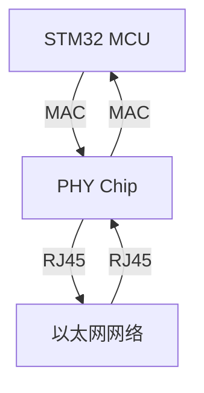

# STM32 以太网接口

## 介绍

STM32微控制器系列广泛用于嵌入式系统开发，其中以太网接口是其重要的外设之一。以太网接口允许STM32设备通过网络进行通信，适用于物联网（IoT）、工业自动化、远程监控等应用场景。

以太网接口通常包括MAC（媒体访问控制）和PHY（物理层）两部分。STM32内部集成了MAC控制器，而PHY通常需要外部芯片实现。通过配置STM32的以太网接口，开发者可以实现TCP/IP协议栈，支持HTTP、FTP、MQTT等网络协议。

## 以太网接口的工作原理

STM32的以太网接口基于IEEE 802.3标准，支持10/100Mbps的传输速率。其工作原理如下：

1. **MAC控制器**：负责数据帧的封装与解封装，处理以太网帧的发送与接收。
2. **DMA控制器**：用于高效地传输数据，减少CPU的负担。
3. **PHY芯片**：负责将数字信号转换为模拟信号，并通过RJ45接口与外部网络通信。

以下是一个简单的以太网通信流程图：



## 配置STM32以太网接口

### 1. 硬件连接

首先，确保STM32与外部PHY芯片正确连接。常见的PHY芯片如DP83848或LAN8720，它们通过MII（媒体独立接口）或RMII（简化媒体独立接口）与STM32通信。

### 2. 软件配置

使用STM32CubeMX工具可以快速生成以太网接口的初始化代码。以下是配置步骤：

1. 打开STM32CubeMX，选择目标STM32芯片。
2. 在“Pinout & Configuration”选项卡中，启用以太网外设。
3. 配置PHY芯片的接口类型（MII或RMII）。
4. 生成初始化代码并导入到开发环境中。

### 3. 代码示例

以下是一个简单的以太网初始化代码示例：

```c
#include "stm32f4xx_hal.h"

ETH_HandleTypeDef heth;

void SystemClock_Config(void);
static void MX_GPIO_Init(void);
static void MX_ETH_Init(void);

int main(void) {
    HAL_Init();
    SystemClock_Config();
    MX_GPIO_Init();
    MX_ETH_Init();

    while (1) {
        // 主循环
    }
}

static void MX_ETH_Init(void) {
    heth.Instance = ETH;
    heth.Init.AutoNegotiation = ETH_AUTONEGOTIATION_ENABLE;
    heth.Init.Speed = ETH_SPEED_100M;
    heth.Init.DuplexMode = ETH_MODE_FULLDUPLEX;
    heth.Init.PhyAddress = DP83848_PHY_ADDRESS;
    HAL_ETH_Init(&heth);
}
```

:::note
**注意**：在实际项目中，还需要配置TCP/IP协议栈（如LwIP）以实现网络通信。
:::

## 实际应用案例

### 1. 物联网设备

STM32的以太网接口常用于物联网设备中，例如智能家居控制器。通过以太网接口，设备可以与云服务器通信，实现远程控制和数据采集。

### 2. 工业自动化

在工业自动化系统中，STM32的以太网接口用于连接PLC（可编程逻辑控制器）和传感器网络，实现实时数据传输和设备监控。

## 总结

STM32的以太网接口为嵌入式系统提供了强大的网络通信能力。通过合理的硬件连接和软件配置，开发者可以轻松实现以太网通信功能。本文介绍了以太网接口的工作原理、配置方法以及实际应用案例，适合初学者入门学习。

## 附加资源

- [STM32CubeMX用户手册](https://www.st.com/resource/en/user_manual/dm00104712-stm32cubemx-for-stm32-configuration-and-initialization-c-code-generation-stmicroelectronics.pdf)
- [LwIP轻量级TCP/IP协议栈](https://savannah.nongnu.org/projects/lwip/)

## 练习

1. 使用STM32CubeMX生成以太网初始化代码，并在开发板上测试网络连接。
2. 尝试使用LwIP协议栈实现一个简单的HTTP服务器。
