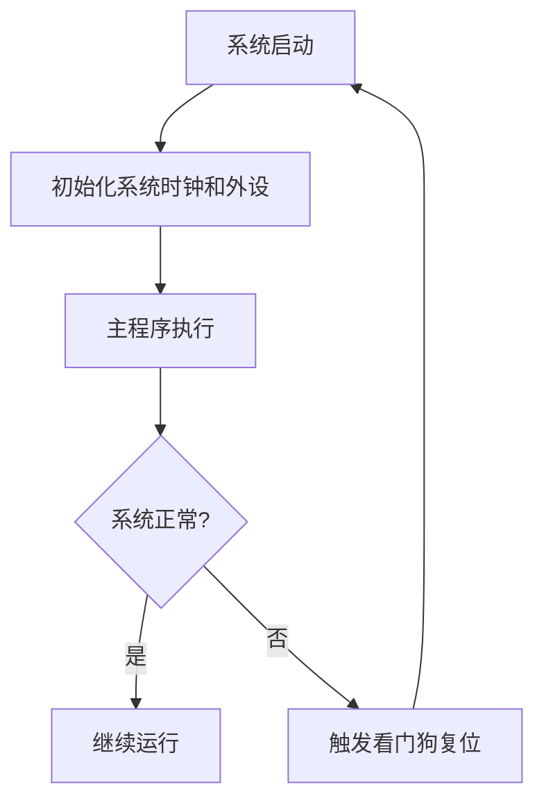

## 介绍

STM32微控制器广泛应用于嵌入式系统中，其启动和恢复机制是确保系统稳定运行的关键部分。恢复机制是指在系统出现故障或异常时，如何使系统恢复到正常工作状态。本文将详细介绍STM32的启动流程、系统复位以及常见的故障恢复方法。

## STM32 启动流程

STM32的启动流程可以分为以下几个步骤：

1. **复位向量表**：STM32上电后，首先从复位向量表中获取初始堆栈指针（SP）和程序计数器（PC）的值。
2. **系统初始化**：初始化系统时钟、外设和中断向量表。
3. **主程序执行**：跳转到主程序开始执行。

```c
// 示例：STM32启动代码片段
void SystemInit(void) {
    // 初始化系统时钟
    RCC->CR |= RCC_CR_HSEON; // 使能外部高速时钟
    while (!(RCC->CR & RCC_CR_HSERDY)); // 等待外部高速时钟就绪
    RCC->CFGR |= RCC_CFGR_SW_HSE; // 选择外部高速时钟作为系统时钟
    while ((RCC->CFGR & RCC_CFGR_SWS) != RCC_CFGR_SWS_HSE); // 等待时钟切换完成
}
```

## 系统复位

系统复位是STM32恢复机制中的重要部分。复位可以分为以下几种类型：

1. **上电复位（POR）**：当电源电压达到一定阈值时，系统自动复位。
2. **外部复位（NRST引脚）**：通过外部复位引脚触发复位。
3. **看门狗复位**：当看门狗定时器超时未刷新时，系统复位。
4. **软件复位**：通过软件指令触发复位。

```c
// 示例：软件复位代码片段
void SoftwareReset(void) {
    SCB->AIRCR = (0x5FA << SCB_AIRCR_VECTKEY_Pos) | SCB_AIRCR_SYSRESETREQ_Msk;
    while (1); // 等待复位
}
```

## 故障恢复方法

在实际应用中，STM32可能会遇到各种故障，如硬件故障、软件错误等。以下是几种常见的故障恢复方法：

1. **看门狗定时器（WDT）**：通过定期刷新看门狗定时器，防止系统死锁。
2. **异常处理**：通过捕获和处理异常，恢复系统正常运行。
3. **备份寄存器（BKP）**：在系统复位后，使用备份寄存器恢复关键数据。

```c
// 示例：看门狗定时器初始化代码片段
void WatchdogInit(void) {
    IWDG->KR = 0x5555; // 解锁IWDG_PR和IWDG_RLR寄存器
    IWDG->PR = 0x06; // 设置预分频器
    IWDG->RLR = 0xFFF; // 设置重装载值
    IWDG->KR = 0xAAAA; // 刷新看门狗
    IWDG->KR = 0xCCCC; // 启动看门狗
}
```

## 实际应用场景

在一个工业控制系统中，STM32需要实时监控多个传感器数据。如果系统由于某种原因进入死锁状态，看门狗定时器将触发复位，使系统恢复正常运行。此外，备份寄存器可以保存关键配置数据，确保系统复位后能够快速恢复。



## 总结

STM32的恢复机制是确保系统稳定运行的重要部分。通过理解启动流程、系统复位和故障恢复方法，开发者可以设计出更加可靠的嵌入式系统。本文介绍了STM32的启动流程、系统复位类型以及常见的故障恢复方法，并提供了代码示例和实际应用场景。

## 附加资源

- [STM32参考手册](https://www.st.com/resource/en/reference_manual/dm00031020-stm32f405-415-stm32f407-417-stm32f427-437-and-stm32f429-439-advanced-arm-based-32-bit-mcus-stmicroelectronics.pdf)
- [STM32CubeMX](https://www.st.com/en/development-tools/stm32cubemx.html)
- [STM32 HAL库文档](https://www.st.com/resource/en/user_manual/dm00105879-description-of-stm32f4-hal-and-lowlayer-drivers-stmicroelectronics.pdf)

## 练习

1. 编写一个STM32程序，使用看门狗定时器实现系统复位。
2. 在STM32上实现一个异常处理机制，捕获并处理除零错误。
3. 使用备份寄存器保存和恢复系统配置数据。

:::tip
在开发过程中，建议使用调试工具（如ST-Link）来监控系统状态，确保恢复机制的有效性。
:::