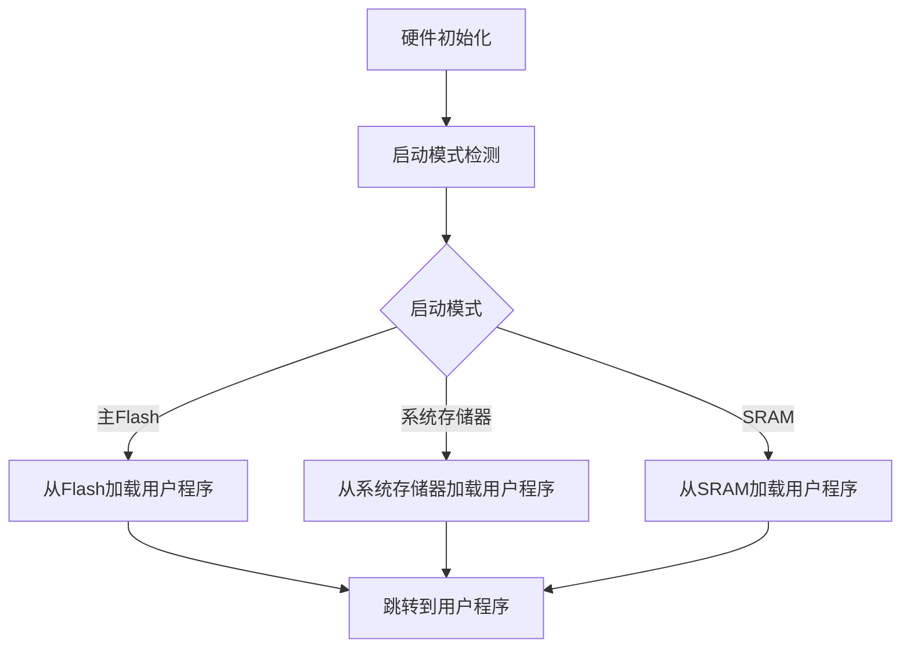

## 介绍

STM32引导加载程序（Bootloader）是STM32微控制器启动时运行的第一段代码。它的主要作用是初始化硬件并加载用户应用程序到内存中执行。引导加载程序通常存储在微控制器的内部ROM中，用户无法修改，但可以通过特定的引脚配置或软件命令来选择不同的启动模式。

### 为什么需要引导加载程序？

引导加载程序的存在使得STM32微控制器能够在不同的启动模式下运行，例如从内部Flash、系统存储器（System Memory）或SRAM启动。这种灵活性使得开发者可以在不同的开发阶段选择最适合的启动方式，例如在开发阶段从SRAM启动以快速调试，而在生产阶段从Flash启动以运行最终的用户程序。

## STM32 启动模式

STM32微控制器通常支持三种启动模式：

1. **从主Flash启动**：这是最常见的启动模式，用户程序存储在内部Flash中。
2. **从系统存储器启动**：系统存储器中存储了STM32的出厂引导加载程序，通常用于通过串口、USB或CAN接口进行固件更新。
3. **从SRAM启动**：这种模式通常用于调试阶段，程序直接从SRAM中运行。

### 启动模式选择

启动模式通过BOOT0和BOOT1引脚的电平状态来选择。以下是常见的启动模式配置：

- **BOOT0 = 0, BOOT1 = X**：从主Flash启动。
- **BOOT0 = 1, BOOT1 = 0**：从系统存储器启动。
- **BOOT0 = 1, BOOT1 = 1**：从SRAM启动。

:::note
在实际应用中，BOOT1引脚可能不存在，具体取决于STM32的型号。请参考具体型号的数据手册。
:::

## 引导加载程序的工作流程

引导加载程序的工作流程可以分为以下几个步骤：

1. **硬件初始化**：引导加载程序首先初始化必要的硬件，如时钟系统、GPIO等。
2. **启动模式检测**：根据BOOT引脚的状态，确定启动模式。
3. **加载用户程序**：根据启动模式，从相应的存储器中加载用户程序到内存中。
4. **跳转到用户程序**：最后，引导加载程序跳转到用户程序的入口地址，开始执行用户程序。



## 实际案例：通过引导加载程序更新固件

在实际应用中，引导加载程序常用于固件更新。以下是一个通过系统存储器中的引导加载程序更新固件的案例：

1. **设置BOOT引脚**：将BOOT0引脚拉高，BOOT1引脚拉低，使STM32从系统存储器启动。
2. **进入引导加载程序**：复位STM32，进入系统存储器中的引导加载程序。
3. **通过串口更新固件**：使用串口工具（如ST提供的Flash Loader Demonstrator）将新的固件通过串口上传到STM32的Flash中。
4. **切换回主Flash启动**：更新完成后，将BOOT0引脚拉低，复位STM32，使其从主Flash启动新的固件。

:::tip
在实际操作中，确保BOOT引脚的配置正确，并且在固件更新过程中不要断电，以免导致固件损坏。
:::

## 代码示例：跳转到用户程序

以下是一个简单的代码示例，展示了如何从引导加载程序跳转到用户程序：

```c
void jump_to_user_app(uint32_t user_app_address) {
    typedef void (*pFunction)(void);
    pFunction jump_to_app;

    // 获取用户程序的栈顶指针
    uint32_t stack_pointer = *(uint32_t *)user_app_address;

    // 获取用户程序的复位向量
    uint32_t reset_vector = *(uint32_t *)(user_app_address + 4);

    // 设置栈顶指针
    __set_MSP(stack_pointer);

    // 跳转到用户程序的复位向量
    jump_to_app = (pFunction)reset_vector;
    jump_to_app();
}
```

:::caution
在跳转到用户程序之前，确保用户程序的地址是有效的，并且用户程序已经正确加载到内存中。
:::

## 总结

STM32引导加载程序是STM32微控制器启动过程中的关键部分，它负责初始化硬件并根据启动模式加载用户程序。通过理解引导加载程序的工作原理，开发者可以更好地利用STM32的启动模式，实现固件更新、调试等功能。

### 附加资源

- [STM32参考手册](https://www.st.com/resource/en/reference_manual/dm00031020-stm32f405-415-stm32f407-417-stm32f427-437-and-stm32f429-439-advanced-arm-based-32-bit-mcus-stmicroelectronics.pdf)
- [STM32 Bootloader应用笔记](https://www.st.com/resource/en/application_note/cd00167594-usart-protocol-used-in-the-stm32-bootloader-stmicroelectronics.pdf)

### 练习

1. 尝试修改BOOT引脚的状态，观察STM32的启动行为。
2. 编写一个简单的引导加载程序，实现从SRAM启动用户程序。
3. 使用ST提供的工具，通过串口更新STM32的固件。

通过以上内容的学习和实践，您将对STM32引导加载程序有更深入的理解，并能够在实际项目中灵活应用。