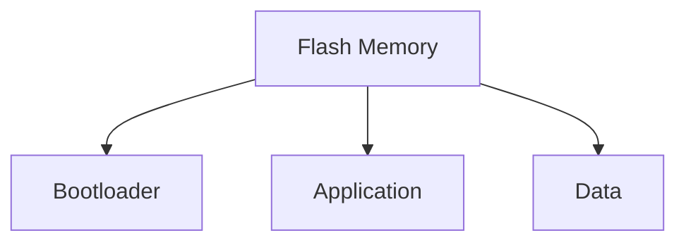

# STM32 Flash 布局

## 介绍

STM32 微控制器是嵌入式系统中广泛使用的芯片之一，其 Flash 内存用于存储程序代码和常量数据。理解 STM32 的 Flash 布局对于开发高效、可靠的嵌入式应用程序至关重要。本文将详细介绍 STM32 Flash 内存的结构、分区以及如何在实际应用中使用这些知识。

## STM32 Flash 内存结构

STM32 的 Flash 内存通常分为以下几个部分：

1. **主存储区（Main Memory）**：用于存储程序代码和常量数据。
2. **系统存储区（System Memory）**：包含出厂预编程的 Bootloader，用于通过串口、USB 等接口进行固件更新。
3. **选项字节（Option Bytes）**：用于配置芯片的某些功能，如写保护、读保护等。

### 主存储区

主存储区是 Flash 内存中最大的部分，通常用于存储应用程序代码和常量数据。主存储区的大小因芯片型号而异，可以从几十 KB 到几 MB 不等。

### 系统存储区

系统存储区是 STM32 芯片出厂时预编程的区域，包含一个 Bootloader。这个 Bootloader 可以通过串口、USB 等接口进行固件更新，而不需要外部编程器。

### 选项字节

选项字节用于配置芯片的某些功能，如写保护、读保护等。选项字节的配置会影响芯片的行为，因此在修改选项字节时需要特别小心。

## Flash 内存的分区

在实际应用中，Flash 内存通常会被划分为多个分区，以便更好地管理代码和数据。常见的分区方式包括：

1. **Bootloader 分区**：用于存储 Bootloader 代码。
2. **应用程序分区**：用于存储主应用程序代码。
3. **数据分区**：用于存储常量数据或配置参数。

以下是一个典型的 Flash 内存分区示例：



## 实际应用案例

### 案例 1：双分区固件更新

在某些应用中，可能需要支持固件的无线更新（OTA）。为了实现这一点，可以将 Flash 内存划分为两个应用程序分区：一个用于当前运行的固件，另一个用于存储新固件。当新固件下载完成后，可以通过 Bootloader 将新固件从备用分区复制到主分区，并重新启动系统。

```c
// 伪代码示例：双分区固件更新
void update_firmware() {
    if (new_firmware_downloaded()) {
        copy_firmware(backup_partition, main_partition);
        reboot_system();
    }
}
```

### 案例 2：配置参数存储

在某些应用中，可能需要存储一些配置参数，如网络设置、用户偏好等。这些参数可以存储在 Flash 的特定分区中，以便在系统重启后仍然可用。

```c
// 伪代码示例：存储配置参数
void save_configuration(uint8_t* config_data, uint32_t size) {
    write_flash(config_partition, config_data, size);
}
```

## 总结

STM32 的 Flash 布局是嵌入式系统开发中的一个重要概念。通过理解 Flash 内存的结构和分区，开发者可以更好地管理代码和数据，实现更复杂的应用场景，如固件更新和配置参数存储。

## 附加资源与练习

- **资源**：
  - [STM32 参考手册](https://www.st.com/resource/en/reference_manual/dm00031020-stm32f405-415-stm32f407-417-stm32f427-437-and-stm32f429-439-advanced-arm-based-32-bit-mcus-stmicroelectronics.pdf)
  - [STM32 Bootloader 应用笔记](https://www.st.com/resource/en/application_note/dm00044891-using-the-stm32f0-stm32f1-and-stm32f3-series-bootloader-stmicroelectronics.pdf)

- **练习**：
  1. 尝试在你的 STM32 项目中划分 Flash 内存，创建一个 Bootloader 分区和一个应用程序分区。
  2. 实现一个简单的固件更新机制，使用双分区策略。

:::tip
在修改 Flash 内存布局时，务必仔细阅读芯片的参考手册，确保不会意外擦除或覆盖重要数据。
:::