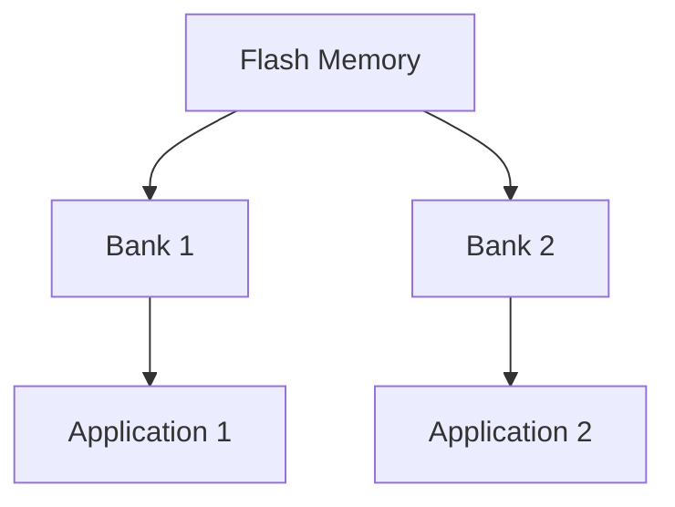

## 介绍

STM32微控制器是嵌入式系统中广泛使用的芯片之一。为了满足不同的应用需求，STM32提供了多种启动模式，其中**双区域启动**（Dual Bank Boot）是一种重要的机制。它允许用户在不中断系统运行的情况下，更新固件或切换应用程序。

双区域启动的核心思想是将Flash存储器分为两个独立的区域（Bank），每个区域可以存储一个完整的应用程序。通过配置启动选项，STM32可以从其中一个区域启动，同时允许在另一个区域进行固件更新。这种机制在需要高可靠性和实时性的系统中非常有用。

## 双区域启动的工作原理

STM32的Flash存储器通常被划分为两个区域：Bank 1和Bank 2。每个区域可以独立存储一个应用程序。通过配置启动选项位（BOOT0和BOOT1引脚或选项字节），可以选择从哪个区域启动。

### Flash存储器的分区

以下是一个典型的Flash存储器分区示例：



在这个示例中，Bank 1和Bank 2分别存储了两个不同的应用程序。通过配置启动选项，可以选择从Bank 1或Bank 2启动。

### 启动选项配置

STM32的启动选项可以通过以下方式配置：

1. **硬件引脚配置**：通过设置BOOT0和BOOT1引脚的电平来选择启动模式。
2. **选项字节配置**：通过修改选项字节（Option Bytes）来配置启动区域。

以下是一个通过选项字节配置双区域启动的示例代码：

```c
#include "stm32f4xx.h"

void configure_dual_bank_boot(void) {
    // 解锁选项字节
    HAL_FLASH_OB_Unlock();

    // 配置启动区域为Bank 2
    FLASH_OBProgramInitTypeDef OBInit;
    OBInit.OptionType = OPTIONBYTE_USER;
    OBInit.USERConfig = OB_BOOT_BANK2;
    HAL_FLASHEx_OBProgram(&OBInit);

    // 锁定选项字节
    HAL_FLASH_OB_Lock();
}
```

:::note
在修改选项字节之前，必须解锁选项字节。修改完成后，需要重新锁定选项字节以确保配置生效。
:::

## 实际应用场景

双区域启动在以下场景中非常有用：

1. **固件更新**：在系统运行时，可以在一个区域中运行当前应用程序，同时在另一个区域中更新固件。更新完成后，切换到新的固件区域启动。
2. **A/B测试**：在开发过程中，可以在两个区域中分别存储不同的应用程序版本，通过切换启动区域进行A/B测试。
3. **故障恢复**：如果一个区域的应用程序出现故障，可以快速切换到另一个区域的应用程序，确保系统的可靠性。

### 案例：固件更新

假设我们有一个STM32系统，当前运行在Bank 1中的应用程序。我们需要在不中断系统运行的情况下，更新Bank 2中的固件。以下是实现步骤：

1. **下载新固件**：通过网络或其他接口将新固件下载到Bank 2中。
2. **验证固件**：在Bank 2中验证新固件的完整性和正确性。
3. **切换启动区域**：通过配置选项字节，将启动区域切换到Bank 2。
4. **重启系统**：系统重启后，将从Bank 2中的新固件启动。

以下是一个简单的固件更新代码示例：

```c
void update_firmware(void) {
    // 下载新固件到Bank 2
    download_firmware_to_bank2();

    // 验证固件
    if (verify_firmware_in_bank2()) {
        // 配置启动区域为Bank 2
        configure_dual_bank_boot();

        // 重启系统
        NVIC_SystemReset();
    }
}
```

:::caution
在切换启动区域之前，务必确保新固件已经正确下载并验证。否则，系统可能无法正常启动。
:::

## 总结

STM32的双区域启动机制为嵌入式系统提供了更高的灵活性和可靠性。通过合理配置Flash存储器的分区和启动选项，可以实现固件更新、A/B测试和故障恢复等功能。对于初学者来说，理解双区域启动的工作原理和配置方法是非常重要的。

## 附加资源与练习

- **练习1**：尝试在STM32开发板上配置双区域启动，并实现固件更新功能。
- **练习2**：研究STM32的选项字节配置，了解其他可配置的选项。
- **资源**：参考STM32官方文档，深入了解Flash存储器的分区和启动选项配置。

通过以上内容的学习和实践，您将能够掌握STM32双区域启动的核心概念，并能够在实际项目中应用这一机制。