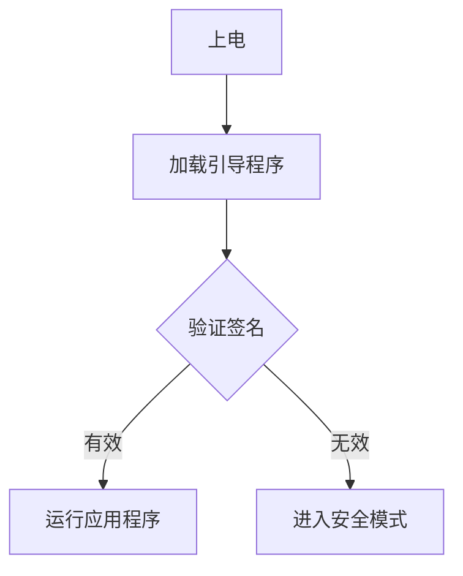

# STM32 代码安全

在嵌入式系统中，代码安全是一个至关重要的主题。STM32微控制器广泛应用于各种领域，从工业控制到消费电子产品。为了保护您的应用程序免受未经授权的访问、篡改或逆向工程，了解如何实现代码安全是必不可少的。

## 什么是代码安全？

代码安全是指通过一系列技术手段，确保嵌入式系统中的代码和数据不被未经授权的用户访问、修改或复制。在STM32中，代码安全通常涉及以下几个方面：

1. **代码保护**：防止未经授权的用户读取或修改固件。
2. **数据加密**：保护存储在微控制器中的敏感数据。
3. **安全启动**：确保只有经过验证的代码才能在设备上运行。

## STM32 的代码保护机制

STM32微控制器提供了多种硬件特性来帮助实现代码安全。以下是一些关键特性：

### 1. 读保护（Read Out Protection, ROP）

读保护是一种硬件特性，可以防止通过调试接口（如JTAG或SWD）读取Flash存储器中的内容。启用读保护后，未经授权的用户将无法通过调试工具访问代码。

```c
// 启用读保护
HAL_FLASH_OB_Unlock();
FLASH_OBProgramInitTypeDef OBInit;
OBInit.OptionType = OPTIONBYTE_RDP;
OBInit.RDPLevel = OB_RDP_LEVEL_1;
HAL_FLASHEx_OBProgram(&OBInit);
HAL_FLASH_OB_Lock();
```

:::note
启用读保护后，如果需要再次编程或调试，必须执行芯片的擦除操作，这将清除Flash中的所有数据。
:::

### 2. 写保护（Write Protection, WP）

写保护可以防止对Flash存储器的特定区域进行写操作。这对于保护关键代码或数据非常有用。

```c
// 启用写保护
HAL_FLASH_OB_Unlock();
FLASH_OBProgramInitTypeDef OBInit;
OBInit.OptionType = OPTIONBYTE_WRP;
OBInit.WRPState = OB_WRPSTATE_ENABLE;
OBInit.WRPSector = OB_WRP_SECTOR_0to3; // 保护扇区0到3
HAL_FLASHEx_OBProgram(&OBInit);
HAL_FLASH_OB_Lock();
```

### 3. 安全启动（Secure Boot）

安全启动是一种机制，确保只有经过验证的代码才能在设备上运行。STM32提供了基于硬件信任根的安全启动功能，通常与加密技术结合使用。



:::tip
安全启动通常与加密技术（如AES或RSA）结合使用，以确保引导程序和应用程序的完整性。
:::

## 实际应用案例

### 案例1：工业控制系统

在一个工业控制系统中，STM32微控制器负责控制关键设备。为了防止恶意代码注入或未经授权的访问，开发人员启用了读保护和写保护，并实现了安全启动机制。这样，即使攻击者物理访问设备，也无法读取或修改固件。

### 案例2：消费电子产品

在一款消费电子产品中，STM32微控制器存储了用户的敏感数据（如Wi-Fi密码）。为了保护这些数据，开发人员使用了AES加密算法，并将加密密钥存储在STM32的安全存储区域中。此外，他们还启用了读保护，以防止通过调试接口访问密钥。

## 总结

代码安全在嵌入式系统中至关重要，尤其是在STM32微控制器中。通过使用读保护、写保护和安全启动等机制，您可以有效地保护您的应用程序免受未经授权的访问和篡改。在实际应用中，根据具体需求选择合适的保护措施，并结合加密技术，可以进一步提高系统的安全性。

## 附加资源

- [STM32参考手册](https://www.st.com/resource/en/reference_manual/dm00031020-stm32f405-415-stm32f407-417-stm32f427-437-and-stm32f429-439-advanced-arm-based-32-bit-mcus-stmicroelectronics.pdf)
- [STM32安全应用笔记](https://www.st.com/resource/en/application_note/dm00105879-stm32-microcontroller-security-features-stmicroelectronics.pdf)
- [嵌入式系统安全指南](https://www.embedded.com/security-in-embedded-systems/)

## 练习

1. 尝试在您的STM32开发板上启用读保护，并验证是否无法通过调试接口读取Flash内容。
2. 实现一个简单的安全启动机制，使用AES加密验证引导程序的完整性。
3. 研究STM32的其他安全特性，如硬件加密模块（HAL）和安全存储区域（OTP）。
