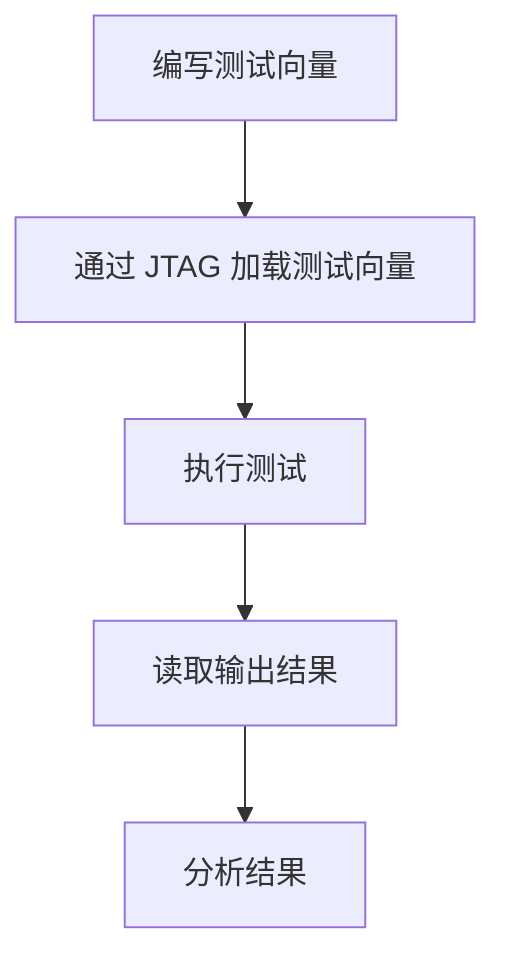

## 什么是 JTAG 接口？

JTAG（Joint Test Action Group）是一种用于测试和调试集成电路的标准接口。它最初是为了解决电路板上的芯片测试问题而设计的，但如今已广泛应用于嵌入式系统的调试和编程。STM32 微控制器支持 JTAG 接口，允许开发者通过 JTAG 调试器与芯片进行通信，从而实现程序的下载、调试和测试。

:::note
JTAG 接口不仅可以用于调试，还可以用于芯片的边界扫描测试（Boundary Scan Test），这是一种通过 JTAG 接口检测芯片引脚连接状态的技术。
:::

## JTAG 接口的工作原理

JTAG 接口通过一组标准的信号线（通常为 4 或 5 根）与目标设备通信。这些信号线包括：

- **TDI（Test Data In）**：数据输入线，用于将数据从调试器传输到目标设备。
- **TDO（Test Data Out）**：数据输出线，用于将数据从目标设备传输到调试器。
- **TCK（Test Clock）**：时钟信号线，用于同步数据传输。
- **TMS（Test Mode Select）**：模式选择线，用于控制 JTAG 状态机的状态转换。
- **TRST（Test Reset）**：可选信号线，用于复位 JTAG 状态机。

:::tip
大多数 STM32 微控制器将 JTAG 接口与 SWD（Serial Wire Debug）接口复用在同一组引脚上。SWD 是一种更简单的调试接口，仅需两根信号线（SWDIO 和 SWCLK）。
:::

## 配置 STM32 的 JTAG 接口

在使用 JTAG 接口之前，需要确保 STM32 的引脚配置正确。以下是一个典型的 JTAG 引脚配置示例：

```c
// 配置 JTAG 引脚
GPIO_InitTypeDef GPIO_InitStruct = {0};

// 使能 GPIO 时钟
__HAL_RCC_GPIOA_CLK_ENABLE();

// 配置 PA13 (JTMS/SWDIO), PA14 (JTCK/SWCLK), PA15 (JTDI), PB3 (JTDO), PB4 (NJTRST)
GPIO_InitStruct.Pin = GPIO_PIN_13 | GPIO_PIN_14 | GPIO_PIN_15;
GPIO_InitStruct.Mode = GPIO_MODE_AF_PP;
GPIO_InitStruct.Pull = GPIO_NOPULL;
GPIO_InitStruct.Speed = GPIO_SPEED_FREQ_HIGH;
GPIO_InitStruct.Alternate = GPIO_AF0_SWJ;
HAL_GPIO_Init(GPIOA, &GPIO_InitStruct);

GPIO_InitStruct.Pin = GPIO_PIN_3 | GPIO_PIN_4;
HAL_GPIO_Init(GPIOB, &GPIO_InitStruct);
```

:::caution
如果不需要使用 JTAG 接口的全部功能（例如仅使用 SWD），可以通过配置禁用部分 JTAG 引脚，以释放这些引脚用于其他用途。
:::

## JTAG 接口的实际应用

### 1. 程序下载与调试

JTAG 接口最常见的用途是通过调试器（如 ST-Link、J-Link 等）将程序下载到 STM32 微控制器中，并进行调试。以下是一个使用 JTAG 接口下载程序的示例：

1. 连接调试器与 STM32 开发板。
2. 在 IDE（如 STM32CubeIDE）中配置调试器为 JTAG 模式。
3. 编译并下载程序到目标设备。
4. 使用断点、单步执行等功能进行调试。

### 2. 边界扫描测试

JTAG 接口还可以用于边界扫描测试，以检测电路板上的连接问题。以下是一个简单的边界扫描测试流程：

1. 编写边界扫描测试向量（Test Vector）。
2. 通过 JTAG 接口将测试向量加载到目标设备中。
3. 读取输出结果并分析是否存在连接问题。



## 总结

JTAG 接口是 STM32 微控制器调试和测试的重要工具。通过 JTAG 接口，开发者可以方便地进行程序下载、调试以及电路板测试。对于初学者来说，掌握 JTAG 接口的基本原理和配置方法是学习 STM32 调试的重要一步。

:::tip
如果你对 JTAG 接口的更多高级功能感兴趣，可以查阅 STM32 的参考手册，了解更多关于 JTAG 状态机和边界扫描测试的细节。
:::

## 附加资源与练习

- **练习 1**：尝试在 STM32CubeIDE 中配置 JTAG 接口，并使用调试器下载一个简单的 LED 闪烁程序。
- **练习 2**：研究如何通过 JTAG 接口禁用部分引脚，以释放这些引脚用于其他用途。
- **资源**：STM32 参考手册中的 JTAG 章节提供了关于 JTAG 接口的详细说明，建议仔细阅读。

通过以上内容的学习和实践，你将能够熟练使用 JTAG 接口进行 STM32 的调试与测试。祝你学习愉快！