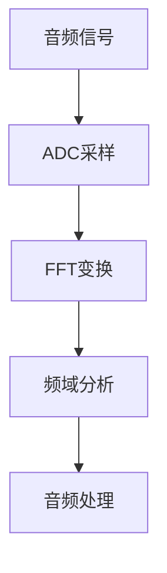
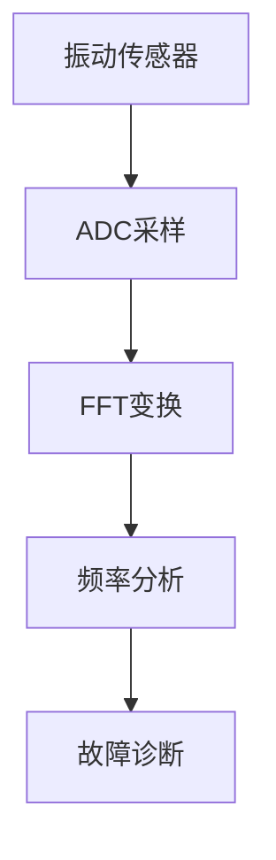

# STM32 FFT变换

## 介绍

快速傅里叶变换（FFT）是一种高效的算法，用于将信号从时域转换到频域。它在信号处理、音频分析、通信系统等领域中有着广泛的应用。STM32微控制器由于其强大的处理能力和丰富的外设资源，非常适合用于实现FFT算法。

在本教程中，我们将逐步讲解如何在STM32上实现FFT变换，并通过一个实际案例展示其应用。

## 什么是FFT？

FFT是离散傅里叶变换（DFT）的一种快速算法。DFT将时域信号转换为频域信号，使我们能够分析信号的频率成分。FFT通过减少计算复杂度，使得在嵌入式系统中实时处理信号成为可能。

### 数学基础

FFT的基本公式如下：

$$
X(k) = \sum_{n=0}^{N-1} x(n) \cdot e^{-j \frac{2\pi}{N} kn}
$$

其中：
- $X(k)$ 是频域中的第k个频率分量。
- $x(n)$ 是时域中的第n个采样点。
- $N$ 是采样点的总数。

## 在STM32上实现FFT

### 准备工作

在STM32上实现FFT，我们需要：
1. 一个支持浮点运算的STM32微控制器（如STM32F4系列）。
2. 一个信号采样源（如ADC）。
3. 一个FFT库（如ARM CMSIS-DSP库）。

### 配置ADC

首先，我们需要配置ADC以采集信号。假设我们使用STM32的ADC1来采集信号：

```c
void ADC_Config(void) {
    // 配置ADC1
    ADC_InitTypeDef ADC_InitStruct;
    ADC_CommonInitTypeDef ADC_CommonInitStruct;

    RCC_APB2PeriphClockCmd(RCC_APB2Periph_ADC1, ENABLE);

    ADC_CommonInitStruct.ADC_Mode = ADC_Mode_Independent;
    ADC_CommonInitStruct.ADC_Prescaler = ADC_Prescaler_Div2;
    ADC_CommonInitStruct.ADC_DMAAccessMode = ADC_DMAAccessMode_Disabled;
    ADC_CommonInitStruct.ADC_TwoSamplingDelay = ADC_TwoSamplingDelay_5Cycles;
    ADC_CommonInit(&ADC_CommonInitStruct);

    ADC_InitStruct.ADC_Resolution = ADC_Resolution_12b;
    ADC_InitStruct.ADC_ScanConvMode = DISABLE;
    ADC_InitStruct.ADC_ContinuousConvMode = ENABLE;
    ADC_InitStruct.ADC_ExternalTrigConvEdge = ADC_ExternalTrigConvEdge_None;
    ADC_InitStruct.ADC_DataAlign = ADC_DataAlign_Right;
    ADC_InitStruct.ADC_NbrOfConversion = 1;
    ADC_Init(ADC1, &ADC_InitStruct);

    ADC_Cmd(ADC1, ENABLE);
}
```

### 使用CMSIS-DSP库进行FFT

ARM CMSIS-DSP库提供了高效的FFT实现。我们可以使用该库来计算FFT。

```c
#include "arm_math.h"

#define FFT_SIZE 1024

float32_t input[FFT_SIZE];
float32_t output[FFT_SIZE];
arm_cfft_radix4_instance_f32 S;

void FFT_Compute(void) {
    // 初始化FFT实例
    arm_cfft_radix4_init_f32(&S, FFT_SIZE, 0, 1);

    // 执行FFT
    arm_cfft_radix4_f32(&S, input);

    // 计算幅度
    arm_cmplx_mag_f32(input, output, FFT_SIZE);
}
```

### 输入与输出

假设我们采集到的信号是一个正弦波，频率为1kHz。经过FFT变换后，我们将在频域中看到一个峰值，对应于1kHz的频率分量。

```c
for (int i = 0; i < FFT_SIZE; i++) {
    input[i] = sin(2 * PI * 1000 * i / FFT_SIZE);  // 1kHz正弦波
}

FFT_Compute();

// 输出频域结果
for (int i = 0; i < FFT_SIZE / 2; i++) {
    printf("Frequency bin %d: %f\n", i, output[i]);
}
```

## 实际应用案例

### 音频频谱分析

在音频处理中，FFT常用于频谱分析。例如，我们可以使用FFT来分析音频信号的频率成分，从而实现均衡器或音效处理。



### 振动监测

在工业应用中，FFT可以用于监测机械设备的振动频率，从而检测设备的健康状况。



## 总结

通过本教程，我们学习了如何在STM32微控制器上实现FFT变换，并探索了其在实际应用中的使用场景。FFT是一个强大的工具，能够帮助我们在嵌入式系统中进行实时信号处理。

### 附加资源

- [ARM CMSIS-DSP库文档](https://www.keil.com/pack/doc/CMSIS/DSP/html/index.html)
- [STM32 ADC配置指南](https://www.st.com/resource/en/user_manual/dm00039084.pdf)

### 练习

1. 尝试使用不同的信号（如方波、三角波）作为输入，观察FFT输出的变化。
2. 修改FFT_SIZE，观察其对计算速度和分辨率的影响。
3. 在实际硬件上实现一个简单的音频频谱分析器。

:::