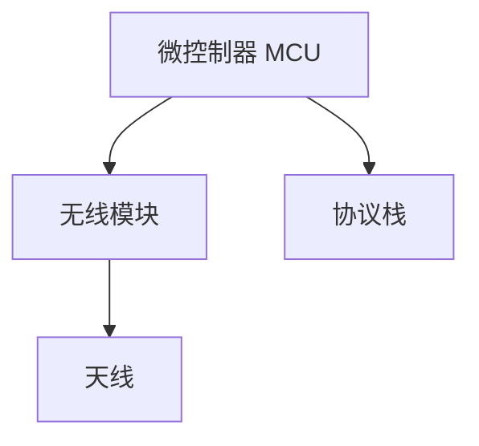

## 引言

在现代嵌入式系统中，无线通信技术扮演着至关重要的角色。STM32微控制器因其强大的性能和丰富的外设支持，成为许多无线通信应用的理想选择。本文将带您了解STM32无线通信的基本概念、常用协议以及实际应用场景，帮助您快速入门。

## 什么是无线通信？

无线通信是指通过无线电波、红外线、激光等无线介质传输数据的技术。与有线通信相比，无线通信具有灵活性高、部署方便等优势，广泛应用于物联网（IoT）、智能家居、工业自动化等领域。

## STM32 支持的无线通信协议

STM32微控制器支持多种无线通信协议，以下是几种常见的协议：

1. **蓝牙（Bluetooth）**：适用于短距离通信，常用于智能设备之间的数据传输。
2. **Wi-Fi**：适用于中长距离通信，支持高速数据传输，常用于互联网连接。
3. **Zigbee**：适用于低功耗、低数据速率的应用场景，如智能家居和工业控制。
4. **LoRa**：适用于远距离、低功耗的通信，常用于广域网（LPWAN）应用。
5. **RF（射频）**：适用于自定义无线通信协议，灵活性高。

:::tip
选择合适的无线通信协议时，需考虑通信距离、功耗、数据速率和应用场景等因素。
:::

## STM32 无线通信的基本架构

STM32的无线通信通常由以下几个部分组成：

1. **微控制器（MCU）**：负责数据处理和控制。
2. **无线模块**：负责无线信号的发送和接收。
3. **天线**：用于发射和接收无线电波。
4. **协议栈**：实现特定无线通信协议的软件层。



## 实际应用场景

### 1. 智能家居

在智能家居系统中，STM32可以通过Wi-Fi或Zigbee协议与智能设备（如灯泡、温控器）通信，实现远程控制和自动化。

### 2. 工业物联网（IIoT）

在工业物联网中，STM32结合LoRa技术可以实现远距离、低功耗的设备监控和数据采集。

### 3. 健康监测

STM32与蓝牙结合，可以用于健康监测设备（如心率监测器）与智能手机之间的数据传输。

## 代码示例：使用STM32实现蓝牙通信

以下是一个简单的代码示例，展示如何使用STM32的HAL库实现蓝牙通信。

```c
#include "stm32f4xx_hal.h"
#include "usart.h"
#include "bluetooth.h"

void SystemClock_Config(void);
static void MX_GPIO_Init(void);

int main(void) {
    HAL_Init();
    SystemClock_Config();
    MX_GPIO_Init();
    MX_USART2_UART_Init();

    Bluetooth_Init();

    while (1) {
        char data[] = "Hello, Bluetooth!";
        Bluetooth_Send(data, sizeof(data));
        HAL_Delay(1000);
    }
}

void SystemClock_Config(void) {
    // 系统时钟配置代码
}

static void MX_GPIO_Init(void) {
    // GPIO初始化代码
}
```

:::note
在实际开发中，您需要根据具体的硬件和协议栈进行配置和调试。
:::

## 总结

STM32无线通信技术为嵌入式系统提供了强大的连接能力，适用于多种应用场景。通过本文的学习，您应该对STM32无线通信的基本概念、常用协议和实际应用有了初步了解。接下来，您可以尝试使用STM32开发板进行实际项目开发，进一步巩固所学知识。

## 附加资源

- [STM32官方文档](https://www.st.com/)
- [Bluetooth协议规范](https://www.bluetooth.com/specifications/)
- [LoRa联盟官网](https://lora-alliance.org/)

## 练习

1. 使用STM32开发板实现一个简单的蓝牙通信项目，发送和接收数据。
2. 尝试将STM32与Wi-Fi模块结合，实现互联网连接。
3. 研究LoRa协议，设计一个远距离通信的应用场景。

希望本文能帮助您在STM32无线通信的学习中迈出坚实的第一步！