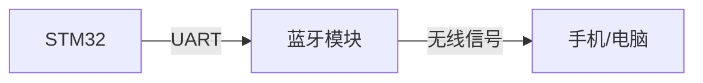

## 介绍

蓝牙是一种短距离无线通信技术，广泛应用于各种设备之间的数据传输。STM32微控制器支持蓝牙通信，可以通过内置的蓝牙模块或外部蓝牙模块实现无线通信。本文将介绍STM32蓝牙通信的基础知识，包括蓝牙协议、硬件连接、软件配置以及实际应用案例。

## 蓝牙协议概述

蓝牙协议栈由多个层次组成，包括物理层、链路层、主机控制器接口（HCI）、逻辑链路控制和适配协议（L2CAP）、服务发现协议（SDP）等。STM32微控制器通常通过HCI接口与蓝牙模块通信。

:::note
蓝牙协议栈的复杂性较高，但在STM32中，通常使用现成的蓝牙库来简化开发过程。
:::

## 硬件连接

在STM32中实现蓝牙通信，通常需要使用外部蓝牙模块，如HC-05或HC-06。这些模块通过UART接口与STM32微控制器通信。

### 连接示意图



### 引脚连接

- **STM32 TX** -> **蓝牙模块 RX**
- **STM32 RX** -> **蓝牙模块 TX**
- **GND** -> **GND**
- **VCC** -> **3.3V/5V**

:::caution
确保蓝牙模块的电压与STM32的电压匹配，否则可能会损坏模块。
:::

## 软件配置

在STM32中配置蓝牙通信，通常需要使用HAL库或LL库。以下是一个简单的UART配置示例，用于与蓝牙模块通信。

### UART配置代码

```c
#include "stm32f1xx_hal.h"

UART_HandleTypeDef huart2;

void SystemClock_Config(void);
static void MX_GPIO_Init(void);
static void MX_USART2_UART_Init(void);

int main(void)
{
    HAL_Init();
    SystemClock_Config();
    MX_GPIO_Init();
    MX_USART2_UART_Init();

    char message[] = "Hello Bluetooth!\n";
    HAL_UART_Transmit(&huart2, (uint8_t*)message, sizeof(message), HAL_MAX_DELAY);

    while (1)
    {
        // 主循环
    }
}

static void MX_USART2_UART_Init(void)
{
    huart2.Instance = USART2;
    huart2.Init.BaudRate = 9600;
    huart2.Init.WordLength = UART_WORDLENGTH_8B;
    huart2.Init.StopBits = UART_STOPBITS_1;
    huart2.Init.Parity = UART_PARITY_NONE;
    huart2.Init.Mode = UART_MODE_TX_RX;
    huart2.Init.HwFlowCtl = UART_HWCONTROL_NONE;
    huart2.Init.OverSampling = UART_OVERSAMPLING_16;
    HAL_UART_Init(&huart2);
}

void SystemClock_Config(void)
{
    // 系统时钟配置
}

static void MX_GPIO_Init(void)
{
    // GPIO初始化
}
```

### 代码解释

- **HAL_UART_Transmit**：通过UART发送数据到蓝牙模块。
- **MX_USART2_UART_Init**：配置UART参数，如波特率、数据位、停止位等。

## 实际应用案例

### 案例：通过蓝牙控制LED

假设我们希望通过手机蓝牙控制STM32上的LED灯。以下是实现步骤：

1. **硬件连接**：将蓝牙模块与STM32连接，LED连接到STM32的GPIO引脚。
2. **软件配置**：配置UART接收中断，当接收到特定命令时，控制LED的开关。

### 代码示例

```c
void HAL_UART_RxCpltCallback(UART_HandleTypeDef *huart)
{
    if (huart->Instance == USART2)
    {
        char receivedChar;
        HAL_UART_Receive(&huart2, (uint8_t*)&receivedChar, 1, HAL_MAX_DELAY);

        if (receivedChar == '1')
        {
            HAL_GPIO_WritePin(GPIOA, GPIO_PIN_5, GPIO_PIN_SET); // 打开LED
        }
        else if (receivedChar == '0')
        {
            HAL_GPIO_WritePin(GPIOA, GPIO_PIN_5, GPIO_PIN_RESET); // 关闭LED
        }
    }
}
```

### 操作步骤

1. 手机通过蓝牙发送字符 `'1'`，STM32接收到后打开LED。
2. 手机通过蓝牙发送字符 `'0'`，STM32接收到后关闭LED。

## 总结

本文介绍了STM32蓝牙通信的基础知识，包括蓝牙协议、硬件连接、软件配置以及实际应用案例。通过本文的学习，你应该能够理解如何在STM32中实现蓝牙通信，并能够通过蓝牙控制简单的设备。

## 附加资源与练习

- **练习1**：尝试修改代码，实现通过蓝牙控制多个LED。
- **练习2**：研究如何通过蓝牙传输更复杂的数据，如传感器数据。
- **资源**：参考STM32官方文档和蓝牙模块的数据手册，深入了解蓝牙通信的细节。

:::tip
在实际项目中，建议使用现成的蓝牙库或中间件，如STM32CubeMX中的蓝牙协议栈，以简化开发过程。
:::