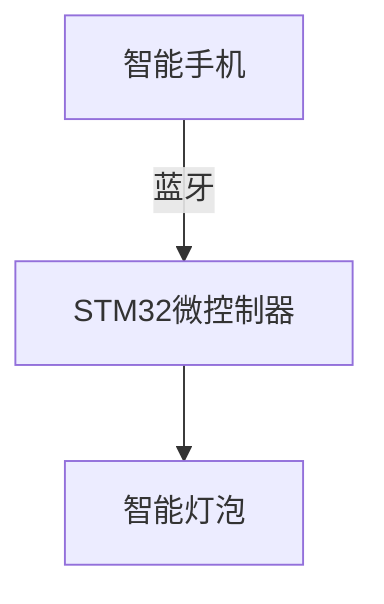

# STM32 无线协议栈

## 介绍

STM32无线协议栈是一组软件库和工具，用于在STM32微控制器上实现无线通信功能。它支持多种无线通信协议，如蓝牙、Zigbee、LoRa等，帮助开发者快速构建无线通信应用。对于初学者来说，理解无线协议栈的工作原理是掌握STM32无线通信的关键。

## 什么是无线协议栈？

无线协议栈是一个分层的软件架构，每一层负责不同的通信任务。它通常包括物理层（PHY）、数据链路层（MAC）、网络层（NWK）和应用层（APP）。每一层都有特定的功能，例如物理层负责信号的发送和接收，而应用层则处理用户数据。

:::note
无线协议栈的分层设计使得开发者可以专注于某一层的开发，而无需关心其他层的细节。
:::

## STM32 无线协议栈的工作原理

STM32无线协议栈的工作原理可以概括为以下几个步骤：

1. **初始化**：配置STM32的硬件和无线模块，初始化协议栈的各个层。
2. **连接建立**：通过无线协议栈建立设备之间的连接。
3. **数据传输**：在连接建立后，设备之间可以开始传输数据。
4. **断开连接**：当通信完成后，设备可以断开连接以节省能源。

### 代码示例

以下是一个简单的STM32蓝牙协议栈初始化代码示例：

```c
#include "bluetooth.h"

void bluetooth_init() {
    // 初始化蓝牙硬件
    HAL_Bluetooth_Init();

    // 配置蓝牙协议栈
    Bluetooth_Stack_Init();

    // 设置蓝牙设备名称
    Bluetooth_Set_Device_Name("STM32_Device");

    // 启动蓝牙广播
    Bluetooth_Start_Advertising();
}
```

在这个示例中，我们首先初始化了蓝牙硬件，然后配置了蓝牙协议栈，并设置了设备名称，最后启动了蓝牙广播。

## 实际应用案例

### 智能家居系统

在智能家居系统中，STM32无线协议栈可以用于实现设备之间的无线通信。例如，通过蓝牙协议栈，智能手机可以与家中的智能灯泡进行通信，控制灯光的开关和亮度。



在这个案例中，STM32微控制器作为中间设备，负责接收智能手机的指令并控制智能灯泡。

## 总结

STM32无线协议栈是嵌入式系统中实现无线通信的重要工具。通过理解其工作原理和分层架构，开发者可以更高效地构建无线通信应用。本文介绍了STM32无线协议栈的基本概念、工作原理，并提供了一个简单的代码示例和实际应用案例。

## 附加资源

- [STM32官方文档](https://www.st.com/)
- [蓝牙协议栈开发指南](https://www.bluetooth.com/)
- [Zigbee协议栈开发指南](https://www.zigbee.org/)

## 练习

1. 尝试修改代码示例中的设备名称，并观察蓝牙广播的变化。
2. 使用STM32无线协议栈实现一个简单的数据传输应用，例如通过蓝牙发送温度数据。

:::tip
在开发过程中，务必参考STM32的官方文档和示例代码，以确保正确配置和使用无线协议栈。
:::