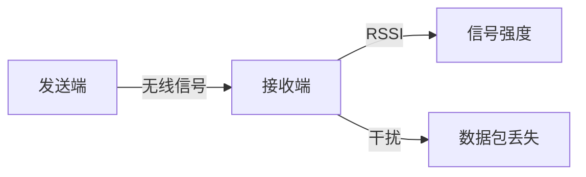

## 介绍

无线通信在现代嵌入式系统中扮演着重要角色，尤其是在物联网（IoT）应用中。STM32微控制器支持多种无线通信协议，如蓝牙、Wi-Fi、LoRa和Zigbee等。然而，无线通信的调试可能会比有线通信更具挑战性，因为它涉及到信号强度、干扰、协议栈配置等多个方面。

在本教程中，我们将逐步讲解如何在STM32上进行无线通信调试，并提供实际案例和代码示例，帮助你更好地理解和掌握这一技能。

## 无线通信调试的基本概念

### 1. 信号强度与干扰

无线通信的信号强度（RSSI）是衡量信号质量的重要指标。信号强度过低可能导致通信失败，而干扰则可能导致数据包丢失或错误。



### 2. 协议栈配置

不同的无线通信协议有不同的协议栈配置。例如，蓝牙协议栈需要配置GAP（Generic Access Profile）和GATT（Generic Attribute Profile），而LoRa则需要配置频率、带宽和扩频因子等参数。

### 3. 调试工具

常用的调试工具包括逻辑分析仪、频谱分析仪和串口调试工具。这些工具可以帮助你捕获和分析无线通信中的数据包，从而找出问题所在。

## 逐步讲解：STM32无线通信调试

### 1. 硬件准备

首先，确保你的STM32开发板支持所需的无线通信协议。例如，如果你要调试蓝牙通信，可以使用STM32WB系列微控制器，它内置了蓝牙协议栈。

### 2. 配置无线通信模块

以蓝牙为例，首先需要配置GAP和GATT。以下是一个简单的GAP配置示例：

```c
#include "stm32wbxx_hal.h"

void GAP_Config(void) {
    // 设置设备名称
    aci_gap_set_auth_requirement(MITM_PROTECTION_NOT_REQUIRED,
                                 OOB_AUTH_DATA_ABSENT,
                                 NULL,
                                 7,
                                 16,
                                 USE_FIXED_PIN_FOR_PAIRING,
                                 123456,
                                 BONDING);

    // 设置广播参数
    aci_gap_set_discoverable(ADV_IND, 0, 0, PUBLIC_ADDR, NO_WHITE_LIST_USE,
                             16, 0, NULL, 0, NULL, 0, 0);
}
```

### 3. 调试信号强度

使用STM32的RSSI功能来测量信号强度。以下代码展示了如何读取RSSI值：

```c
int16_t getRSSI(void) {
    int16_t rssi;
    hci_read_rssi(&rssi);
    return rssi;
}
```

### 4. 捕获和分析数据包

使用逻辑分析仪或串口调试工具捕获数据包。你可以通过串口打印出接收到的数据包内容：

```c
void printPacket(uint8_t *packet, uint16_t length) {
    for (uint16_t i = 0; i < length; i++) {
        printf("%02X ", packet[i]);
    }
    printf("\n");
}
```

## 实际案例：蓝牙温度传感器

假设你正在开发一个基于STM32的蓝牙温度传感器。以下是一个简单的实现步骤：

1. **配置蓝牙协议栈**：使用GAP和GATT配置蓝牙通信。
2. **读取温度传感器数据**：通过I2C或SPI接口读取温度传感器的数据。
3. **发送数据**：将温度数据通过蓝牙发送到手机或电脑。

```c
void sendTemperature(float temperature) {
    uint8_t data[4];
    memcpy(data, &temperature, sizeof(float));
    aci_gatt_update_char_value(0, 0, 4, data);
}
```

## 总结

无线通信调试是STM32开发中的一个重要环节。通过本教程，你应该已经掌握了基本的调试技巧，包括信号强度测量、协议栈配置和数据包分析。希望这些知识能帮助你在实际项目中更好地调试无线通信。

## 附加资源与练习

- **练习1**：尝试使用STM32的LoRa模块进行无线通信调试，并测量不同距离下的信号强度。
- **练习2**：使用逻辑分析仪捕获蓝牙数据包，并分析其内容。
- **资源**：STM32官方文档和社区论坛是学习无线通信调试的宝贵资源。

:::tip
如果你在调试过程中遇到问题，不妨尝试使用不同的调试工具，或者参考STM32的官方示例代码。
:::