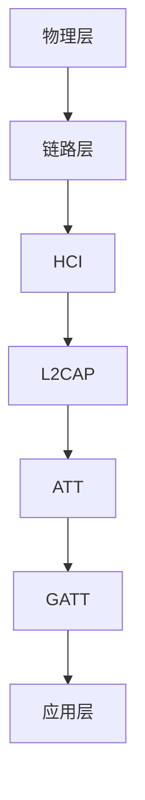

# STM32 蓝牙应用

## 介绍

蓝牙是一种短距离无线通信技术，广泛应用于各种设备之间的数据传输。STM32微控制器支持蓝牙通信，可以通过集成蓝牙模块或外部蓝牙模块实现无线连接。本文将介绍如何在STM32上实现蓝牙通信，并通过代码示例和实际案例帮助初学者理解这一技术。

## 蓝牙基础

蓝牙通信基于主从架构，主设备（如手机）与从设备（如STM32）之间通过蓝牙协议进行通信。常见的蓝牙协议包括经典蓝牙（Bluetooth Classic）和低功耗蓝牙（Bluetooth Low Energy, BLE）。STM32通常使用BLE进行低功耗通信。

### 蓝牙协议栈

蓝牙协议栈包括多个层次，从物理层到应用层。STM32通常使用HCI（Host Controller Interface）与蓝牙模块通信，并通过GATT（Generic Attribute Profile）协议进行数据传输。



## STM32 蓝牙通信实现

### 硬件准备

要实现STM32蓝牙通信，你需要以下硬件：
- STM32开发板（如STM32F4 Discovery）
- 蓝牙模块（如HC-05或HM-10）
- 连接线（如杜邦线）

### 软件准备

在STM32上实现蓝牙通信，通常需要使用HAL库或LL库。以下是一个简单的代码示例，展示如何通过UART与蓝牙模块通信。

```c
#include "stm32f4xx_hal.h"

UART_HandleTypeDef huart2;

void SystemClock_Config(void);
static void MX_GPIO_Init(void);
static void MX_USART2_UART_Init(void);

int main(void) {
    HAL_Init();
    SystemClock_Config();
    MX_GPIO_Init();
    MX_USART2_UART_Init();

    char message[] = "Hello, Bluetooth!\n";
    HAL_UART_Transmit(&huart2, (uint8_t*)message, sizeof(message), HAL_MAX_DELAY);

    while (1) {
        // 主循环
    }
}

void SystemClock_Config(void) {
    // 系统时钟配置
}

static void MX_GPIO_Init(void) {
    // GPIO初始化
}

static void MX_USART2_UART_Init(void) {
    huart2.Instance = USART2;
    huart2.Init.BaudRate = 9600;
    huart2.Init.WordLength = UART_WORDLENGTH_8B;
    huart2.Init.StopBits = UART_STOPBITS_1;
    huart2.Init.Parity = UART_PARITY_NONE;
    huart2.Init.Mode = UART_MODE_TX_RX;
    huart2.Init.HwFlowCtl = UART_HWCONTROL_NONE;
    huart2.Init.OverSampling = UART_OVERSAMPLING_16;
    HAL_UART_Init(&huart2);
}
```

### 代码解释

1. **HAL库初始化**：`HAL_Init()` 初始化HAL库。
2. **系统时钟配置**：`SystemClock_Config()` 配置系统时钟。
3. **GPIO初始化**：`MX_GPIO_Init()` 初始化GPIO引脚。
4. **UART初始化**：`MX_USART2_UART_Init()` 初始化UART接口，用于与蓝牙模块通信。
5. **发送数据**：`HAL_UART_Transmit()` 通过UART发送数据到蓝牙模块。

## 实际应用场景

### 智能家居控制

在智能家居系统中，STM32可以通过蓝牙与手机APP通信，实现远程控制家电。例如，通过手机APP发送指令，STM32控制灯光开关。

```c
char command[] = "TURN_ON_LIGHT\n";
HAL_UART_Transmit(&huart2, (uint8_t*)command, sizeof(command), HAL_MAX_DELAY);
```

### 健康监测设备

在健康监测设备中，STM32可以通过蓝牙将传感器数据（如心率、体温）发送到手机APP，实现实时监测。

```c
char data[] = "HEART_RATE:72\n";
HAL_UART_Transmit(&huart2, (uint8_t*)data, sizeof(data), HAL_MAX_DELAY);
```

## 总结

本文介绍了STM32蓝牙通信的基础知识、硬件准备、软件实现以及实际应用场景。通过本文的学习，你应该能够在STM32上实现基本的蓝牙通信，并将其应用于实际项目中。

## 附加资源

- [STM32 HAL库文档](https://www.st.com/en/embedded-software/stm32cube-mcu-mpu-packages.html)
- [蓝牙协议规范](https://www.bluetooth.com/specifications/bluetooth-core-specification/)

## 练习

1. 修改代码示例，使其能够接收蓝牙模块发送的数据并打印到串口。
2. 设计一个简单的智能家居控制系统，通过蓝牙控制多个家电设备。
