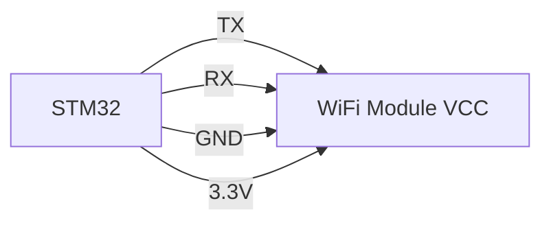

## 介绍

在现代物联网（IoT）应用中，无线通信是不可或缺的一部分。STM32 微控制器通过与 WiFi 模块的集成，能够轻松实现无线数据传输。本文将详细介绍如何在 STM32 上配置 WiFi 模块，帮助你快速上手无线通信的开发。

## 准备工作

在开始配置之前，确保你已经准备好以下工具和材料：
- 一块支持 WiFi 的 STM32 开发板（如 STM32F4 Discovery 或 STM32H7 Nucleo）。
- 一个 WiFi 模块（如 ESP8266 或 ESP32）。
- STM32CubeMX 和 STM32CubeIDE 开发环境。
- 基本的 C 语言编程知识。

## WiFi 模块与 STM32 的连接

首先，我们需要将 WiFi 模块与 STM32 微控制器连接。常见的连接方式是通过 UART 或 SPI 接口。以下是一个典型的 UART 连接示意图：



:::note
确保 WiFi 模块的电压与 STM32 的电压匹配，通常为 3.3V。
:::

## 配置 STM32CubeMX

1. 打开 STM32CubeMX，创建一个新项目并选择你的 STM32 开发板型号。
2. 在 "Pinout & Configuration" 选项卡中，启用 UART 或 SPI 接口，具体取决于你选择的连接方式。
3. 配置 UART 或 SPI 的参数，如波特率、数据位、停止位等。
4. 生成代码并导入到 STM32CubeIDE 中。

## 编写 WiFi 配置代码

以下是一个简单的代码示例，展示如何通过 UART 与 ESP8266 WiFi 模块通信：

```c
#include "stm32f4xx_hal.h"

UART_HandleTypeDef huart2;

void SystemClock_Config(void);
static void MX_GPIO_Init(void);
static void MX_USART2_UART_Init(void);

int main(void) {
    HAL_Init();
    SystemClock_Config();
    MX_GPIO_Init();
    MX_USART2_UART_Init();

    char wifi_command[] = "AT+CWJAP=\"SSID\",\"PASSWORD\"\r\n";
    HAL_UART_Transmit(&huart2, (uint8_t*)wifi_command, strlen(wifi_command), HAL_MAX_DELAY);

    char response[100];
    HAL_UART_Receive(&huart2, (uint8_t*)response, sizeof(response), HAL_MAX_DELAY);
    printf("Response: %s\n", response);

    while (1) {
        // 主循环
    }
}

void SystemClock_Config(void) {
    // 系统时钟配置
}

static void MX_GPIO_Init(void) {
    // GPIO 初始化
}

static void MX_USART2_UART_Init(void) {
    // UART 初始化
}
```

:::tip
在实际应用中，建议使用状态机或中断来处理 WiFi 模块的响应，以提高代码的效率和可靠性。
:::

## 实际应用案例

假设你正在开发一个智能家居系统，需要通过 WiFi 将传感器数据发送到云端。以下是一个简单的应用场景：

1. **传感器数据采集**：使用 STM32 读取温度传感器的数据。
2. **WiFi 连接**：通过 ESP8266 模块将数据发送到指定的服务器。
3. **数据上传**：使用 HTTP 或 MQTT 协议将数据上传到云端。

```c
char http_request[] = "POST /data HTTP/1.1\r\nHost: example.com\r\nContent-Length: 10\r\n\r\ntemp=25.3";
HAL_UART_Transmit(&huart2, (uint8_t*)http_request, strlen(http_request), HAL_MAX_DELAY);
```

## 总结

通过本文的学习，你应该已经掌握了如何在 STM32 上配置 WiFi 模块，并实现基本的无线通信功能。我们介绍了硬件连接、STM32CubeMX 配置、代码编写以及实际应用案例。希望这些内容能够帮助你在物联网项目中更好地应用 STM32 和 WiFi 技术。

## 附加资源与练习

- **练习 1**：尝试使用不同的 WiFi 模块（如 ESP32）并比较其性能。
- **练习 2**：实现一个简单的 MQTT 客户端，将传感器数据发布到 MQTT 服务器。
- **资源**：参考 [STM32CubeMX 官方文档](https://www.st.com/en/development-tools/stm32cubemx.html) 和 [ESP8266 AT 指令集](https://www.espressif.com/en/products/socs/esp8266/resources) 获取更多信息。

祝你学习愉快，编程顺利！