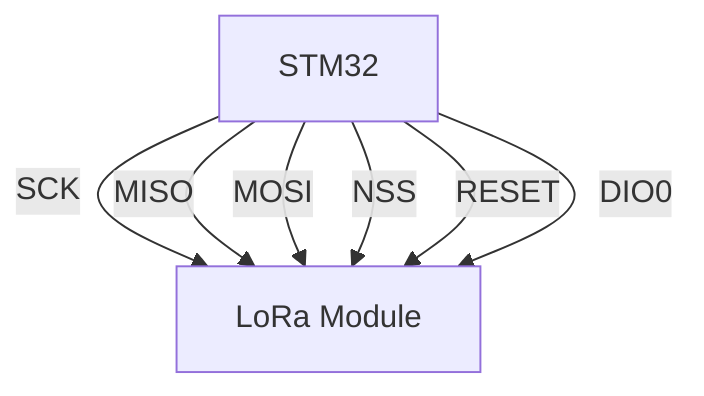
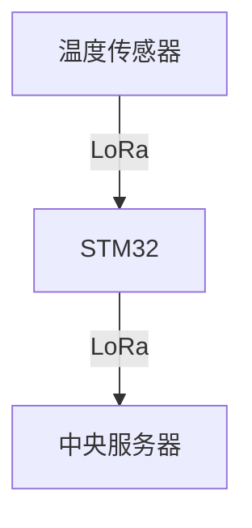
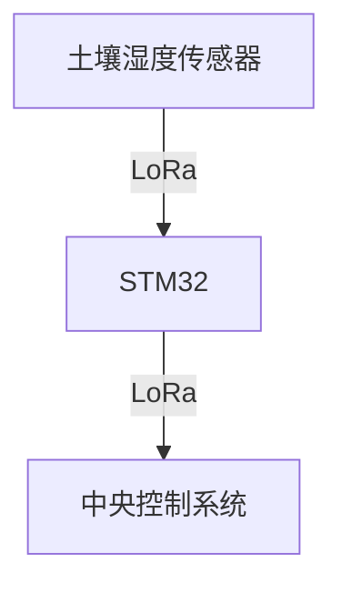

## 介绍

LoRa（Long Range）是一种低功耗、远距离的无线通信技术，广泛应用于物联网（IoT）设备中。STM32 微控制器通过与 LoRa 模块的接口，可以实现高效的无线数据传输。本文将详细介绍如何在 STM32 上实现 LoRa 通信，并提供代码示例和实际应用场景。

## LoRa 基础

LoRa 技术基于扩频调制，能够在低功耗的情况下实现远距离通信。它通常工作在 Sub-GHz 频段（如 433MHz、868MHz、915MHz），适合需要长距离传输和低功耗的应用场景。

### LoRa 模块

常见的 LoRa 模块包括 Semtech 的 SX1276、SX1278 等。这些模块通过 SPI 接口与 STM32 微控制器通信。

## STM32 与 LoRa 模块的连接

### 硬件连接

STM32 与 LoRa 模块的连接通常通过 SPI 接口实现。以下是典型的连接方式：

- **SCK**: STM32 的 SPI 时钟引脚
- **MISO**: STM32 的 SPI 主输入从输出引脚
- **MOSI**: STM32 的 SPI 主输出从输入引脚
- **NSS**: STM32 的 SPI 片选引脚
- **RESET**: LoRa 模块的复位引脚
- **DIO0**: LoRa 模块的中断引脚



### 软件配置

在 STM32 上配置 SPI 接口以与 LoRa 模块通信。以下是一个简单的 SPI 初始化代码示例：

```c
#include "stm32f1xx_hal.h"

SPI_HandleTypeDef hspi1;

void SPI1_Init(void) {
    hspi1.Instance = SPI1;
    hspi1.Init.Mode = SPI_MODE_MASTER;
    hspi1.Init.Direction = SPI_DIRECTION_2LINES;
    hspi1.Init.DataSize = SPI_DATASIZE_8BIT;
    hspi1.Init.CLKPolarity = SPI_POLARITY_LOW;
    hspi1.Init.CLKPhase = SPI_PHASE_1EDGE;
    hspi1.Init.NSS = SPI_NSS_SOFT;
    hspi1.Init.BaudRatePrescaler = SPI_BAUDRATEPRESCALER_256;
    hspi1.Init.FirstBit = SPI_FIRSTBIT_MSB;
    hspi1.Init.TIMode = SPI_TIMODE_DISABLE;
    hspi1.Init.CRCCalculation = SPI_CRCCALCULATION_DISABLE;
    hspi1.Init.CRCPolynomial = 10;
    HAL_SPI_Init(&hspi1);
}
```

## LoRa 通信实现

### 初始化 LoRa 模块

在 STM32 上初始化 LoRa 模块，通常需要配置 LoRa 模块的工作频率、带宽、扩频因子等参数。以下是一个简单的初始化代码示例：

```c
void LoRa_Init(void) {
    // 复位 LoRa 模块
    HAL_GPIO_WritePin(LoRa_RESET_GPIO_Port, LoRa_RESET_Pin, GPIO_PIN_RESET);
    HAL_Delay(100);
    HAL_GPIO_WritePin(LoRa_RESET_GPIO_Port, LoRa_RESET_Pin, GPIO_PIN_SET);
    HAL_Delay(100);

    // 配置 LoRa 模块
    LoRa_WriteRegister(REG_OP_MODE, MODE_LONG_RANGE_MODE | MODE_SLEEP);
    HAL_Delay(100);
    LoRa_WriteRegister(REG_OP_MODE, MODE_LONG_RANGE_MODE | MODE_STANDBY);
    HAL_Delay(100);

    // 设置频率
    uint64_t frf = ((uint64_t)868000000 << 19) / 32000000;
    LoRa_WriteRegister(REG_FRF_MSB, (uint8_t)(frf >> 16));
    LoRa_WriteRegister(REG_FRF_MID, (uint8_t)(frf >> 8));
    LoRa_WriteRegister(REG_FRF_LSB, (uint8_t)(frf >> 0));

    // 设置带宽、扩频因子等
    LoRa_WriteRegister(REG_MODEM_CONFIG_1, 0x72);
    LoRa_WriteRegister(REG_MODEM_CONFIG_2, 0x74);
}
```

### 发送和接收数据

LoRa 模块可以发送和接收数据包。以下是一个简单的发送和接收数据的代码示例：

```c
void LoRa_SendPacket(uint8_t *buffer, uint8_t size) {
    // 设置为发送模式
    LoRa_WriteRegister(REG_OP_MODE, MODE_LONG_RANGE_MODE | MODE_TX);

    // 写入数据
    LoRa_WriteRegister(REG_FIFO_ADDR_PTR, 0);
    for (int i = 0; i < size; i++) {
        LoRa_WriteRegister(REG_FIFO, buffer[i]);
    }
    LoRa_WriteRegister(REG_PAYLOAD_LENGTH, size);

    // 开始发送
    LoRa_WriteRegister(REG_OP_MODE, MODE_LONG_RANGE_MODE | MODE_TX);
}

uint8_t LoRa_ReceivePacket(uint8_t *buffer, uint8_t size) {
    // 设置为接收模式
    LoRa_WriteRegister(REG_OP_MODE, MODE_LONG_RANGE_MODE | MODE_RXCONTINUOUS);

    // 检查是否有数据
    if (LoRa_ReadRegister(REG_IRQ_FLAGS) & IRQ_RX_DONE_MASK) {
        // 读取数据
        uint8_t length = LoRa_ReadRegister(REG_RX_NB_BYTES);
        LoRa_ReadRegister(REG_FIFO_ADDR_PTR);
        for (int i = 0; i < length; i++) {
            buffer[i] = LoRa_ReadRegister(REG_FIFO);
        }
        return length;
    }
    return 0;
}
```

## 实际应用场景

### 远程环境监测

LoRa 技术非常适合用于远程环境监测系统。例如，可以使用 STM32 和 LoRa 模块构建一个远程温度监测系统，将温度数据从远程传感器节点发送到中央服务器。



### 智能农业

在智能农业中，LoRa 可以用于监测土壤湿度、光照强度等参数，并将数据传输到中央控制系统，以便进行自动化灌溉和施肥。



## 总结

本文介绍了如何在 STM32 微控制器上使用 LoRa 无线通信技术。我们从基础概念讲起，逐步介绍了 LoRa 模块的硬件连接、软件配置以及数据发送和接收的实现。最后，我们还探讨了 LoRa 在实际应用中的场景。

## 附加资源与练习

- **练习**: 尝试修改代码，实现一个简单的 LoRa 通信系统，发送和接收自定义数据包。
- **资源**: 参考 Semtech 的 SX1276 数据手册，了解更多关于 LoRa 模块的详细信息。

:::tip
如果你在实现过程中遇到问题，可以参考 STM32 的 HAL 库文档，或者查阅相关的 LoRa 模块数据手册。
:::