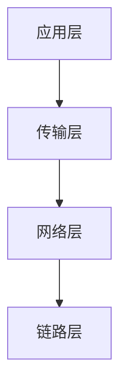

# STM32 TCP/IP 基础

## 介绍

TCP/IP（传输控制协议/互联网协议）是互联网通信的基础协议栈。它定义了数据如何在网络中传输，并确保数据的可靠性和完整性。STM32 微控制器通过集成以太网控制器或使用外部模块（如 W5500、ENC28J60 等）支持 TCP/IP 协议栈，使得开发者能够在嵌入式系统中实现网络通信。

本文将逐步介绍 TCP/IP 协议的基础知识，并展示如何在 STM32 上实现简单的 TCP/IP 通信。

## TCP/IP 协议栈

TCP/IP 协议栈由四层组成：

1. **应用层**：提供应用程序之间的通信（如 HTTP、FTP、SMTP 等）。
2. **传输层**：负责端到端的通信（如 TCP、UDP）。
3. **网络层**：处理数据包的路由和转发（如 IP 协议）。
4. **链路层**：负责物理网络上的数据传输（如以太网、Wi-Fi）。



## STM32 上的 TCP/IP 实现

在 STM32 上实现 TCP/IP 通信通常需要使用一个轻量级的 TCP/IP 协议栈，如 [LwIP](https://savannah.nongnu.org/projects/lwip/)（轻量级 IP 协议栈）。LwIP 是一个开源的 TCP/IP 协议栈，专为嵌入式系统设计，适合资源有限的微控制器。

### 配置 LwIP

首先，需要在 STM32 项目中配置 LwIP。以下是一个简单的配置步骤：

1. **初始化以太网控制器**：配置 STM32 的以太网外设或外部以太网模块。
2. **配置 LwIP**：设置 IP 地址、子网掩码、网关等网络参数。
3. **创建 TCP 服务器或客户端**：使用 LwIP 提供的 API 创建 TCP 连接。

### 代码示例：创建一个简单的 TCP 服务器

以下是一个简单的 TCP 服务器示例，监听端口 5000 并接收客户端发送的数据。

```c
#include "lwip/opt.h"
#include "lwip/sys.h"
#include "lwip/api.h"

void tcp_server_thread(void *arg)
{
    struct netconn *conn, *newconn;
    err_t err;
    struct netbuf *buf;
    char *data;
    u16_t len;

    conn = netconn_new(NETCONN_TCP);
    netconn_bind(conn, NULL, 5000);
    netconn_listen(conn);

    while (1) {
        err = netconn_accept(conn, &newconn);
        if (err == ERR_OK) {
            while ((err = netconn_recv(newconn, &buf)) == ERR_OK) {
                do {
                    netbuf_data(buf, (void **)&data, &len);
                    // 处理接收到的数据
                    netconn_write(newconn, data, len, NETCONN_COPY);
                } while (netbuf_next(buf) >= 0);
                netbuf_delete(buf);
            }
            netconn_close(newconn);
            netconn_delete(newconn);
        }
    }
}

int main(void)
{
    sys_thread_new("tcp_server_thread", tcp_server_thread, NULL, DEFAULT_THREAD_STACKSIZE, DEFAULT_THREAD_PRIO);
    while (1) {
        // 主循环
    }
    return 0;
}
```

### 代码解释

- `netconn_new(NETCONN_TCP)`：创建一个新的 TCP 连接。
- `netconn_bind(conn, NULL, 5000)`：绑定到端口 5000。
- `netconn_listen(conn)`：开始监听连接。
- `netconn_accept(conn, &newconn)`：接受新的客户端连接。
- `netconn_recv(newconn, &buf)`：接收客户端发送的数据。
- `netconn_write(newconn, data, len, NETCONN_COPY)`：将接收到的数据回显给客户端。

## 实际应用场景

### 远程监控系统

在工业自动化中，STM32 可以通过 TCP/IP 协议与远程监控系统通信。例如，STM32 可以作为一个 TCP 服务器，接收来自监控系统的控制命令，并返回传感器数据。

### 智能家居

在智能家居系统中，STM32 可以通过 TCP/IP 协议与家庭网关通信，实现远程控制家电设备的功能。

## 总结

本文介绍了 STM32 上 TCP/IP 协议的基础知识，并展示了如何使用 LwIP 协议栈在 STM32 上实现简单的 TCP 服务器。通过理解 TCP/IP 协议栈的结构和 STM32 的网络通信实现，开发者可以在嵌入式系统中实现复杂的网络应用。

## 附加资源

- [LwIP 官方文档](https://savannah.nongnu.org/projects/lwip/)
- [STM32 以太网外设参考手册](https://www.st.com/resource/en/reference_manual/dm00031020-stm32f405-415-stm32f407-417-stm32f427-437-and-stm32f429-439-advanced-arm-based-32-bit-mcus-stmicroelectronics.pdf)
- [TCP/IP 协议详解](https://en.wikipedia.org/wiki/Internet_protocol_suite)

## 练习

1. 修改上述代码，使其能够处理多个客户端连接。
2. 尝试在 STM32 上实现一个 TCP 客户端，连接到远程服务器并发送数据。
3. 研究 LwIP 的 UDP 实现，并在 STM32 上实现一个简单的 UDP 服务器。

:::tip
在调试网络应用时，使用网络调试工具（如 Wireshark）可以帮助你分析网络数据包，快速定位问题。
:::