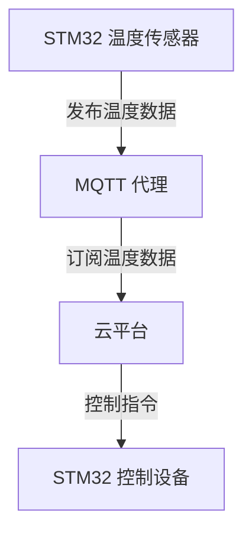
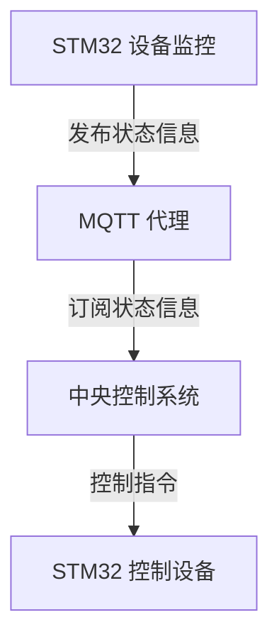

# STM32 MQTT 客户端

MQTT（Message Queuing Telemetry Transport）是一种轻量级的消息传输协议，专为低带宽、不稳定网络环境下的物联网设备设计。STM32 作为一款广泛使用的嵌入式微控制器，能够通过 MQTT 协议与云平台或其他设备进行通信。本文将详细介绍如何在 STM32 上实现 MQTT 客户端，并通过实际案例展示其应用。

## 什么是 MQTT？

MQTT 是一种基于发布/订阅模式的通信协议。它由三个主要组件组成：

1. **发布者（Publisher）**：负责发布消息到特定的主题（Topic）。
2. **订阅者（Subscriber）**：订阅感兴趣的主题，并接收相关消息。
3. **代理（Broker）**：负责接收发布者的消息，并将其转发给订阅者。

MQTT 协议的优势在于其轻量级和低功耗，非常适合资源受限的嵌入式设备。

## STM32 上的 MQTT 客户端实现

在 STM32 上实现 MQTT 客户端，通常需要以下步骤：

1. **选择 MQTT 库**：选择一个适合 STM32 的 MQTT 库，例如 `Eclipse Paho MQTT` 或 `MQTT-C`。
2. **配置网络连接**：确保 STM32 能够通过以太网或 Wi-Fi 连接到 MQTT 代理。
3. **实现 MQTT 客户端逻辑**：编写代码以连接 MQTT 代理、订阅主题、发布消息以及处理接收到的消息。

### 代码示例

以下是一个简单的 STM32 MQTT 客户端代码示例，使用 `Eclipse Paho MQTT` 库：

```c
#include "MQTTClient.h"
#include "Network.h"

#define MQTT_BROKER "mqtt.eclipse.org"
#define MQTT_PORT 1883
#define CLIENT_ID "STM32Client"
#define TOPIC "stm32/topic"

Network network;
MQTTClient client;

void messageArrived(MQTT::MessageData& md) {
    MQTT::Message &message = md.message;
    printf("Message arrived: %.*s\n", message.payloadlen, (char*)message.payload);
}

int main() {
    NetworkInit(&network);
    MQTTClientInit(&client, &network, 1000, messageArrived);

    MQTTPacket_connectData connectData = MQTTPacket_connectData_initializer;
    connectData.MQTTVersion = 3;
    connectData.clientID.cstring = CLIENT_ID;
    connectData.keepAliveInterval = 20;
    connectData.cleansession = 1;

    if (NetworkConnect(&network, MQTT_BROKER, MQTT_PORT) < 0) {
        printf("Failed to connect to MQTT broker\n");
        return -1;
    }

    if (MQTTConnect(&client, &connectData) < 0) {
        printf("Failed to connect to MQTT broker\n");
        return -1;
    }

    if (MQTTSubscribe(&client, TOPIC, 1) < 0) {
        printf("Failed to subscribe to topic\n");
        return -1;
    }

    while (1) {
        MQTTYield(&client, 1000);
    }

    return 0;
}
```

### 代码解释

1. **NetworkInit**：初始化网络连接。
2. **MQTTClientInit**：初始化 MQTT 客户端，并设置消息到达时的回调函数。
3. **MQTTPacket_connectData**：配置 MQTT 连接参数，包括客户端 ID、保持连接时间等。
4. **NetworkConnect**：连接到 MQTT 代理。
5. **MQTTConnect**：与 MQTT 代理建立连接。
6. **MQTTSubscribe**：订阅指定的主题。
7. **MQTTYield**：在主循环中处理 MQTT 消息。

## 实际应用案例

### 智能家居系统

在智能家居系统中，STM32 可以作为传感器节点，通过 MQTT 协议将温度、湿度等数据发布到云平台。云平台可以订阅这些数据，并根据需要控制家中的设备。



### 工业物联网

在工业物联网中，STM32 可以用于监控设备的运行状态，并通过 MQTT 协议将状态信息发送到中央控制系统。中央控制系统可以根据接收到的数据做出相应的决策。



## 总结

通过本文，您已经了解了如何在 STM32 上实现 MQTT 客户端，并掌握了 MQTT 协议的基本概念及其在物联网中的应用。MQTT 协议因其轻量级和低功耗的特点，非常适合用于嵌入式设备的通信。

## 附加资源与练习

- **练习**：尝试在 STM32 上实现一个简单的 MQTT 客户端，并发布和订阅消息。
- **资源**：
  - [Eclipse Paho MQTT 官方文档](https://www.eclipse.org/paho/)
  - [MQTT 协议规范](https://mqtt.org/mqtt-specification/)

:::tip
在实际项目中，建议使用更健壮的 MQTT 库，并考虑网络连接的稳定性和安全性。
:::