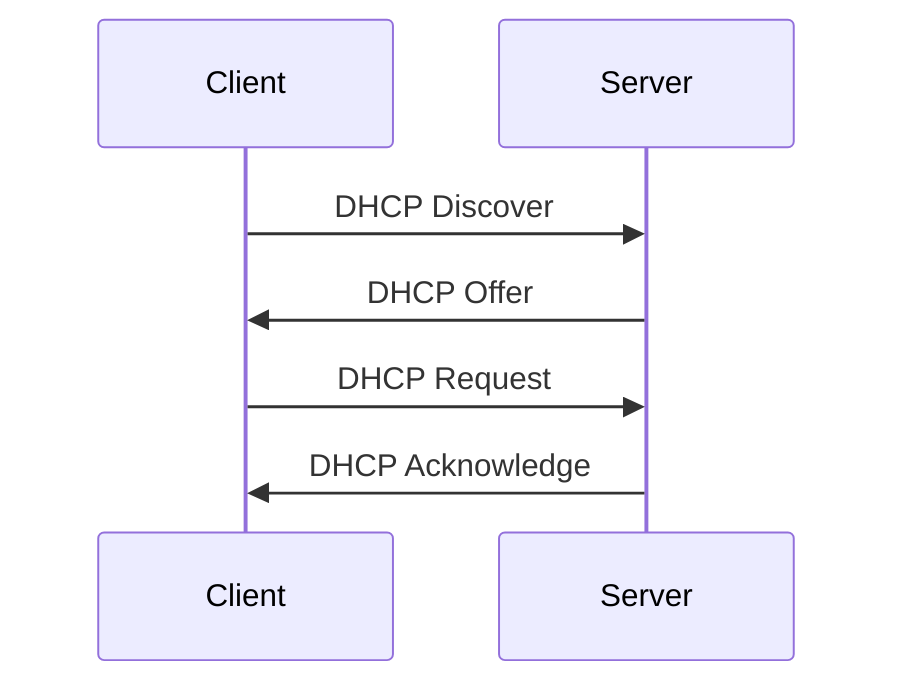

# STM32 DHCP 客户端

## 介绍

在现代嵌入式系统中，网络连接变得越来越重要。动态主机配置协议（DHCP）是一种网络协议，允许设备自动从 DHCP 服务器获取 IP 地址和其他网络配置信息。对于 STM32 微控制器，实现 DHCP 客户端可以大大简化网络配置，特别是在设备需要频繁更换网络环境的情况下。

本文将详细介绍如何在 STM32 上实现 DHCP 客户端，并提供代码示例和实际应用场景。

## DHCP 的工作原理

DHCP 是一种客户端-服务器协议，客户端通过发送 DHCP 请求来获取 IP 地址、子网掩码、默认网关和 DNS 服务器等信息。整个过程通常包括以下步骤：

1. **DHCP Discover**：客户端广播一个 DHCP Discover 消息，寻找可用的 DHCP 服务器。
2. **DHCP Offer**：DHCP 服务器响应一个 DHCP Offer 消息，提供可用的 IP 地址。
3. **DHCP Request**：客户端选择一个 Offer 并发送 DHCP Request 消息，请求该 IP 地址。
4. **DHCP Acknowledge**：DHCP 服务器确认请求，并发送 DHCP Acknowledge 消息，完成 IP 地址分配。



## 在 STM32 上实现 DHCP 客户端

### 1. 配置网络接口

首先，确保你的 STM32 项目已经配置了网络接口。通常，这涉及到配置以太网控制器（如 STM32 的 ETH 外设）和相关的 PHY 芯片。

```c
// 初始化以太网外设
ETH_HandleTypeDef heth;
void MX_ETH_Init(void) {
    // 配置 ETH 外设
    heth.Instance = ETH;
    heth.Init.AutoNegotiation = ETH_AUTONEGOTIATION_ENABLE;
    heth.Init.Speed = ETH_SPEED_100M;
    heth.Init.DuplexMode = ETH_MODE_FULLDUPLEX;
    heth.Init.PhyAddress = LAN8742A_PHY_ADDRESS;
    HAL_ETH_Init(&heth);
}
```

### 2. 配置 LwIP 协议栈

LwIP 是一个轻量级的 TCP/IP 协议栈，广泛用于嵌入式系统。我们需要在 LwIP 中启用 DHCP 客户端功能。

```c
#include "lwip/dhcp.h"

// 初始化 LwIP 协议栈
void MX_LWIP_Init(void) {
    // 初始化 LwIP
    lwip_init();

    // 创建网络接口
    netif_add(&gnetif, &ipaddr, &netmask, &gw, NULL, ðernetif_init, &tcpip_input);

    // 启用 DHCP 客户端
    dhcp_start(&gnetif);
}
```

### 3. 处理 DHCP 事件

在 LwIP 中，DHCP 事件是通过回调函数处理的。你可以通过注册回调函数来监控 DHCP 的状态变化。

```c
void dhcp_event_callback(struct netif *netif) {
    if (dhcp_supplied_address(netif)) {
        printf("DHCP IP address assigned: %s\n", ip4addr_ntoa(netif_ip4_addr(netif)));
    } else {
        printf("DHCP IP address assignment failed\n");
    }
}

// 在初始化时注册回调函数
netif_set_status_callback(&gnetif, dhcp_event_callback);
```

### 4. 测试 DHCP 客户端

编译并烧录代码到 STM32 开发板，连接网络后，你应该能够看到 DHCP 客户端成功获取 IP 地址的输出。

```plaintext
DHCP IP address assigned: 192.168.1.100
```

## 实际应用场景

### 1. 物联网设备

在物联网设备中，设备可能需要频繁更换网络环境。通过 DHCP 客户端，设备可以自动获取 IP 地址，而无需手动配置。

### 2. 工业自动化

在工业自动化系统中，设备通常需要与多个控制器和服务器通信。使用 DHCP 可以简化网络配置，减少人为错误。

## 总结

通过本文，你已经了解了如何在 STM32 上实现 DHCP 客户端。DHCP 客户端可以大大简化网络配置，特别是在设备需要频繁更换网络环境的情况下。我们通过 LwIP 协议栈实现了 DHCP 客户端，并展示了如何监控 DHCP 事件。

## 附加资源与练习

- **练习 1**：尝试在 STM32 上实现静态 IP 地址配置，并与 DHCP 客户端进行比较。
- **练习 2**：扩展代码，使其能够处理 DHCP 失败的情况，并尝试重新获取 IP 地址。
- **资源**：阅读 [LwIP 官方文档](https://savannah.nongnu.org/projects/lwip/) 以了解更多关于 LwIP 协议栈的详细信息。

:::tip
如果你在实现过程中遇到问题，可以参考 STM32 官方提供的 HAL 库和 LwIP 示例代码，这些代码通常包含详细的注释和说明。
:::