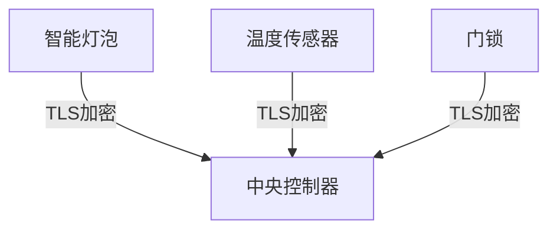

# STM32 网络安全

## 介绍

在现代嵌入式系统中，网络安全是一个至关重要的主题。随着物联网（IoT）设备的普及，越来越多的设备通过网络进行通信，这使得它们容易受到各种网络攻击。STM32微控制器作为嵌入式系统的核心，也需要具备强大的网络安全功能，以确保数据的机密性、完整性和可用性。

本文将介绍如何在STM32微控制器中实现网络安全，涵盖从基本概念到实际应用的各个方面。

## 基本概念

### 1. 加密与解密

加密是将数据转换为不可读格式的过程，而解密则是将加密数据恢复为原始格式的过程。常见的加密算法包括AES（高级加密标准）、RSA（非对称加密）和SHA（安全哈希算法）。

### 2. 认证与授权

认证是验证用户或设备身份的过程，而授权是确定用户或设备是否有权限访问特定资源的过程。常见的认证机制包括密码、数字证书和生物识别。

### 3. 安全通信协议

安全通信协议用于在网络中安全地传输数据。常见的协议包括TLS（传输层安全协议）和DTLS（数据报传输层安全协议）。

## 实现步骤

### 1. 配置硬件安全模块（HSM）

STM32微控制器通常配备硬件安全模块（HSM），用于加速加密操作并存储密钥。首先，我们需要配置HSM以启用加密功能。

```c
#include "stm32f4xx_hal.h"

void HSM_Init(void) {
    // 启用HSM模块
    __HAL_RCC_HSM_ENABLE();
    // 配置HSM参数
    HAL_HSM_Config(&hsm_config);
}
```

### 2. 实现AES加密

以下是一个使用AES算法加密数据的示例代码：

```c
#include "stm32f4xx_hal.h"
#include "stm32f4xx_hal_cryp.h"

void AES_Encrypt(uint8_t* plaintext, uint8_t* ciphertext, uint8_t* key) {
    CRYP_HandleTypeDef hcryp;
    hcryp.Instance = CRYP;
    hcryp.Init.KeySize = CRYP_KEYSIZE_128B;
    hcryp.Init.DataType = CRYP_DATATYPE_8B;
    hcryp.Init.pKey = key;
    HAL_CRYP_Init(&hcryp);

    HAL_CRYP_AESECB_Encrypt(&hcryp, plaintext, 16, ciphertext, HAL_MAX_DELAY);
    HAL_CRYP_DeInit(&hcryp);
}
```

### 3. 配置TLS协议

为了实现安全的网络通信，我们可以使用TLS协议。以下是一个配置TLS的示例代码：

```c
#include "mbedtls/ssl.h"
#include "mbedtls/net_sockets.h"

void TLS_Init(void) {
    mbedtls_ssl_context ssl;
    mbedtls_ssl_config conf;
    mbedtls_ssl_init(&ssl);
    mbedtls_ssl_config_init(&conf);

    // 配置TLS参数
    mbedtls_ssl_config_defaults(&conf, MBEDTLS_SSL_IS_CLIENT, MBEDTLS_SSL_TRANSPORT_STREAM, MBEDTLS_SSL_PRESET_DEFAULT);
    mbedtls_ssl_setup(&ssl, &conf);
}
```

## 实际案例

### 案例：智能家居系统

在一个智能家居系统中，多个设备（如灯光控制器、温度传感器等）通过Wi-Fi连接到中央控制器。为了保护这些设备免受网络攻击，我们可以使用TLS协议来加密通信，并使用AES算法加密存储的数据。



## 总结

在STM32微控制器中实现网络安全是保护嵌入式系统免受攻击的关键步骤。通过配置硬件安全模块、实现加密算法和使用安全通信协议，我们可以确保数据的机密性、完整性和可用性。

## 附加资源

- [STM32官方文档](https://www.st.com/)
- [Mbed TLS文档](https://tls.mbed.org/)
- [AES加密算法详解](https://en.wikipedia.org/wiki/Advanced_Encryption_Standard)

## 练习

1. 尝试在STM32微控制器上实现RSA加密算法。
2. 配置一个简单的TLS客户端和服务器，并在STM32上进行测试。
3. 研究并实现一种基于数字证书的认证机制。

:::tip
在实现网络安全功能时，务必遵循最佳实践，并定期更新固件以修复已知漏洞。
:::