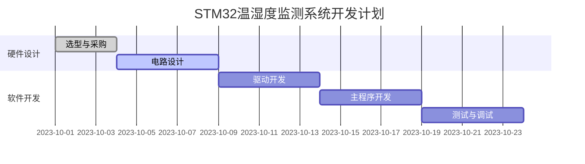

# STM32 项目规划

在嵌入式开发中，STM32项目规划是确保项目成功的关键步骤。无论是初学者还是有经验的开发者，都需要通过合理的规划来明确目标、分配资源并降低开发风险。本文将带你从零开始，逐步学习如何规划一个STM32项目。

## 什么是STM32项目规划？

STM32项目规划是指在开发STM32微控制器项目之前，明确项目的目标、需求、功能模块、硬件资源和开发流程的过程。它包括需求分析、模块划分、硬件选型、软件设计以及时间安排等内容。一个良好的项目规划可以帮助你避免开发中的常见问题，例如功能遗漏、资源不足或进度延误。

:::tip
项目规划不仅仅是技术问题，还涉及到团队协作、时间管理和资源分配。对于初学者来说，掌握规划技巧可以显著提高开发效率。
:::

---

## 项目规划的步骤

### 1. 需求分析

需求分析是项目规划的第一步。你需要明确项目的目标和功能需求。例如：
- 项目是用于控制电机、采集传感器数据，还是实现通信功能？
- 需要支持哪些外设（如GPIO、UART、I2C、SPI等）？
- 是否有实时性要求或低功耗需求？

**示例：**
假设我们要开发一个基于STM32的温湿度监测系统，需求如下：
- 采集温湿度传感器数据。
- 通过UART将数据发送到上位机。
- 支持LCD显示当前数据。
- 低功耗设计，支持电池供电。

:::note
需求分析阶段需要与客户或团队成员充分沟通，确保所有需求都被明确记录。
:::

---

### 2. 硬件选型

根据需求选择合适的STM32微控制器型号和外设。需要考虑以下因素：
- **性能需求**：是否需要高性能的Cortex-M7，还是低功耗的Cortex-M0+？
- **外设支持**：是否需要特定的通信接口（如CAN、USB）？
- **存储需求**：Flash和RAM是否足够？
- **成本**：在满足需求的前提下，选择性价比最高的型号。

**示例：**
对于温湿度监测系统，我们可以选择STM32F103C8T6，因为它具有足够的GPIO、UART接口，并且成本较低。

---

### 3. 模块划分

将项目划分为多个功能模块，每个模块负责一个独立的功能。常见的模块划分包括：
- **传感器模块**：负责采集数据。
- **通信模块**：负责与上位机或其他设备通信。
- **显示模块**：负责在LCD上显示数据。
- **电源管理模块**：负责低功耗设计。

**示例：**
温湿度监测系统的模块划分如下：
1. **传感器模块**：使用DHT11采集温湿度数据。
2. **通信模块**：通过UART发送数据到PC。
3. **显示模块**：使用1602 LCD显示数据。
4. **电源管理模块**：设计低功耗模式以延长电池寿命。

---

### 4. 软件设计

在硬件选型和模块划分完成后，开始设计软件架构。包括：
- **主程序流程**：定义程序的执行顺序。
- **任务调度**：如果使用RTOS，需要设计任务优先级。
- **驱动开发**：为每个外设编写驱动程序。
- **通信协议**：定义数据传输格式。

**示例：**
温湿度监测系统的软件设计如下：
```c
#include "stm32f1xx_hal.h"
#include "dht11.h"
#include "lcd1602.h"

int main(void) {
    HAL_Init();
    SystemClock_Config();
    DHT11_Init();
    LCD1602_Init();

    while (1) {
        float temp = DHT11_ReadTemperature();
        float humidity = DHT11_ReadHumidity();
        LCD1602_Display(temp, humidity);
        HAL_UART_Transmit(&huart1, (uint8_t*)&temp, sizeof(temp), HAL_MAX_DELAY);
        HAL_Delay(1000);
    }
}
```

---

### 5. 时间安排

为每个模块和任务分配时间，并制定开发计划。可以使用甘特图来可视化时间安排。



---

## 实际案例：智能家居控制系统

假设我们要开发一个智能家居控制系统，需求如下：
- 控制灯光、窗帘和空调。
- 支持Wi-Fi远程控制。
- 具有本地触摸屏界面。

**规划步骤：**
1. **需求分析**：明确控制对象和通信方式。
2. **硬件选型**：选择支持Wi-Fi的STM32型号（如STM32F4系列）。
3. **模块划分**：分为控制模块、通信模块和界面模块。
4. **软件设计**：设计控制逻辑和通信协议。
5. **时间安排**：制定开发计划并分配任务。

---

## 总结

STM32项目规划是嵌入式开发中不可或缺的一环。通过需求分析、硬件选型、模块划分、软件设计和时间安排，你可以确保项目顺利进行并按时完成。对于初学者来说，掌握这些规划技巧将为未来的项目开发打下坚实的基础。

---

## 附加资源与练习

1. **练习**：尝试为一个简单的LED闪烁项目进行规划，包括需求分析、硬件选型和软件设计。
2. **资源**：
   - [STM32官方文档](https://www.st.com/en/microcontrollers-microprocessors/stm32-32-bit-arm-cortex-mcus.html)
   - 《STM32嵌入式系统设计与实战》
   - [STM32CubeMX工具](https://www.st.com/en/development-tools/stm32cubemx.html)

:::caution
在项目开发中，务必定期检查进度，并根据实际情况调整规划。
:::