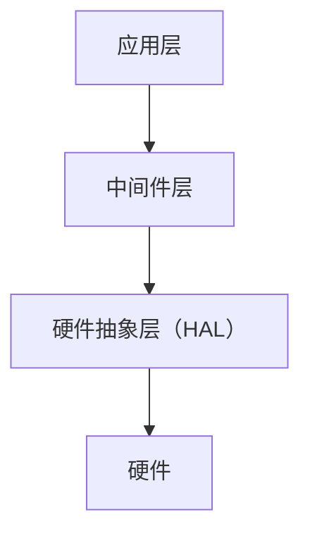
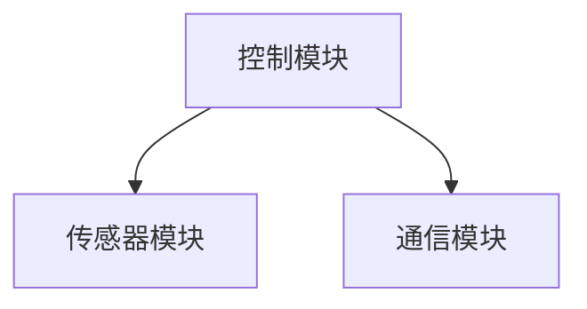

# STM32 软件架构

## 介绍

STM32微控制器广泛应用于嵌入式系统中，其强大的性能和丰富的外设使其成为开发者的首选。然而，随着项目复杂度的增加，如何设计一个高效、可维护的软件架构变得至关重要。本文将介绍STM32的软件架构，帮助你理解如何组织代码、管理外设以及优化性能。

## 软件架构的基本概念

### 1. 分层架构

在STM32开发中，常见的软件架构是分层架构。分层架构将代码分为多个层次，每一层都有明确的职责。常见的分层包括：

- **硬件抽象层（HAL）**：直接与硬件交互，提供统一的接口。
- **中间件层**：提供通用的功能，如文件系统、网络协议栈等。
- **应用层**：实现具体的业务逻辑。



### 2. 模块化设计

模块化设计是将系统分解为多个独立的模块，每个模块负责特定的功能。模块之间通过接口进行通信，这样可以提高代码的可维护性和可重用性。

## 代码示例：使用HAL库控制LED

以下是一个简单的代码示例，展示如何使用STM32的HAL库控制LED灯。

```c
#include "stm32f4xx_hal.h"

void SystemClock_Config(void);
static void MX_GPIO_Init(void);

int main(void)
{
    HAL_Init();
    SystemClock_Config();
    MX_GPIO_Init();

    while (1)
    {
        HAL_GPIO_TogglePin(GPIOA, GPIO_PIN_5);
        HAL_Delay(500);
    }
}

void SystemClock_Config(void)
{
    // 系统时钟配置代码
}

static void MX_GPIO_Init(void)
{
    GPIO_InitTypeDef GPIO_InitStruct = {0};

    __HAL_RCC_GPIOA_CLK_ENABLE();

    GPIO_InitStruct.Pin = GPIO_PIN_5;
    GPIO_InitStruct.Mode = GPIO_MODE_OUTPUT_PP;
    GPIO_InitStruct.Pull = GPIO_NOPULL;
    GPIO_InitStruct.Speed = GPIO_SPEED_FREQ_LOW;
    HAL_GPIO_Init(GPIOA, &GPIO_InitStruct);
}
```

### 代码解释

- `HAL_Init()`：初始化HAL库。
- `SystemClock_Config()`：配置系统时钟。
- `MX_GPIO_Init()`：初始化GPIO引脚。
- `HAL_GPIO_TogglePin()`：切换GPIO引脚状态，控制LED灯的亮灭。

## 实际案例：温度监控系统

假设我们要开发一个温度监控系统，系统需要读取温度传感器的数据，并通过串口发送到上位机。我们可以将系统分为以下几个模块：

1. **传感器模块**：负责读取温度数据。
2. **通信模块**：负责通过串口发送数据。
3. **控制模块**：负责协调传感器和通信模块的工作。



### 代码结构

```c
// sensor.c
float read_temperature(void)
{
    // 读取温度传感器的代码
}

// communication.c
void send_data(float data)
{
    // 通过串口发送数据的代码
}

// main.c
int main(void)
{
    HAL_Init();
    SystemClock_Config();
    MX_GPIO_Init();
    MX_USART2_UART_Init();

    while (1)
    {
        float temperature = read_temperature();
        send_data(temperature);
        HAL_Delay(1000);
    }
}
```

## 总结

通过本文，你应该对STM32的软件架构有了基本的了解。分层架构和模块化设计是构建高效、可维护嵌入式系统的关键。在实际开发中，合理划分模块、明确各层职责，可以大大提高开发效率和代码质量。

## 附加资源

- [STM32 HAL库文档](https://www.st.com/en/embedded-software/stm32cube-mcu-packages.html)
- [嵌入式系统设计模式](https://www.oreilly.com/library/view/design-patterns-for/9781492051678/)

## 练习

1. 尝试将上述温度监控系统扩展为支持多个传感器。
2. 研究如何使用FreeRTOS在STM32上实现多任务处理。
