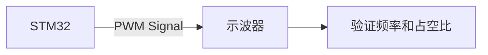

# STM32 测试策略

在STM32项目开发中，测试策略是确保代码质量和系统稳定性的关键步骤。无论是初学者还是经验丰富的开发者，都需要掌握如何设计有效的测试策略，以验证硬件和软件的正确性。本文将逐步介绍STM32测试策略的核心概念、方法和实际应用。

---

## 什么是STM32测试策略？

STM32测试策略是指在开发过程中，通过一系列系统化的测试方法，验证STM32微控制器的硬件和软件功能是否符合预期。测试策略的目标是尽早发现并修复问题，确保项目的可靠性和稳定性。

测试策略通常包括以下内容：
- **单元测试**：验证单个模块或函数的功能。
- **集成测试**：验证多个模块或组件之间的交互。
- **系统测试**：验证整个系统的功能是否符合需求。
- **硬件测试**：验证STM32硬件与外设的兼容性和稳定性。

---

## 测试策略的核心步骤

### 1. 单元测试
单元测试是针对代码中最小的可测试单元（如函数或模块）进行的测试。在STM32开发中，可以使用工具如`Unity`或`Ceedling`来编写和运行单元测试。

#### 示例：LED控制函数的单元测试
假设我们有一个控制LED的函数 `void toggle_led(void)`，我们可以编写如下测试：

```c
#include "unity.h"
#include "led_control.h"

void setUp(void) {
    // 初始化代码
}

void tearDown(void) {
    // 清理代码
}

void test_toggle_led(void) {
    // 模拟LED初始状态为关闭
    led_state = LED_OFF;
    toggle_led();
    TEST_ASSERT_EQUAL(LED_ON, led_state); // 验证LED状态切换
}
```

**输入**：LED初始状态为关闭。<br />
**输出**：LED状态切换为打开。

:::tip
单元测试应覆盖所有可能的输入和边界条件，以确保代码的健壮性。
:::

---

### 2. 集成测试
集成测试用于验证多个模块或组件之间的交互是否正确。例如，测试STM32的GPIO模块与外部传感器的通信。

#### 示例：GPIO与传感器的集成测试
假设我们有一个传感器通过GPIO与STM32通信，我们可以编写如下测试：

```c
void test_sensor_gpio_communication(void) {
    // 初始化GPIO和传感器
    gpio_init();
    sensor_init();

    // 模拟传感器发送数据
    simulate_sensor_data(0x55);
    uint8_t received_data = read_sensor_data();

    TEST_ASSERT_EQUAL(0x55, received_data); // 验证数据是否正确接收
}
```

**输入**：传感器发送数据 `0x55`。<br />
**输出**：STM32正确接收并返回 `0x55`。

---

### 3. 系统测试
系统测试是对整个系统功能的验证。例如，测试STM32与多个外设（如LCD、按键、传感器）的协同工作。

#### 示例：温度监控系统的系统测试
假设我们开发了一个温度监控系统，STM32通过传感器读取温度并在LCD上显示：

```c
void test_temperature_monitoring_system(void) {
    // 初始化系统
    init_system();

    // 模拟传感器温度值为25°C
    simulate_temperature(25);

    // 验证LCD显示是否正确
    char display_buffer[16];
    read_lcd_display(display_buffer);
    TEST_ASSERT_EQUAL_STRING("Temp: 25C", display_buffer);
}
```

**输入**：传感器温度值为 `25°C`。<br />
**输出**：LCD显示 `Temp: 25C`。

---

### 4. 硬件测试
硬件测试是验证STM32与外部硬件（如传感器、电机、通信模块）的兼容性和稳定性。可以使用示波器、逻辑分析仪等工具进行信号分析。

#### 示例：PWM信号输出测试
假设我们使用STM32的PWM模块控制电机转速，可以通过示波器验证PWM信号的频率和占空比是否符合预期。



---

## 实际案例：智能家居控制系统

假设我们开发了一个基于STM32的智能家居控制系统，包括以下功能：
- 控制LED灯
- 读取温湿度传感器数据
- 通过Wi-Fi模块与手机APP通信

### 测试策略设计
1. **单元测试**：测试LED控制函数、传感器数据读取函数、Wi-Fi通信函数。
2. **集成测试**：测试传感器与STM32的通信、Wi-Fi模块与STM32的交互。
3. **系统测试**：测试整个系统的功能，如通过手机APP控制LED灯、查看温湿度数据。
4. **硬件测试**：验证PWM信号控制LED亮度、Wi-Fi模块的信号强度。

---

## 总结

STM32测试策略是确保项目成功的关键。通过单元测试、集成测试、系统测试和硬件测试，可以全面验证代码和硬件的正确性。初学者应从简单的单元测试开始，逐步掌握更复杂的测试方法。

---

## 附加资源与练习

1. **资源**：
   - [Unity测试框架文档](https://github.com/ThrowTheSwitch/Unity)
   - [Ceedling测试工具](https://github.com/ThrowTheSwitch/Ceedling)
   - STM32官方测试指南

2. **练习**：
   - 编写一个STM32的GPIO控制函数，并为其编写单元测试。
   - 设计一个简单的温度监控系统，并编写集成测试和系统测试。

通过不断实践，你将能够设计出高效的STM32测试策略，提升项目的质量和可靠性。